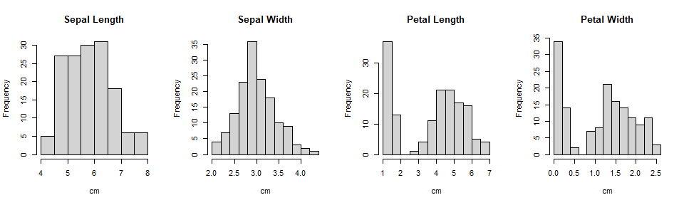
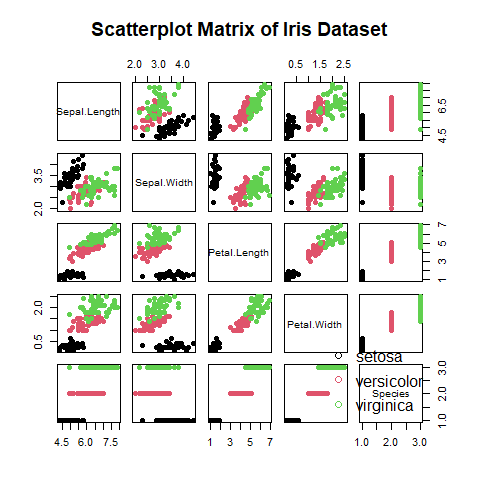
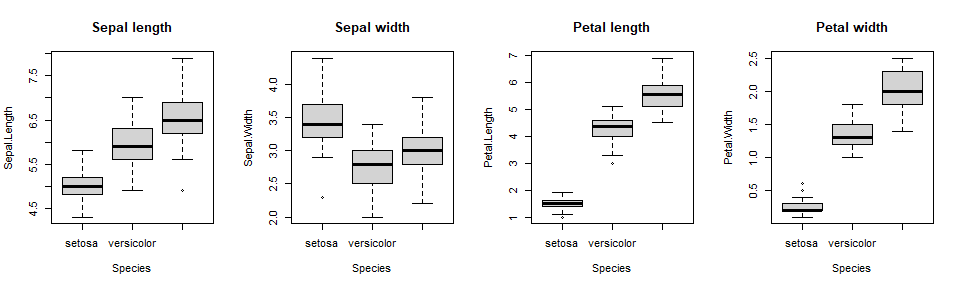
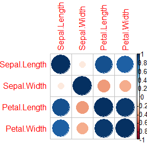

Exploratory multivariate analysis of the iris dataset
================
Georgios Papadopoulos \|
2025-10-05

*This report presents a compact multivariate analysis of the classic
`iris` dataset. The goal is to explore relationships between flower
variables, summarize key statistical properties, and verify fundamental
results from multivariate theory using empirical data.*

# Dataset Overview

We begin by exploring a well-known dataset from the base R datasets
package. The most famous R datasets are iris, mtcars, AirPassengers and
USArrests. The `iris` dataset contains 150 obs, consists of 4 numeric
continuous variables and 1 categorical variable.

    ## 'data.frame':    150 obs. of  5 variables:
    ##  $ Sepal.Length: num  5.1 4.9 4.7 4.6 5 5.4 4.6 5 4.4 4.9 ...
    ##  $ Sepal.Width : num  3.5 3 3.2 3.1 3.6 3.9 3.4 3.4 2.9 3.1 ...
    ##  $ Petal.Length: num  1.4 1.4 1.3 1.5 1.4 1.7 1.4 1.5 1.4 1.5 ...
    ##  $ Petal.Width : num  0.2 0.2 0.2 0.2 0.2 0.4 0.3 0.2 0.2 0.1 ...
    ##  $ Species     : Factor w/ 3 levels "setosa","versicolor",..: 1 1 1 1 1 1 1 1 1 1 ...

- The 4 numeric variables are the width and length of specific flower
  parts in centimeters named sepal and petal. See photo
  <https://www.sciencefacts.net/sepals.html>
- The categorical variable is the species of iris flower. The three iris
  species in the dataset are:

<!-- -->

    ## [1] setosa     versicolor virginica 
    ## Levels: setosa versicolor virginica

# Exploratory Data Analysis

### Distribution of variables with histograms

The histograms show the frequency distributions of all four numeric
variables in the iris dataset.

- Sepal Length and Sepal Width are approximately normally distributed,
  with most flowers having sepal lengths between 5–6 cm and widths
  around 3 cm.
- Petal Length and Petal Width show multiple distributions which could
  be because of the different species cluster around the distinct size
  range till 2 cm for petal length.

<!-- -->

### Scatterplot of pairwise relationships

The scatterplot matrix displays all pairwise relationships colored by
species. Black for setosa, red forversicolor and green for virginica.

- Petal length and petal width show a strong positive correlation with
  clusters that are good separated for each species.
- Sepal measurements are less strongly correlated and show more overlap
  between species.
- Setosa appears clearly distinct from versicolor and virginica, because
  the other two partially overlap.

<!-- -->

### Boxplot group comparisons

The boxplots show the interquartile range and the line inside the box
marks the median value. So we can compare all four numeric variables
across the three iris species.

- Setosa has the smallest values for most measurements.
- Virginica has the largest while versicolor is in between.
- The petal length and petal width plots show very clear species
  separation, with little to no overlap.
- The sepal part of the flowers overlap more, especially between
  versicolor and virginica.

<!-- -->

# Descriptive Statistics

Summary statistics provide a quantitative view of the variable
distributions: Sepal length and width show smaller ranges between 4-8cm
compared to petal length and width which seem from 0.1 till 2.5 cm. This
might indicate diversity in petal sizes among species.

    ##   Sepal.Length    Sepal.Width     Petal.Length    Petal.Width   
    ##  Min.   :4.300   Min.   :2.000   Min.   :1.000   Min.   :0.100  
    ##  1st Qu.:5.100   1st Qu.:2.800   1st Qu.:1.600   1st Qu.:0.300  
    ##  Median :5.800   Median :3.000   Median :4.350   Median :1.300  
    ##  Mean   :5.843   Mean   :3.057   Mean   :3.758   Mean   :1.199  
    ##  3rd Qu.:6.400   3rd Qu.:3.300   3rd Qu.:5.100   3rd Qu.:1.800  
    ##  Max.   :7.900   Max.   :4.400   Max.   :6.900   Max.   :2.500  
    ##        Species  
    ##  setosa    :50  
    ##  versicolor:50  
    ##  virginica :50  
    ##                 
    ##                 
    ## 

Following table summerizes when we group by species. Length measurement
for both petal and sepal increase from setosa to virginica species,
showing that petals are the strongest indicators for species
classification. However, sepal width differentiates less across groups.

    ## # A tibble: 8 × 5
    ##   Variable     Statistic setosa versicolor virginica
    ##   <chr>        <chr>      <dbl>      <dbl>     <dbl>
    ## 1 Sepal.Length mean       5.01       5.94      6.59 
    ## 2 Sepal.Length sd         0.352      0.516     0.636
    ## 3 Sepal.Width  mean       3.43       2.77      2.97 
    ## 4 Sepal.Width  sd         0.379      0.314     0.322
    ## 5 Petal.Length mean       1.46       4.26      5.55 
    ## 6 Petal.Length sd         0.174      0.470     0.552
    ## 7 Petal.Width  mean       0.246      1.33      2.03 
    ## 8 Petal.Width  sd         0.105      0.198     0.275

# Covariance and Correlation structure

## Covariance matrix

#### Variances cov(X, X))

The diagonal elements of the covariance matrix represent the variances
of each variable, indicating how much each measurement fluctuates around
its mean.

- Petal length shows the largest variance of 3.12, which means that it
  differs a lot among all iris samples
- Petal width and Sepal.Length show moderate variation
- Sepal width shows the smallest variance of 0.19 therefore sepal width
  is the most consistent characteristic.

#### Covariances cov(X,Y)

Covariances between same flower part:

- Sepal length and width show negative covariance of -0.04. It means
  that longer sepals are very slightly associated with negative sepal
  width (narrow).
- Petal length and width show positive covariance of 1.29. It means that
  longer petals are positevely associated with wider petals.

Covariances between width of different part:

- Sepal length and petal length show positive covariance of 1.27. It
  means that longer sepals tend to have longer petals.
- Sepal width and petal length show negative covariance of -0.12. It
  means that wider sepals tend very little to narrower petals.

``` r
cov(iris[, 1:4])
```

    ##              Sepal.Length Sepal.Width Petal.Length Petal.Width
    ## Sepal.Length    0.6856935  -0.0424340    1.2743154   0.5162707
    ## Sepal.Width    -0.0424340   0.1899794   -0.3296564  -0.1216394
    ## Petal.Length    1.2743154  -0.3296564    3.1162779   1.2956094
    ## Petal.Width     0.5162707  -0.1216394    1.2956094   0.5810063

## Correlation matrix

The highest correlation in the matrix is between petal length and its
width of 0.96. This is extremely positive as petals get longer, they
also get wider. The most negative correlation is between sepal width and
petal length of -0.43. Since its close to -0.5, it meas that flowers
with wider sepals tend to have shorter petals. Interestingly the weakest
correlation is between sepal length and its width of -0.12, which means
that for that flower part, width and length are not correlated, perhaps
slightly negatively.

``` r
cor(iris[, 1:4])
```

    ##              Sepal.Length Sepal.Width Petal.Length Petal.Width
    ## Sepal.Length    1.0000000  -0.1175698    0.8717538   0.8179411
    ## Sepal.Width    -0.1175698   1.0000000   -0.4284401  -0.3661259
    ## Petal.Length    0.8717538  -0.4284401    1.0000000   0.9628654
    ## Petal.Width     0.8179411  -0.3661259    0.9628654   1.0000000

# Correlation Visualization

The correlation matrix can be visualized to highlight the strength and
direction of relationships:

- Indeed the positive correlations are colored with blue whereas the
  negative ones are colored towards dark red. The smallest points for
  the correlation between sepal width and its width are as mentioned the
  ones with the closest correlation to zero.
- The orange points represent the negative correlations described
  before.

``` r
cor_matrix <- cor(iris[, 1:4])
corrplot(cor_matrix)
```

<!-- -->

# Standardization and Covariance Transformation

To link covariance and correlation, we apply a linear transformation
based on Equation (1.13).

From Equation 1.13 $Cov(Ax)=ACov(x)A^T$ we need to find a matrix A such
that Cov(Ax) = cor(x)

We set as X matrix the observations and compute covariance and
correlation matrices.

``` r
X <- iris[, 1:4]

cov_matrix <- cov(X)   # Σ = Cov(x)
cor_matrix <- cor(X)   # Cor(x)
```

The matrix D is a diagonal matrix that contains the variances of each
variable from the covariance matrix on its diagonal. Its square root,
$D^{1/2}$ has the standard deviation. Therefore we need to use
$A=D^{-1/2}$ to standardize each variable by dividing it by its own
standard deviation.

The standardization formula is $z_i=\frac{x_i-\bar{x}_i}{\sigma_i}$

However in matrix form it is $z=D^{-1/2}(\mathbf{x}-\bar{\mathbf{x}})$

``` r
D <- diag(diag(cov_matrix))

A <- diag(1 / sqrt(diag(cov_matrix)))
```

Here we compute equation 1.13 $Cov(Ax)=ACov(x)A^T$

``` r
Cov_Ax <- A %*% cov_matrix %*% t(A)
```

We compare if they are the same

``` r
Cov_Ax
```

    ##            [,1]       [,2]       [,3]       [,4]
    ## [1,]  1.0000000 -0.1175698  0.8717538  0.8179411
    ## [2,] -0.1175698  1.0000000 -0.4284401 -0.3661259
    ## [3,]  0.8717538 -0.4284401  1.0000000  0.9628654
    ## [4,]  0.8179411 -0.3661259  0.9628654  1.0000000

``` r
cor_matrix
```

    ##              Sepal.Length Sepal.Width Petal.Length Petal.Width
    ## Sepal.Length    1.0000000  -0.1175698    0.8717538   0.8179411
    ## Sepal.Width    -0.1175698   1.0000000   -0.4284401  -0.3661259
    ## Petal.Length    0.8717538  -0.4284401    1.0000000   0.9628654
    ## Petal.Width     0.8179411  -0.3661259    0.9628654   1.0000000

# Eigenvalue Decomposition of the Covariance Matrix

Every symmetric matrix Σ can be decomposed as $Σ=ΓAΓ^{T}$. Obviously
covariance and correlation matrices are symmetrical. A is a diagonal
matrix that contains eigenvalues. Γ is the matrix of eigenvectors of Σ.

Performing eigenvalue decomposιtion

``` r
eig <- eigen(cov_matrix)
eig
```

    ## eigen() decomposition
    ## $values
    ## [1] 4.22824171 0.24267075 0.07820950 0.02383509
    ## 
    ## $vectors
    ##             [,1]        [,2]        [,3]       [,4]
    ## [1,]  0.36138659 -0.65658877  0.58202985  0.3154872
    ## [2,] -0.08452251 -0.73016143 -0.59791083 -0.3197231
    ## [3,]  0.85667061  0.17337266 -0.07623608 -0.4798390
    ## [4,]  0.35828920  0.07548102 -0.54583143  0.7536574

Reconstructing Σ from eigen decomposition

``` r
Gamma <- eig$vectors           
A <- diag(eig$values)          
Sigma_reconstructed <- Gamma %*% A %*% t(Gamma)
Sigma_reconstructed
```

    ##            [,1]       [,2]       [,3]       [,4]
    ## [1,]  0.6856935 -0.0424340  1.2743154  0.5162707
    ## [2,] -0.0424340  0.1899794 -0.3296564 -0.1216394
    ## [3,]  1.2743154 -0.3296564  3.1162779  1.2956094
    ## [4,]  0.5162707 -0.1216394  1.2956094  0.5810063

Compare if cov_matrix equals numerically with sigma_reconstructed

``` r
cov_matrix
```

    ##              Sepal.Length Sepal.Width Petal.Length Petal.Width
    ## Sepal.Length    0.6856935  -0.0424340    1.2743154   0.5162707
    ## Sepal.Width    -0.0424340   0.1899794   -0.3296564  -0.1216394
    ## Petal.Length    1.2743154  -0.3296564    3.1162779   1.2956094
    ## Petal.Width     0.5162707  -0.1216394    1.2956094   0.5810063

# Conclusion

The analysis shows that petal measurements are the most informative
variables for distinguishing species, while sepal characteristics
exhibit weaker separation. The empirical results also confirm key
theoretical properties of covariance transformations and eigenvalue
decomposition.
