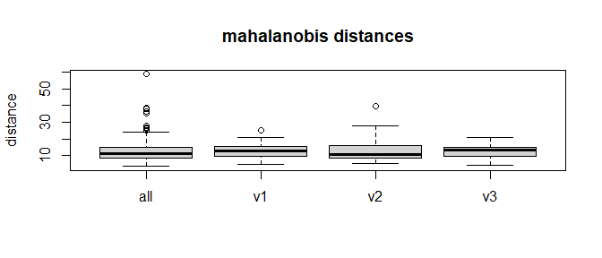
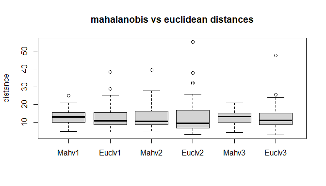
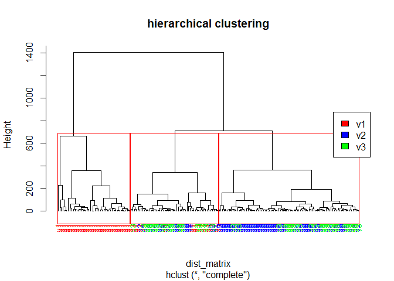

2. Distance based Clustering of Wine Cultivars
================
Georgios Papadopoulos
2025-10-09

# Preparation

``` r
library(doBy)
data(wine)
wine_split <- split(wine[, -1], wine$Cult)
```

# 1. Scaling, Covariance, and Eigenstructure

This section compares the covariance structure and eigenvalues of the
complete wine dataset with those computed within each cultivar group.

After centering and scaling the data, the cov matrix of all wines
produced eigenvalues of 4.7, 2.5, 1.4 etc whereas the grouped wines
produced first eigenvalues of around 3. We expected that since the
larger eigenvalues in all wines have both variation between and within
wine groups, whereas the grouped wines have variation only within their
group.

## All wines

``` r
wine_num <- wine[, -1]
wine_scaled <- scale(wine_num)
S_wine <- cov(wine_scaled)
eig_wine <- eigen(S_wine, only.values = TRUE)$values
eig_wine
```

    ##  [1] 4.7058503 2.4969737 1.4460720 0.9189739 0.8532282 0.6416570 0.5510283
    ##  [8] 0.3484974 0.2888799 0.2509025 0.2257886 0.1687702 0.1033779

## Group of wines

``` r
eig_groups <- lapply(wine_split, function(group_data) {
  
  group_scaled <- scale(group_data)
  
  cov_matrix <- cov(group_scaled)
  
  eigenvalues <- eigen(cov_matrix, only.values = TRUE)$values
  
  list(
    covariance = cov_matrix,
    eigenvalues = eigenvalues
  )})

cat("Eigenvalues v1:", eig_groups$v1$eigenvalues, 
    "\n\nEigenvalues v2:", eig_groups$v2$eigenvalues, 
    "\n\nEigenvalues v3:", eig_groups$v3$eigenvalues, "\n")
```

    ## Eigenvalues v1: 3.643537 2.37069 1.860146 0.944364 0.8673725 0.8464056 0.6820594 0.5203715 0.4182374 0.3102435 0.2447178 0.1827456 0.1091102 
    ## 
    ## Eigenvalues v2: 3.078336 2.09335 1.649223 1.468982 1.203905 0.8891476 0.6973441 0.4808904 0.4672186 0.3768454 0.2980678 0.2130273 0.08366319 
    ## 
    ## Eigenvalues v3: 3.313441 2.436875 1.902309 1.307867 1.034322 0.8771269 0.6301794 0.476566 0.3371074 0.252972 0.2048573 0.1332131 0.09316341

# 2. Importance of scaling

If the data weren’t scaled, variables with bigger ranges would dominate
the results. The eigenvalues would represent the big variables instead
of showing real relationships among all variables. Basically eigenvalues
would be biased toward variables with bigger numbers. Scaling
standardizes all variables with mean 0 and standard deviation 1.

# 3. Mahalanobis Distance: Complete data vs. group analysis

When mahalanobis distances are computed using all wines together the
distances are larger and spread. This happens because the its mean and
covariance include both within and between wine variation. For example
v2 is naturally farther from the overall mean, so that wine group get
higher mahalanobis distances and look like outliers.

In contrast, when distances are computed separately for each wine type,
each wine is compared only to the mean and covariance of its own group.
The distances become smaller and fewer outliers appear because between
wine group differences are no longer included.

Inside each group, however, the wines are similar to their own group
mean, so only a few true outliers appear.

## All wines

``` r
mahal_all <- mahalanobis(
  x = wine_scaled,
  center = colMeans(wine_scaled),
  cov = cov(wine_scaled),
  inverted = FALSE
)
#mahal_all
```

## Group of wines

``` r
mahal_groups <- lapply(wine_split, function(group_data) {
  group_scaled <- scale(group_data)
  mahalanobis(
    x = group_scaled,
    center = colMeans(group_scaled),
    cov = cov(group_scaled),
    inverted = FALSE)
  })

#mahal_groups
```

Boxplot

``` r
boxplot(list(
  all = mahal_all,
  v1 = mahal_groups$v1,
  v2 = mahal_groups$v2,
  v3 = mahal_groups$v3
), 
main = "mahalanobis distances",
ylab = "distance")
```

<!-- -->

# 4. Mahalanobis and Euclidean distance comparison

Using the group-wise Mahalanobis distances computed above, we compare
them with group-wise Euclidean distances. The mahalanobis distance of an
observation vector x from the mean vector μ is defined as

$MD^2 = (x - μ)' Σ ^{-1} \, (x - μ)$

where Σ is the covariance matrix of the data. This metric adjusts for
differences in scale and for correlations among variables.

If we assume that all variables are uncorrelated and have unit variance,
then the covariance matrix equals the identity matrix *Σ = I*. In this
case, the inverse is also the identity matrix, $Σ^{-1} = I$ and the
mahalanobis distance simplifies to squared euclidean distance between x
and μ:

$$
D^2 = (x - μ)' I (x - μ)   = (x - μ)' (x - μ),
$$

The Euclidean distance is a special case of the Mahalanobis distance
when Σ = I.

``` r
eucl_groups <- lapply(wine_split, function(group_data) {
  group_scaled <- scale(group_data)
  mahalanobis(
    x = group_scaled,
    center = colMeans(group_scaled),
    cov = diag(ncol(group_scaled)),
    inverted = FALSE)
  })

#eucl_groups
```

We see that mahalanobis distances are smaller with less outliers.
Euclidean distances look bigger and more spread. This happens because
euclidean distance treats all variables as if they were unrelated.
Mahalanobis distance knows that some variables move together with high
covariance and adjusts for that, so the distances are smaller.

If the data were not scaled the comparison would not make sense because
variables with large numbers would dominate distance and hide the real
differences between wines.

``` r
boxplot(list(
  Mahv1 = mahal_groups$v1,
  Euclv1 = eucl_groups$v1,
  Mahv2 = mahal_groups$v2,
  Euclv2 = eucl_groups$v2,  
  Mahv3 = mahal_groups$v3,
  Euclv3 = eucl_groups$v3
),
main = "mahalanobis vs euclidean distances",
ylab = "distance")
```

<!-- -->

# 5. Role of variable transformations in clustering

Clustering algorithms like k-means or hierarchical clustering rely on
distance. If variables are skewed those extreme points can dominate
distances. Transformations such as log, square root or Box Cox can
normalize distribution reduce outliers.

However if all variables are already normally distributed,
transformations can distort relationships rather than help. If we use
other cluster algorithms that are robust to skewness, then
transformations will not be useful. Also it depends whether we can give
later a good explanation to transformed variable, like log(x).

# 6. Hierarchical clustering of wine profiles

``` r
dist_matrix <- dist(wine_num, method = "euclidean")

hcluster_wine <- hclust(dist_matrix)
#plot(hcluster_wine)

# adding color by using the initial wine df

library(ClassDiscovery)

grp  <- factor(wine$Cult)

plotColoredClusters(hcluster_wine, 
                    labs = as.character(grp),
                    cols = c("red","blue","green")[as.integer(grp)],
                    main = "hierarchical clustering")
rect.hclust(hcluster_wine, k = 3, border = "red")
legend("right", levels(grp), fill = c("red","blue","green"))
```

<!-- -->

The hierarchical clustering created a dendrogram with three main
branches. The branches somewhat correspond to the three wine groups.
This shows that the wine variables are somewhat informative to separate
the wines by type. Most wines from the same group are grouped together.
For v1 we see that clustering worked excellent, though the obs for v2
and v3 are mixed, especially when neighboring.

# 7. Adjusted rand index as a clustering agreement measure

The adjusted rand index between the clustering result and the true
groups was 0.37 which shows a somewhat successful clustering. This means
that some parts of the hierarchical clustering captured the true groups,
some wines were grouped differently. This can be explained by
overlapping variables between some wine types, especially v2 and v3
wines.

In general, when ARI close to 1 then its perfect clustering and closer
to 0 means worse clustering but still better than random.

``` r
library(mclust)
cluster_cut <- cutree(hcluster_wine, k = 3)
adjustedRandIndex(cluster_cut, wine$Cult)
```

    ## [1] 0.370833

# 8. Comparing cluster assignments with true wine cultivars

We have a strong agreement between ARI being moderate at 0.37 and the
cluster table because: - v1 wines are clearly defined in the first
cluster - a very mixed cluster with v1 and v2 overlapping the same with
most obs being v3 - mostly v2 in the third cluster with many v3 mixed in

``` r
cluster_cut <- cutree(hcluster_wine, k = 3)
table(cluster_cut, wine$Cult)
```

    ##            
    ## cluster_cut v1 v2 v3
    ##           1 43  0  0
    ##           2 16 15 21
    ##           3  0 56 27

# 9. Distance and linkage choices in hierarchical clustering

The distance measures for point to point obs we learned is Euclidean and
Manhattan (page 20). Euclidean was used in task 6 so now we will compare
Manhattan which is less sensitive to outliers to see which method
computes the bigger ARI.

``` r
dist_matrix_manhattan <- dist(wine_num, method = "manhattan")
hcluster_wine_manhattan <- hclust(dist_matrix_manhattan)
cluster_cut_manhattan <- cutree(hcluster_wine_manhattan, k = 3)
adjustedRandIndex(cluster_cut_manhattan, wine$Cult)
```

    ## [1] 0.370833

Interestingly, we see that both Euclidean and Manhattan result in the
same ARI. This happened because we scaled the distances within the
dataset. But we could also check linkage methods to see differences in
ARI. So here we will check the cluster to cluster distance measures from
page 22, complete, single, average, centroid and wards” Based on
`?hclust` I found that the default method is “complete” and for that we
already got ARI = 0.37

``` r
methods <- c("single", "average", "centroid","complete", "ward.D")

ari_results <- sapply(methods, function(m) {
  cutree(hclust(dist_matrix, method = m), k = 3) |> 
    (\(c) adjustedRandIndex(c, wine$Cult))()})

ari_results
```

    ##      single     average    centroid    complete      ward.D 
    ## 0.005443835 0.292626917 0.300695128 0.370833022 0.402264010

The methods complete and ward.D achieved the highest ARI values which
means the best possible hierarchical clustering methods. Average and
centroid linkage produced moderate results, while single linkage
performed poorly due to chaining effects.

# 10. K-means clustering benchmark

K-means produced for 3 clusters ARI=0.90 vs. hierarchical ARI=0.40. This
means that k-means performed better in clustering the wine groups. To
obtain stable results, we must used scaled data, use many random
initializations, here we did 50 random starts and use a fixed seed.

To double check clustering, I created the same table showing that indeed
the three real wine groups were clustered extremely good.

``` r
set.seed(123)
kmeans <- kmeans(wine_scaled, centers = 3, nstart = 50)

adjustedRandIndex(kmeans$cluster, wine$Cult)
```

    ## [1] 0.897495

``` r
table(kmeans$cluster, wine$Cult)
```

    ##    
    ##     v1 v2 v3
    ##   1  0  3 48
    ##   2 59  3  0
    ##   3  0 65  0
