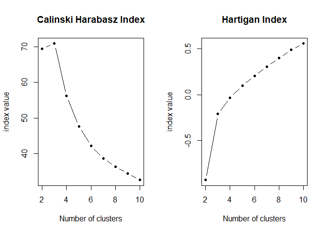
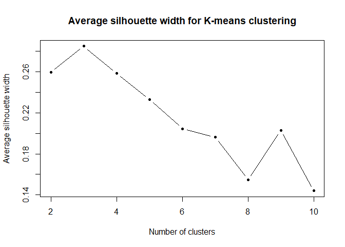
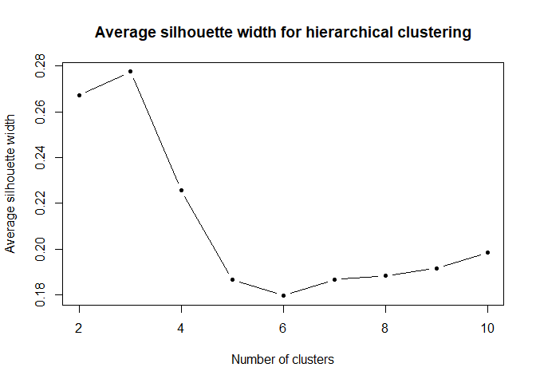
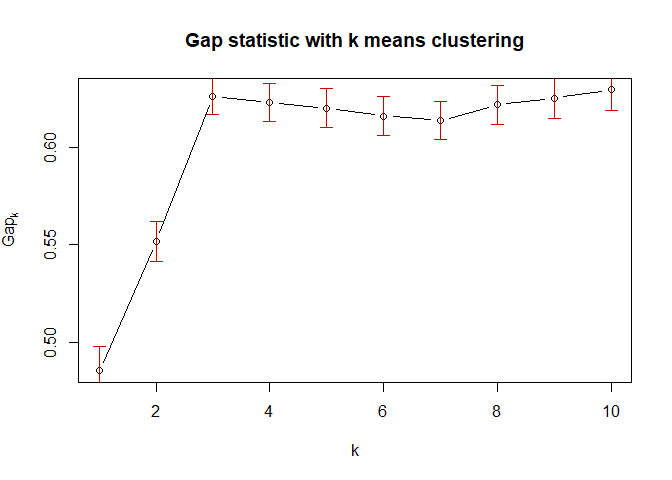
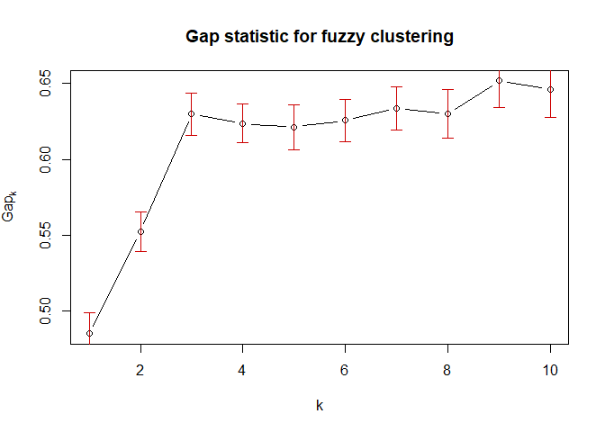
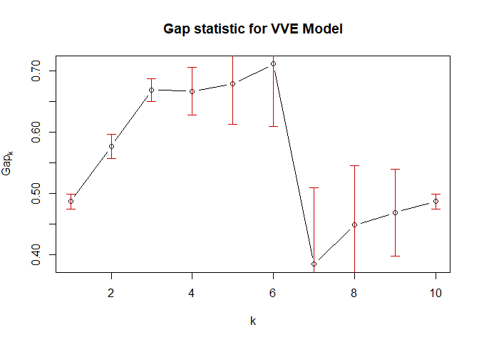

Cluster validation for wine profiling
================
Georgios Papadopoulos
2025-10-17

*Evaluating K-Means, Hierarchical, Fuzzy, and Model-Based Clustering
with Internal Validity Measures in R*

# Preparation

``` r
library(doBy)
data(wine)
wine_numbers <- wine[, sapply(wine, is.numeric)]
wine_scaled <- scale(wine_numbers)
```

# 1. Calinski-Harabasz and Hartigan indices for K-means

To calculate Calinksi Harabasz index I used `fpc` package
<https://search.r-project.org/CRAN/refmans/fpc/html/calinhara.html>
where I double checked that we use the same formula.

We calculate the between-cluster variance $B_k$ divided by the
within-cluster variance $W_k$ then take the natural logarithm:

$$
H_k=ln\frac{W_k}{B_k}
$$

The optimal cluster k=3 since for the Calinski Harabasz index we are
interested in the biggest value which we see both visually and on the
data for k=3. For the Hartigan index we are interested in the largest
change of Hartigan, namely $ΔH_k=H_k−H_{k−1}$ which happens for k=3.
Basically the biggest increase is when we approach when from cluster 2
we add **cluster 3**. From our previous exercise, we know that we had
three types of wines.

``` r
library(fpc)
library(cluster)
library(dplyr)

data(wine)
wine_numbers <- wine[, sapply(wine, is.numeric)]
wine_scaled <- scale(wine_numbers)

set.seed(123)
k <- 2:10
CH_index <- numeric(length(k))
Hartigan_index <- numeric(length(k))


for (i in seq_along(k)) {
  res <- kmeans(wine_scaled, centers = k[i], nstart = 25)
  
  CH_index[i] <- calinhara(wine_scaled, res$cluster)
  
  Hartigan_index[i] <- log(res$betweenss / res$tot.withinss)
}


results_task1 <- data.frame(
  K = k,
  Calinski_Harabasz = CH_index,
  Hartigan = Hartigan_index
)

print(results_task1)
```

    ##    K Calinski_Harabasz    Hartigan
    ## 1  2          69.52333 -0.92882159
    ## 2  3          70.94001 -0.20980423
    ## 3  4          56.20192 -0.03149210
    ## 4  5          47.62155  0.09628823
    ## 5  6          42.14803  0.20313128
    ## 6  7          38.65167  0.30468579
    ## 7  8          36.24411  0.40038862
    ## 8  9          34.43467  0.48860661
    ## 9 10          32.54956  0.55602432

``` r
par(mfrow = c(1, 2))

plot(k, CH_index, type = "b", pch = 20,
     xlab = "Number of clusters",
     ylab = "index value",
     main = "Calinski Harabasz Index")

plot(k, Hartigan_index, type = "b", pch = 20,
     xlab = "Number of clusters",
     ylab = "index value",
     main = "Hartigan Index")
```

<!-- -->

# 2. Silhouette analysis for k-means

Αverage silhouette width measures how well each observation fits within
its cluster compared to other clusters. On the numerator there is the
difference of smallest average distance to points in the nearest cluster
with the average distance to all points in its own cluster c.

$$
s_i = \frac{d_{i,c} - d_{i,ck}}{max(d_{i,ck},d_{i,c})}
$$ Then we take the mean of column 3 to obtain the average silhouette
width which summarizes the overall clustering quality for each cluster.
I tested this before with `head(sil)`.

Although the values are relatively low the highest average is for k = 3
which means that three clusters provide the best clustering structure.
The values are low because we remember from the last exercise that there
was a significant overlap throughout two of three clusters
`plot(wine, col = wine$Cult, pch = 16)`

``` r
# Initialize
set.seed(123)
k <- 2:10
silhouette_values <- numeric(length(k))


for (i in seq_along(k)) {
  km <- kmeans(wine_scaled, centers = k[i], nstart = 25)
  sil <- silhouette(km$cluster, dist(wine_scaled))
  silhouette_values[i] <- mean(sil[, 3])  # column 3 = silhouette width
}


results_sil <- data.frame(k, silhouette_values)
print(results_sil)
```

    ##    k silhouette_values
    ## 1  2         0.2593170
    ## 2  3         0.2848589
    ## 3  4         0.2584470
    ## 4  5         0.2329354
    ## 5  6         0.2044226
    ## 6  7         0.1962602
    ## 7  8         0.1546339
    ## 8  9         0.2029853
    ## 9 10         0.1439783

``` r
plot(k, silhouette_values, type = "b", pch = 20,
     xlab = "Number of clusters",
     ylab = "Average silhouette width",
     main = "Average silhouette width for K-means clustering")
```

<!-- -->

# 3. Silhouette analysis for hierarchical clustering

Now we will use again the average silhouette width as a validity
measure, but change the clustering method. Instead of kmeans we use
hierarchical clustering.

Again the highest average silhouette value is at K = 3, meaning that the
clustering quality is then the best. The results are consistent with
k-means clustering. Between the two algorithms k-means achieved slightly
higher silhouette values which means slightly better cluster separation.

There is a small rise after k=6 which is likely because the existing
groups are split into smaller parts rather than forming new meaningful
clusters.

``` r
dist_matrix <- dist(wine_scaled)

hc <- hclust(dist_matrix, method = "ward.D2")

# initialize
k <- 2:10
silhouette_values_hc <- numeric(length(k))

for (i in seq_along(k)) {
  clusters <- cutree(hc, k[i])
  sil <- silhouette(clusters, dist_matrix)
  silhouette_values_hc[i] <- mean(sil[, 3])
}


data.frame(K = k, Avg_Silhouette = silhouette_values_hc)
```

    ##    K Avg_Silhouette
    ## 1  2      0.2670132
    ## 2  3      0.2774440
    ## 3  4      0.2258367
    ## 4  5      0.1867424
    ## 5  6      0.1796664
    ## 6  7      0.1868534
    ## 7  8      0.1883470
    ## 8  9      0.1917169
    ## 9 10      0.1985675

``` r
plot(k, silhouette_values_hc, type = "b", pch = 20,
     xlab = "Number of clusters",
     ylab = "Average silhouette width",
     main = "Average silhouette width for hierarchical clustering")
```

<!-- -->

# 4. Gap atatistic for k-means

The Gap statistic compares how compact clusters are with what would
happen in random data that has no real clusters. A big Gap value means
clusters are much more compact than random noise. The best number of
clusters is the smallest k where the Gap value is almost as high as the
next one.

The Gap statistic rises until k = 3 with Gap = 0.63 and then stays
almost the same. Since the standard errors are very small the difference
after k = 3 is not meaningful. According to the standard error rule the
best number of clusters is k = 3.

The nstart parameter in k-means specifies how many times the k-means
algorithm should run with random initial centroids. With nstart = 25+ we
ensure that k-means explores multiple starting points and chooses the
best clustering result.

``` r
set.seed(123)
gap <- clusGap(wine_scaled,
                  FUN = kmeans,
                  K.max = 10,
                  nstart = 25,
                  B = 50) #number of random bootstrap samples

gap
```

    ## Clustering Gap statistic ["clusGap"] from call:
    ## clusGap(x = wine_scaled, FUNcluster = kmeans, K.max = 10, B = 50, nstart = 25)
    ## B=50 simulated reference sets, k = 1..10; spaceH0="scaledPCA"
    ##  --> Number of clusters (method 'firstSEmax', SE.factor=1): 3
    ##           logW   E.logW       gap      SE.sim
    ##  [1,] 5.377557 5.862775 0.4852182 0.012319766
    ##  [2,] 5.203497 5.755346 0.5518490 0.010262462
    ##  [3,] 5.066929 5.693360 0.6264310 0.009535433
    ##  [4,] 5.023946 5.647109 0.6231634 0.009926294
    ##  [5,] 4.989519 5.609674 0.6201548 0.010005762
    ##  [6,] 4.961090 5.577280 0.6161904 0.009860836
    ##  [7,] 4.935551 5.549372 0.6138206 0.009921485
    ##  [8,] 4.902342 5.524320 0.6219782 0.010103273
    ##  [9,] 4.876035 5.501338 0.6253029 0.010541628
    ## [10,] 4.850386 5.479980 0.6295937 0.010395976

``` r
plot(gap, main = "Gap statistic with k means clustering")
```

<!-- -->

``` r
opt_k <- maxSE(gap$Tab[, 3], gap$Tab[, 4])
opt_k
```

    ## [1] 3

# 5. Gap statistic for fuzzy clustering

The difference with the previous exercise is that now we implement fuzzy
cmeans clustering. m is a parameter than controls how fuzzy the
clustering is. For m=1 clustering is exactly like k-means, but as m
increases the points can belong to multiple clusters.

For our exercise the Gap statistic increases up to K = 3, after which it
stabilizes. This confirms the previous findings from k-means and
hierarchical clustering.

``` r
library(fclust)
library(e1071)
set.seed(123)

gap_fuzzy <- clusGap(wine_scaled,
                     FUNcluster = cmeans,
                     m = 1.5,         
                     K.max = 10,
                     B = 50)

plot(gap_fuzzy, main = "Gap statistic for fuzzy clustering")
```

<!-- -->

``` r
gap_fuzzy
```

    ## Clustering Gap statistic ["clusGap"] from call:
    ## clusGap(x = wine_scaled, FUNcluster = cmeans, K.max = 10, B = 50, m = 1.5)
    ## B=50 simulated reference sets, k = 1..10; spaceH0="scaledPCA"
    ##  --> Number of clusters (method 'firstSEmax', SE.factor=1): 3
    ##           logW   E.logW       gap     SE.sim
    ##  [1,] 5.377557 5.862251 0.4846944 0.01396090
    ##  [2,] 5.204200 5.756205 0.5520053 0.01323872
    ##  [3,] 5.066929 5.696806 0.6298765 0.01407212
    ##  [4,] 5.027593 5.651171 0.6235783 0.01276725
    ##  [5,] 4.998531 5.619898 0.6213666 0.01491150
    ##  [6,] 4.966476 5.592104 0.6256278 0.01381310
    ##  [7,] 4.933154 5.566992 0.6338377 0.01432969
    ##  [8,] 4.915474 5.545477 0.6300033 0.01619468
    ##  [9,] 4.877576 5.529382 0.6518065 0.01780292
    ## [10,] 4.867921 5.514328 0.6464074 0.01880982

``` r
optimal_k_fuzzy <- maxSE(gap_fuzzy$Tab[,3], gap_fuzzy$Tab[,4])
optimal_k_fuzzy
```

    ## [1] 3

# 6. Efficient gap statistic for model based clustering

To use the Gap statistic for model-based-clustering, at first I used the
Bayesian Information Criterion (BIC) to find the best model which is VVE
for variable volume, variable shape and equal orientation. Basically
different sizes and shapes but all elipsoids tilted the same way. In
this way I will calculate the Gap statistics only for VVE.

``` r
library(mclust)

bic <- mclustBIC(wine_scaled)
#summary(bic)                
best_model <- Mclust(wine_scaled)  # Fits the best automatically
best_model$modelName
```

    ## [1] "VVE"

Mclust() tries different numbers of clusters G=1,2,…,10 and chooses the
one with the best BIC. This is to briefly check if we will get the
optimal number of clusters with VVE model. Once again k=3 so now I will
calculate Gap.

``` r
Mclust(wine_scaled, modelNames = "VVE")$G
```

    ## [1] 3

Now I run the Gap statistic only on VVE. For each number of clusters it
fits a Gaussian mixture model using the `Mclust()` function.

I used a wrapper around Mclust() because of vector and list issues. If a
model cannot be fitted, now all data points are temporarily assigned to
one cluster so the process can continue.

``` r
set.seed(123)

mclustGap <- function(x, k) {
  model <- try(Mclust(x, G = k, modelNames = "VVE", verbose = FALSE), silent = TRUE)
  if (inherits(model, "try-error") || is.null(model$classification)) {
    cl <- rep(1, nrow(x))  # fallback: assign all to one cluster
  } else {
    cl <- model$classification
  }
  list(cluster = cl)
}


gap_mclust <- clusGap(wine_scaled,
                      FUNcluster = mclustGap,
                      K.max = 10,
                      B = 50)


plot(gap_mclust, main = "Gap statistic for VVE Model")
```

<!-- -->

``` r
optimal_k <- maxSE(gap_mclust$Tab[,3], gap_mclust$Tab[,4])
optimal_k
```

    ## [1] 3
