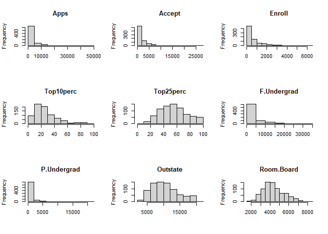
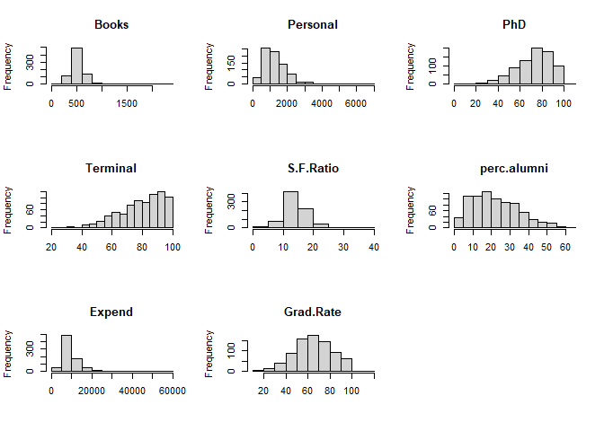
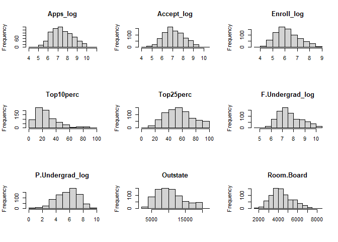
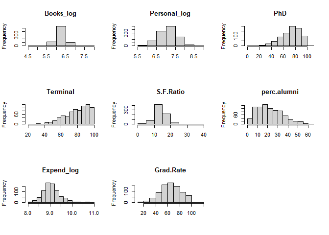
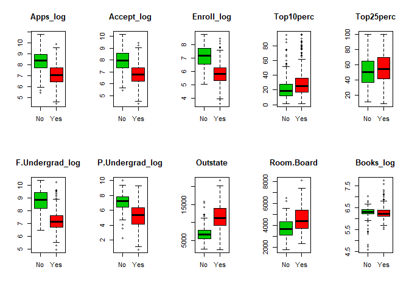
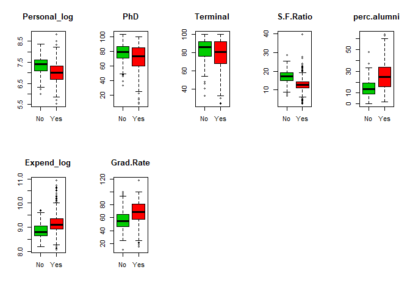
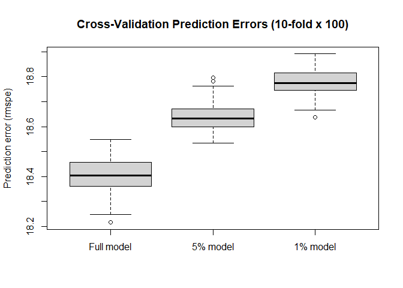
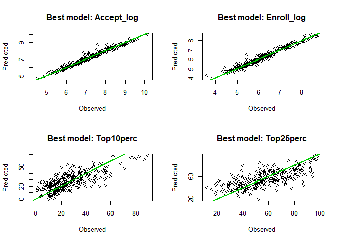
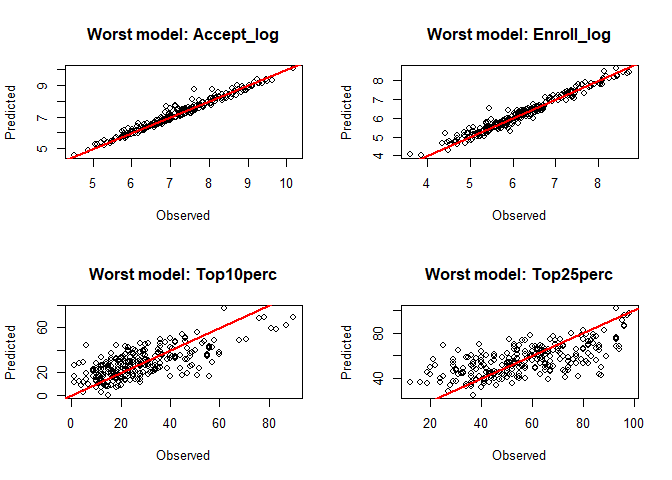

Multivariate regression for college admissions outcomes
================
Georgios Papadopoulos
2025-10-25

*Joint prediction of acceptance, enrollment, and academic profile
metrics using multivariate linear models in R*

# 1. Visual inspection and preprocessing

From Str and Summary we know that we have 777 obs of 18 variables,
`private` is a factor with Yes/No whereas the rest are numerical
variables. We do not have missing values.

``` r
library(ISLR)
data(College)
#?College
#str(College)
#summary(College)
#anyNA(College)
```

Histograms help to inspect the distributions of numeric variables.
Variables “Apps”, “Accept”, “Enroll”, “F.Undergrad”, “P.Undergrad”,
“Books”, “Personal”, “Expend” show skewed distributions and a few
extreme outliers, suggesting that log transformations are appropriate
prior to regression modeling.

``` r
par(mfrow = c(3, 3))
College_num <- College[,2:18]

for (v in names(College_num)) {
  hist(College_num[[v]], main = v, xlab = "") 
  }
```

<!-- --><!-- -->

The variable `Private` was converted to a factor to ensure that it is
treated as categorical in next analyses. To stabilize variance and
reduce skewness, the skewed variables were transformed using the natural
logarithm with a x+1 offset (log1p) which safely handles potential zero
values.

After transformation, the affected variables were renamed by appending
the suffix “\_log” (e.g., Expend_log.

``` r
college_transformed <- College
college_transformed$Private <- as.factor(college_transformed$Private)

skewed_vars <- c("Apps", "Accept", "Enroll", "F.Undergrad", "P.Undergrad", "Books",
                 "Personal", "Expend")

college_transformed[skewed_vars] <- lapply(college_transformed[skewed_vars], log1p)
names(college_transformed)[names(college_transformed) %in% skewed_vars] <-
  paste0(skewed_vars, "_log")

# Scale all numeric variables (recommended before multivariate regression / CV)
#num_vars <- sapply(college_transformed, is.numeric)
#college_transformed[num_vars] <- scale(college_transformed[num_vars])
```

With the new distributions we see that skewness is fixed.

``` r
par(mfrow = c(3, 3))

for (v in names(college_transformed)[sapply(college_transformed, is.numeric)]) {
  hist(college_transformed[[v]], main = v, xlab = "")
}
```

<!-- --><!-- -->

The boxplots show systematic level differences between private and
public university, with private colleges generally showing higher
values. These differences are consistent as expected and will be
preserved in the modeling process rather than treated as outliers.

``` r
par(mfrow = c(2, 5))

for (v in names(college_transformed)[sapply(college_transformed, is.numeric)]) {
  boxplot(college_transformed[[v]] ~ college_transformed$Private,
          main = v, xlab = "", ylab = "", col = c("green3", "red1"))
}
```

<!-- --><!-- -->

# 2. Training and test split

Setting seed to ensure reproducibility of random split, then for n=777
obs I randomly pick 2/3 of n indices for training, and the rest of the
indices are for testing the df. `train` df has 518 obs and `test` has
259 obs. To prepare for model fitting for task 3, I checked the
proportions of our factor `private` which looks decently splitted up.

``` r
set.seed(123)

n <- nrow(college_transformed)
train_index <- sample(1:n, size = 2/3 * n)

train <- college_transformed[train_index, ]
test  <- college_transformed[-train_index, ]
nrow(train) 
```

    ## [1] 518

``` r
nrow(test) 
```

    ## [1] 259

``` r
summary(train$Private)
```

    ##  No Yes 
    ## 145 373

``` r
summary(test$Private)
```

    ##  No Yes 
    ##  67 192

# 3. Joint linear model for multiple admission outcomes

The model predicts `Accept_log` and `Enroll_log` very well with multiple
$R^2$ 0.9618 and 0.9505 respectively, but `Top10perc` and `Top25perc`
are harder to explain as multiple $R^2$ are moderate of 0.6073 and
0.5362 respectively. This suggests that admission and enrollment are
well captured by our variables, but top student percentages depend on
additional unobserved factors we dont see here.

The overall F statistics for each regression equation are large with all
p-values \< 0.001 which shows that the joint predictors explain a
significant amount of variance.

Across the four equations, the most statistically significant predictors
are `Apps_log`, `F.Undergrad_log`, and `Expend_log`, each showing p \<
0.001. The number of applications and fulltime students and expenditure
per student show a strong positive influence on the joint predictors.

``` r
model_lm <- lm(cbind(Accept_log, Enroll_log, Top10perc, Top25perc) ~ ., data = train)

summary(model_lm)
```

    ## Response Accept_log :
    ## 
    ## Call:
    ## lm(formula = Accept_log ~ Private + Apps_log + F.Undergrad_log + 
    ##     P.Undergrad_log + Outstate + Room.Board + Books_log + Personal_log + 
    ##     PhD + Terminal + S.F.Ratio + perc.alumni + Expend_log + Grad.Rate, 
    ##     data = train)
    ## 
    ## Residuals:
    ##      Min       1Q   Median       3Q      Max 
    ## -1.09091 -0.09848  0.03332  0.11473  0.62191 
    ## 
    ## Coefficients:
    ##                   Estimate Std. Error t value Pr(>|t|)    
    ## (Intercept)      2.230e+00  3.985e-01   5.596 3.62e-08 ***
    ## PrivateYes       8.548e-02  3.417e-02   2.501 0.012687 *  
    ## Apps_log         8.060e-01  2.050e-02  39.319  < 2e-16 ***
    ## F.Undergrad_log  1.533e-01  2.487e-02   6.163 1.46e-09 ***
    ## P.Undergrad_log  5.662e-03  8.023e-03   0.706 0.480658    
    ## Outstate         1.427e-05  4.380e-06   3.258 0.001196 ** 
    ## Room.Board      -3.043e-05  1.097e-05  -2.775 0.005727 ** 
    ## Books_log       -1.136e-01  3.338e-02  -3.403 0.000719 ***
    ## Personal_log     4.949e-03  2.054e-02   0.241 0.809651    
    ## PhD             -7.812e-04  1.036e-03  -0.754 0.450970    
    ## Terminal         1.910e-03  1.126e-03   1.696 0.090479 .  
    ## S.F.Ratio       -1.876e-03  3.163e-03  -0.593 0.553355    
    ## perc.alumni      2.169e-04  9.039e-04   0.240 0.810467    
    ## Expend_log      -1.833e-01  4.026e-02  -4.553 6.65e-06 ***
    ## Grad.Rate       -1.906e-03  6.484e-04  -2.939 0.003443 ** 
    ## ---
    ## Signif. codes:  0 '***' 0.001 '**' 0.01 '*' 0.05 '.' 0.1 ' ' 1
    ## 
    ## Residual standard error: 0.1904 on 503 degrees of freedom
    ## Multiple R-squared:  0.9618, Adjusted R-squared:  0.9607 
    ## F-statistic: 904.3 on 14 and 503 DF,  p-value: < 2.2e-16
    ## 
    ## 
    ## Response Enroll_log :
    ## 
    ## Call:
    ## lm(formula = Enroll_log ~ Private + Apps_log + F.Undergrad_log + 
    ##     P.Undergrad_log + Outstate + Room.Board + Books_log + Personal_log + 
    ##     PhD + Terminal + S.F.Ratio + perc.alumni + Expend_log + Grad.Rate, 
    ##     data = train)
    ## 
    ## Residuals:
    ##      Min       1Q   Median       3Q      Max 
    ## -1.17042 -0.11055  0.01646  0.11163  1.05824 
    ## 
    ## Coefficients:
    ##                   Estimate Std. Error t value Pr(>|t|)    
    ## (Intercept)     -4.653e-01  4.371e-01  -1.065   0.2875    
    ## PrivateYes       7.661e-02  3.749e-02   2.044   0.0415 *  
    ## Apps_log         3.700e-01  2.248e-02  16.455  < 2e-16 ***
    ## F.Undergrad_log  5.812e-01  2.728e-02  21.300  < 2e-16 ***
    ## P.Undergrad_log -1.535e-02  8.800e-03  -1.744   0.0818 .  
    ## Outstate        -7.484e-06  4.805e-06  -1.558   0.1199    
    ## Room.Board      -6.050e-05  1.203e-05  -5.030 6.85e-07 ***
    ## Books_log       -6.747e-02  3.661e-02  -1.843   0.0659 .  
    ## Personal_log     2.360e-02  2.252e-02   1.048   0.2953    
    ## PhD             -1.664e-03  1.136e-03  -1.465   0.1437    
    ## Terminal         1.954e-03  1.235e-03   1.582   0.1143    
    ## S.F.Ratio        6.916e-04  3.470e-03   0.199   0.8421    
    ## perc.alumni      2.454e-03  9.915e-04   2.475   0.0137 *  
    ## Expend_log       4.808e-03  4.416e-02   0.109   0.9133    
    ## Grad.Rate       -8.851e-04  7.112e-04  -1.244   0.2139    
    ## ---
    ## Signif. codes:  0 '***' 0.001 '**' 0.01 '*' 0.05 '.' 0.1 ' ' 1
    ## 
    ## Residual standard error: 0.2089 on 503 degrees of freedom
    ## Multiple R-squared:  0.9505, Adjusted R-squared:  0.9491 
    ## F-statistic: 690.3 on 14 and 503 DF,  p-value: < 2.2e-16
    ## 
    ## 
    ## Response Top10perc :
    ## 
    ## Call:
    ## lm(formula = Top10perc ~ Private + Apps_log + F.Undergrad_log + 
    ##     P.Undergrad_log + Outstate + Room.Board + Books_log + Personal_log + 
    ##     PhD + Terminal + S.F.Ratio + perc.alumni + Expend_log + Grad.Rate, 
    ##     data = train)
    ## 
    ## Residuals:
    ##     Min      1Q  Median      3Q     Max 
    ## -33.271  -7.385  -1.145   5.829  48.208 
    ## 
    ## Coefficients:
    ##                   Estimate Std. Error t value Pr(>|t|)    
    ## (Intercept)     -1.931e+02  2.422e+01  -7.971 1.06e-14 ***
    ## PrivateYes       1.130e+00  2.077e+00   0.544 0.586736    
    ## Apps_log         4.992e-01  1.246e+00   0.401 0.688880    
    ## F.Undergrad_log  5.340e+00  1.512e+00   3.532 0.000451 ***
    ## P.Undergrad_log -2.479e+00  4.877e-01  -5.083 5.26e-07 ***
    ## Outstate         2.118e-04  2.663e-04   0.795 0.426786    
    ## Room.Board      -1.620e-04  6.666e-04  -0.243 0.808123    
    ## Books_log        3.234e+00  2.029e+00   1.594 0.111544    
    ## Personal_log     4.291e-01  1.248e+00   0.344 0.731189    
    ## PhD              2.030e-01  6.295e-02   3.225 0.001342 ** 
    ## Terminal        -5.808e-02  6.846e-02  -0.848 0.396607    
    ## S.F.Ratio       -5.660e-02  1.923e-01  -0.294 0.768622    
    ## perc.alumni      1.186e-01  5.495e-02   2.159 0.031320 *  
    ## Expend_log       1.553e+01  2.447e+00   6.346 4.94e-10 ***
    ## Grad.Rate        1.768e-01  3.942e-02   4.485 9.03e-06 ***
    ## ---
    ## Signif. codes:  0 '***' 0.001 '**' 0.01 '*' 0.05 '.' 0.1 ' ' 1
    ## 
    ## Residual standard error: 11.58 on 503 degrees of freedom
    ## Multiple R-squared:  0.6073, Adjusted R-squared:  0.5964 
    ## F-statistic: 55.57 on 14 and 503 DF,  p-value: < 2.2e-16
    ## 
    ## 
    ## Response Top25perc :
    ## 
    ## Call:
    ## lm(formula = Top25perc ~ Private + Apps_log + F.Undergrad_log + 
    ##     P.Undergrad_log + Outstate + Room.Board + Books_log + Personal_log + 
    ##     PhD + Terminal + S.F.Ratio + perc.alumni + Expend_log + Grad.Rate, 
    ##     data = train)
    ## 
    ## Residuals:
    ##     Min      1Q  Median      3Q     Max 
    ## -39.257  -8.988  -0.385   8.250  52.729 
    ## 
    ## Coefficients:
    ##                   Estimate Std. Error t value Pr(>|t|)    
    ## (Intercept)     -1.296e+02  2.905e+01  -4.461 1.01e-05 ***
    ## PrivateYes       1.024e+00  2.491e+00   0.411 0.681216    
    ## Apps_log         4.304e-01  1.494e+00   0.288 0.773437    
    ## F.Undergrad_log  6.095e+00  1.813e+00   3.361 0.000835 ***
    ## P.Undergrad_log -2.504e+00  5.848e-01  -4.282 2.22e-05 ***
    ## Outstate         3.814e-04  3.193e-04   1.194 0.232906    
    ## Room.Board      -6.853e-05  7.994e-04  -0.086 0.931714    
    ## Books_log        5.280e+00  2.433e+00   2.170 0.030474 *  
    ## Personal_log     9.071e-01  1.497e+00   0.606 0.544826    
    ## PhD              2.136e-01  7.549e-02   2.830 0.004844 ** 
    ## Terminal         7.360e-02  8.209e-02   0.897 0.370399    
    ## S.F.Ratio       -6.219e-02  2.306e-01  -0.270 0.787496    
    ## perc.alumni      1.779e-01  6.590e-02   2.700 0.007158 ** 
    ## Expend_log       7.196e+00  2.935e+00   2.452 0.014536 *  
    ## Grad.Rate        2.370e-01  4.727e-02   5.013 7.42e-07 ***
    ## ---
    ## Signif. codes:  0 '***' 0.001 '**' 0.01 '*' 0.05 '.' 0.1 ' ' 1
    ## 
    ## Residual standard error: 13.88 on 503 degrees of freedom
    ## Multiple R-squared:  0.5362, Adjusted R-squared:  0.5233 
    ## F-statistic: 41.54 on 14 and 503 DF,  p-value: < 2.2e-16

# 4. MANOVA-based model assessment

While lm() fits separate regressions for each response variable,
manova() fits one combined model and tests whether the predictors have a
joint effect on all responses together.

Almost all predictors have p \< 0.001 (\*\*\*), meaning they jointly
influence the responses. The largest multivariate effects (highest
Pillai values) are for `Apps_log`, `Private`, `F.Undergrad_log`, meaning
the most influential predictors overall. Only a few variables, such as
`Personal_log`, lack significant multivariate influence.

``` r
model_manova <- manova(cbind(Accept_log, Enroll_log, Top10perc, Top25perc) ~ ., data = train)

summary(model_manova)
```

    ##                  Df  Pillai approx F num Df den Df    Pr(>F)    
    ## Private           1 0.91508   1346.9      4    500 < 2.2e-16 ***
    ## Apps_log          1 0.96285   3239.3      4    500 < 2.2e-16 ***
    ## F.Undergrad_log   1 0.54936    152.4      4    500 < 2.2e-16 ***
    ## P.Undergrad_log   1 0.23217     37.8      4    500 < 2.2e-16 ***
    ## Outstate          1 0.24412     40.4      4    500 < 2.2e-16 ***
    ## Room.Board        1 0.06899      9.3      4    500 3.162e-07 ***
    ## Books_log         1 0.02915      3.8      4    500 0.0050923 ** 
    ## Personal_log      1 0.00489      0.6      4    500 0.6522435    
    ## PhD               1 0.09755     13.5      4    500 1.822e-10 ***
    ## Terminal          1 0.02051      2.6      4    500 0.0344862 *  
    ## S.F.Ratio         1 0.05407      7.1      4    500 1.340e-05 ***
    ## perc.alumni       1 0.04528      5.9      4    500 0.0001146 ***
    ## Expend_log        1 0.10330     14.4      4    500 3.896e-11 ***
    ## Grad.Rate         1 0.05412      7.2      4    500 1.321e-05 ***
    ## Residuals       503                                             
    ## ---
    ## Signif. codes:  0 '***' 0.001 '**' 0.01 '*' 0.05 '.' 0.1 ' ' 1

# 5. Significance-based submodel construction

To create a model based on all variables which a specific significance,
we look at the significance levels and stars. Each predictor can differ
in significance across the four response equations, so I kept the
variables that were significant in at least one outcome.

This approach is wrong because now we selected variables only based on
their p-values. Significance tests measure inference namely whether a
relationship likely exists in the population. This doesnt say how well a
variable improves prediction on new data. Some variables that are not
significant can still help predict, while others could appear
significant only by chance.

A better way to build a predictive submodel is to use cross validation
because it doesnt use p-values. CV splits the data into training and
validation parts several times to test how well the model predicts
unseen data. This gives a more realistic measure of performance and
helps find models that generalize well rather than just fitting random
noise. After the best model is chosen, it can be evaluated on a separate
test set to estimate its final predictive accuracy on completely new
data. This process reduces overfitting and leads to more reliable model
selection.

## 5% significance level

The 5% model includes all predictors with p \< 0.05, namely `***`, `**`,
`*`

``` r
model_5 <- lm(cbind(Accept_log, Enroll_log, Top10perc, Top25perc) ~ 
                Private + Apps_log + F.Undergrad_log + Outstate + Room.Board + Books_log +
                PhD + perc.alumni + Expend_log + Grad.Rate,
              data = train)
summary(model_5)
```

    ## Response Accept_log :
    ## 
    ## Call:
    ## lm(formula = Accept_log ~ Private + Apps_log + F.Undergrad_log + 
    ##     Outstate + Room.Board + Books_log + PhD + perc.alumni + Expend_log + 
    ##     Grad.Rate, data = train)
    ## 
    ## Residuals:
    ##      Min       1Q   Median       3Q      Max 
    ## -1.10049 -0.09333  0.03389  0.11606  0.61411 
    ## 
    ## Coefficients:
    ##                   Estimate Std. Error t value Pr(>|t|)    
    ## (Intercept)      2.144e+00  3.229e-01   6.640 8.10e-11 ***
    ## PrivateYes       8.260e-02  3.386e-02   2.440  0.01505 *  
    ## Apps_log         8.025e-01  2.009e-02  39.945  < 2e-16 ***
    ## F.Undergrad_log  1.615e-01  2.250e-02   7.178 2.54e-12 ***
    ## Outstate         1.402e-05  4.262e-06   3.290  0.00107 ** 
    ## Room.Board      -2.601e-05  1.029e-05  -2.527  0.01181 *  
    ## Books_log       -1.079e-01  3.265e-02  -3.306  0.00101 ** 
    ## PhD              4.368e-04  7.139e-04   0.612  0.54091    
    ## perc.alumni      3.111e-04  8.813e-04   0.353  0.72422    
    ## Expend_log      -1.713e-01  3.343e-02  -5.123 4.28e-07 ***
    ## Grad.Rate       -2.031e-03  6.288e-04  -3.230  0.00132 ** 
    ## ---
    ## Signif. codes:  0 '***' 0.001 '**' 0.01 '*' 0.05 '.' 0.1 ' ' 1
    ## 
    ## Residual standard error: 0.1905 on 507 degrees of freedom
    ## Multiple R-squared:  0.9615, Adjusted R-squared:  0.9607 
    ## F-statistic:  1265 on 10 and 507 DF,  p-value: < 2.2e-16
    ## 
    ## 
    ## Response Enroll_log :
    ## 
    ## Call:
    ## lm(formula = Enroll_log ~ Private + Apps_log + F.Undergrad_log + 
    ##     Outstate + Room.Board + Books_log + PhD + perc.alumni + Expend_log + 
    ##     Grad.Rate, data = train)
    ## 
    ## Residuals:
    ##      Min       1Q   Median       3Q      Max 
    ## -1.14623 -0.10338  0.01909  0.11342  1.03501 
    ## 
    ## Coefficients:
    ##                   Estimate Std. Error t value Pr(>|t|)    
    ## (Intercept)     -4.334e-01  3.548e-01  -1.221  0.22247    
    ## PrivateYes       7.049e-02  3.720e-02   1.895  0.05869 .  
    ## Apps_log         3.781e-01  2.207e-02  17.128  < 2e-16 ***
    ## F.Undergrad_log  5.653e-01  2.472e-02  22.869  < 2e-16 ***
    ## Outstate        -6.121e-06  4.683e-06  -1.307  0.19178    
    ## Room.Board      -6.538e-05  1.131e-05  -5.781  1.3e-08 ***
    ## Books_log       -5.385e-02  3.587e-02  -1.501  0.13392    
    ## PhD             -2.950e-04  7.844e-04  -0.376  0.70703    
    ## perc.alumni      2.894e-03  9.683e-04   2.989  0.00294 ** 
    ## Expend_log       1.569e-02  3.673e-02   0.427  0.66935    
    ## Grad.Rate       -1.018e-03  6.908e-04  -1.473  0.14126    
    ## ---
    ## Signif. codes:  0 '***' 0.001 '**' 0.01 '*' 0.05 '.' 0.1 ' ' 1
    ## 
    ## Residual standard error: 0.2093 on 507 degrees of freedom
    ## Multiple R-squared:  0.9499, Adjusted R-squared:  0.949 
    ## F-statistic: 962.2 on 10 and 507 DF,  p-value: < 2.2e-16
    ## 
    ## 
    ## Response Top10perc :
    ## 
    ## Call:
    ## lm(formula = Top10perc ~ Private + Apps_log + F.Undergrad_log + 
    ##     Outstate + Room.Board + Books_log + PhD + perc.alumni + Expend_log + 
    ##     Grad.Rate, data = train)
    ## 
    ## Residuals:
    ##     Min      1Q  Median      3Q     Max 
    ## -32.079  -7.786  -1.423   5.671  48.955 
    ## 
    ## Coefficients:
    ##                   Estimate Std. Error t value Pr(>|t|)    
    ## (Intercept)     -2.090e+02  2.007e+01 -10.413  < 2e-16 ***
    ## PrivateYes       1.028e+00  2.104e+00   0.489  0.62521    
    ## Apps_log         1.604e+00  1.248e+00   1.285  0.19943    
    ## F.Undergrad_log  2.107e+00  1.398e+00   1.507  0.13248    
    ## Outstate         4.229e-04  2.648e-04   1.597  0.11094    
    ## Room.Board      -1.321e-03  6.396e-04  -2.065  0.03942 *  
    ## Books_log        3.511e+00  2.029e+00   1.731  0.08408 .  
    ## PhD              1.711e-01  4.436e-02   3.856  0.00013 ***
    ## perc.alumni      1.615e-01  5.477e-02   2.949  0.00333 ** 
    ## Expend_log       1.741e+01  2.077e+00   8.383 5.13e-16 ***
    ## Grad.Rate        1.962e-01  3.907e-02   5.020 7.15e-07 ***
    ## ---
    ## Signif. codes:  0 '***' 0.001 '**' 0.01 '*' 0.05 '.' 0.1 ' ' 1
    ## 
    ## Residual standard error: 11.84 on 507 degrees of freedom
    ## Multiple R-squared:  0.5863, Adjusted R-squared:  0.5781 
    ## F-statistic: 71.84 on 10 and 507 DF,  p-value: < 2.2e-16
    ## 
    ## 
    ## Response Top25perc :
    ## 
    ## Call:
    ## lm(formula = Top25perc ~ Private + Apps_log + F.Undergrad_log + 
    ##     Outstate + Room.Board + Books_log + PhD + perc.alumni + Expend_log + 
    ##     Grad.Rate, data = train)
    ## 
    ## Residuals:
    ##     Min      1Q  Median      3Q     Max 
    ## -34.063 -10.039  -0.527   8.947  50.341 
    ## 
    ## Coefficients:
    ##                   Estimate Std. Error t value Pr(>|t|)    
    ## (Intercept)     -1.449e+02  2.388e+01  -6.066 2.56e-09 ***
    ## PrivateYes       5.807e-01  2.504e+00   0.232 0.816690    
    ## Apps_log         1.562e+00  1.486e+00   1.051 0.293559    
    ## F.Undergrad_log  2.965e+00  1.664e+00   1.782 0.075352 .  
    ## Outstate         6.183e-04  3.152e-04   1.962 0.050322 .  
    ## Room.Board      -1.098e-03  7.612e-04  -1.443 0.149722    
    ## Books_log        6.033e+00  2.414e+00   2.499 0.012774 *  
    ## PhD              2.689e-01  5.279e-02   5.094 4.96e-07 ***
    ## perc.alumni      2.337e-01  6.517e-02   3.585 0.000369 ***
    ## Expend_log       9.348e+00  2.472e+00   3.781 0.000174 ***
    ## Grad.Rate        2.475e-01  4.650e-02   5.323 1.53e-07 ***
    ## ---
    ## Signif. codes:  0 '***' 0.001 '**' 0.01 '*' 0.05 '.' 0.1 ' ' 1
    ## 
    ## Residual standard error: 14.08 on 507 degrees of freedom
    ## Multiple R-squared:  0.5188, Adjusted R-squared:  0.5093 
    ## F-statistic: 54.66 on 10 and 507 DF,  p-value: < 2.2e-16

## 1% significance level

The 1% model includes those with p \< 0.01, , namely `***`, `**`
therefore I removed `private`, `perc.alumni`

``` r
model_1 <- lm(cbind(Accept_log, Enroll_log, Top10perc, Top25perc) ~ 
                Apps_log + F.Undergrad_log + Outstate + Room.Board +  Books_log + PhD +
                Expend_log + Grad.Rate,
              data = train)
summary(model_1)
```

    ## Response Accept_log :
    ## 
    ## Call:
    ## lm(formula = Accept_log ~ Apps_log + F.Undergrad_log + Outstate + 
    ##     Room.Board + Books_log + PhD + Expend_log + Grad.Rate, data = train)
    ## 
    ## Residuals:
    ##      Min       1Q   Median       3Q      Max 
    ## -1.08533 -0.09405  0.03669  0.12155  0.58981 
    ## 
    ## Coefficients:
    ##                   Estimate Std. Error t value Pr(>|t|)    
    ## (Intercept)      2.263e+00  3.203e-01   7.064 5.36e-12 ***
    ## Apps_log         8.011e-01  2.016e-02  39.741  < 2e-16 ***
    ## F.Undergrad_log  1.419e-01  2.107e-02   6.732 4.51e-11 ***
    ## Outstate         1.804e-05  3.906e-06   4.620 4.87e-06 ***
    ## Room.Board      -2.506e-05  1.022e-05  -2.452  0.01452 *  
    ## Books_log       -1.025e-01  3.268e-02  -3.136  0.00181 ** 
    ## PhD              9.338e-05  6.959e-04   0.134  0.89331    
    ## Expend_log      -1.680e-01  3.341e-02  -5.028 6.86e-07 ***
    ## Grad.Rate       -1.665e-03  5.889e-04  -2.827  0.00489 ** 
    ## ---
    ## Signif. codes:  0 '***' 0.001 '**' 0.01 '*' 0.05 '.' 0.1 ' ' 1
    ## 
    ## Residual standard error: 0.1912 on 509 degrees of freedom
    ## Multiple R-squared:  0.961,  Adjusted R-squared:  0.9604 
    ## F-statistic:  1568 on 8 and 509 DF,  p-value: < 2.2e-16
    ## 
    ## 
    ## Response Enroll_log :
    ## 
    ## Call:
    ## lm(formula = Enroll_log ~ Apps_log + F.Undergrad_log + Outstate + 
    ##     Room.Board + Books_log + PhD + Expend_log + Grad.Rate, data = train)
    ## 
    ## Residuals:
    ##      Min       1Q   Median       3Q      Max 
    ## -1.05981 -0.11100  0.01505  0.11746  1.08349 
    ## 
    ## Coefficients:
    ##                   Estimate Std. Error t value Pr(>|t|)    
    ## (Intercept)     -3.490e-01  3.542e-01  -0.985    0.325    
    ## Apps_log         3.779e-01  2.229e-02  16.955  < 2e-16 ***
    ## F.Undergrad_log  5.406e-01  2.330e-02  23.204  < 2e-16 ***
    ## Outstate        -1.798e-07  4.318e-06  -0.042    0.967    
    ## Room.Board      -6.881e-05  1.130e-05  -6.092 2.21e-09 ***
    ## Books_log       -5.154e-02  3.614e-02  -1.426    0.154    
    ## PhD             -3.565e-04  7.694e-04  -0.463    0.643    
    ## Expend_log       2.765e-02  3.694e-02   0.749    0.454    
    ## Grad.Rate       -1.362e-04  6.511e-04  -0.209    0.834    
    ## ---
    ## Signif. codes:  0 '***' 0.001 '**' 0.01 '*' 0.05 '.' 0.1 ' ' 1
    ## 
    ## Residual standard error: 0.2114 on 509 degrees of freedom
    ## Multiple R-squared:  0.9487, Adjusted R-squared:  0.9479 
    ## F-statistic:  1177 on 8 and 509 DF,  p-value: < 2.2e-16
    ## 
    ## 
    ## Response Top10perc :
    ## 
    ## Call:
    ## lm(formula = Top10perc ~ Apps_log + F.Undergrad_log + Outstate + 
    ##     Room.Board + Books_log + PhD + Expend_log + Grad.Rate, data = train)
    ## 
    ## Residuals:
    ##     Min      1Q  Median      3Q     Max 
    ## -31.342  -8.399  -0.856   6.061  49.088 
    ## 
    ## Coefficients:
    ##                   Estimate Std. Error t value Pr(>|t|)    
    ## (Intercept)     -2.085e+02  1.996e+01 -10.444  < 2e-16 ***
    ## Apps_log         1.647e+00  1.256e+00   1.312   0.1902    
    ## F.Undergrad_log  1.382e+00  1.313e+00   1.052   0.2932    
    ## Outstate         6.234e-04  2.434e-04   2.562   0.0107 *  
    ## Room.Board      -1.564e-03  6.366e-04  -2.457   0.0144 *  
    ## Books_log        3.440e+00  2.037e+00   1.689   0.0919 .  
    ## PhD              1.807e-01  4.336e-02   4.166 3.64e-05 ***
    ## Expend_log       1.800e+01  2.082e+00   8.648  < 2e-16 ***
    ## Grad.Rate        2.348e-01  3.670e-02   6.399 3.54e-10 ***
    ## ---
    ## Signif. codes:  0 '***' 0.001 '**' 0.01 '*' 0.05 '.' 0.1 ' ' 1
    ## 
    ## Residual standard error: 11.92 on 509 degrees of freedom
    ## Multiple R-squared:  0.579,  Adjusted R-squared:  0.5724 
    ## F-statistic: 87.49 on 8 and 509 DF,  p-value: < 2.2e-16
    ## 
    ## 
    ## Response Top25perc :
    ## 
    ## Call:
    ## lm(formula = Top25perc ~ Apps_log + F.Undergrad_log + Outstate + 
    ##     Room.Board + Books_log + PhD + Expend_log + Grad.Rate, data = train)
    ## 
    ## Residuals:
    ##     Min      1Q  Median      3Q     Max 
    ## -34.431  -9.594  -0.485   9.106  54.003 
    ## 
    ## Coefficients:
    ##                   Estimate Std. Error t value Pr(>|t|)    
    ## (Intercept)     -1.455e+02  2.385e+01  -6.102 2.08e-09 ***
    ## Apps_log         1.642e+00  1.501e+00   1.094  0.27443    
    ## F.Undergrad_log  2.121e+00  1.569e+00   1.352  0.17686    
    ## Outstate         8.675e-04  2.907e-04   2.984  0.00298 ** 
    ## Room.Board      -1.466e-03  7.605e-04  -1.927  0.05450 .  
    ## Books_log        5.867e+00  2.433e+00   2.411  0.01625 *  
    ## PhD              2.869e-01  5.180e-02   5.538 4.91e-08 ***
    ## Expend_log       1.018e+01  2.487e+00   4.093 4.95e-05 ***
    ## Grad.Rate        3.002e-01  4.384e-02   6.848 2.17e-11 ***
    ## ---
    ## Signif. codes:  0 '***' 0.001 '**' 0.01 '*' 0.05 '.' 0.1 ' ' 1
    ## 
    ## Residual standard error: 14.23 on 509 degrees of freedom
    ## Multiple R-squared:  0.5065, Adjusted R-squared:  0.4988 
    ## F-statistic: 65.31 on 8 and 509 DF,  p-value: < 2.2e-16

# 6. Nested model comparison with ANOVA

The ANOVA comparison shows very small p-values (p \< 0.001) when
comparing the full model to the reduced 5% and 1% models. This means
that each time predictors are removed, the model’s ability to explain
variation in the four response variables decreases significantly from
full model to 5% significance and from 5% significance variables only to
1% significance.

The residual degrees of freedom increases as predictors are removed
which shows the loss of parameters when simplifying the model. The
column Df shows the number of predictors removed between models.

The Pillai values describe the joint effect of the predictors that were
dropped between models.

- The predictors removed in the 5% model jointly explained ~8% of the
  variance.
- The additional predictors removed in the 1% model jointly explained
  ~6% of the variance.

Although these values are small, the associated approximate F-statistics
and very small p-values show that the reductions in model complexity
lead to a loss of explanatory power.

``` r
anova( model_1, model_5,model_lm)
```

    ## Analysis of Variance Table
    ## 
    ## Model 1: cbind(Accept_log, Enroll_log, Top10perc, Top25perc) ~ Apps_log + 
    ##     F.Undergrad_log + Outstate + Room.Board + Books_log + PhD + 
    ##     Expend_log + Grad.Rate
    ## Model 2: cbind(Accept_log, Enroll_log, Top10perc, Top25perc) ~ Private + 
    ##     Apps_log + F.Undergrad_log + Outstate + Room.Board + Books_log + 
    ##     PhD + perc.alumni + Expend_log + Grad.Rate
    ## Model 3: cbind(Accept_log, Enroll_log, Top10perc, Top25perc) ~ Private + 
    ##     Apps_log + F.Undergrad_log + P.Undergrad_log + Outstate + 
    ##     Room.Board + Books_log + Personal_log + PhD + Terminal + 
    ##     S.F.Ratio + perc.alumni + Expend_log + Grad.Rate
    ##   Res.Df Df Gen.var.   Pillai approx F num Df den Df    Pr(>F)    
    ## 1    509      1.8871                                              
    ## 2    507 -2   1.8660 0.061490   3.9730      8   1002 0.0001200 ***
    ## 3    503 -4   1.8430 0.079448   2.5482     16   2012 0.0006569 ***
    ## ---
    ## Signif. codes:  0 '***' 0.001 '**' 0.01 '*' 0.05 '.' 0.1 ' ' 1

**Statistical requirements:** For the ANOVA comparisons to be valid the
models must be nested and fitted on the same dataset which basically
means that the same dataset created all 3 models and one model is a
simpler version of the other. Another requirement is that our obs are
independent because it prevents biased standard errors. Relationships
between predictors and responses should be roughly linear because strong
nonlinear patterns would violate the assumptions of the linear model
regression. Homoscedasticity requires that the residuals have constant
variance and covariance across all levels of the predictors because it
ensures that errors are evenly distributed.

# 7. Cross-validation-based model comparison

After setting a random seed, a response matrix Y containing the four
dependent variables was created. A 10-fold cross-validation repeated 100
times was then applied to the training data. In each repetition, the
training data were randomly split into 10 folds, the model was fitted on
K-1=9 folds and validated on the remaining fold.

``` r
library(cvTools)

set.seed(123)
Y_train <- cbind(train$Accept_log, train$Enroll_log, train$Top10perc, train$Top25perc)

cv_full <- cvFit(model_lm, y= Y_train, data = train, K = 10, R = 100)
cv_5    <- cvFit(model_5, y= Y_train, data = train, K = 10, R = 100)
cv_1    <- cvFit(model_1, y= Y_train, data = train, K = 10, R = 100)

cv_errors <- data.frame(
  Full = cv_full$reps,
  Model_5 = cv_5$reps,
  Model_1 = cv_1$reps
)

boxplot(cv_errors,
        names = c("Full model", "5% model", "1% model"),
        main = "Cross-Validation Prediction Errors (10-fold x 100)",
        ylab = "Prediction error (rmspe)"
        )
```

<!-- -->

``` r
apply(cv_errors, 2, sd)
```

    ##         CV       CV.1       CV.2 
    ## 0.06907962 0.05412192 0.05248930

The cross-validation results show clear differences in predictive
accuracy. The full model achieves the lowest mean RMSPE of 18.4,
followed by the 5 % model of 18.6 and the 1 % model of 18.8. Standard
deviation is around 0.05 meaning that prediction variability is low
across all models thus stable results. We conclude that the full model
provides the best overall predictive performance.

The prediction error is computed by the *root mean squared prediction
error RMSPE*:

$$
RMSPE = \sqrt{\frac{1}{n} \sum_{i=1}^{n} (y_i - \hat{y}_i)^2}
$$

For each cross validation repetition, the data are split into 10 folds;
the model is fitted on K - 1 folds and used to predict the 1 last fold.
The squared differences between observed $y_i$ and predicted $\hat{y}_i$
values are averaged across all validation folds, and their square root
gives the RMSPE. Repeating this procedure 100 times yields the
distribution of prediction errors stored in the `$reps` component.

# 8. Test set prediction and graphical evaluation

The best model is the complete full one, and the worst at the 1%
significance level.

``` r
best_model <- lm(cbind(Accept_log, Enroll_log, Top10perc, Top25perc) ~ ., data = train)

worst_model <- lm(cbind(Accept_log, Enroll_log, Top10perc, Top25perc) ~ 
                      Private + Apps_log + F.Undergrad_log + Expend_log + Grad.Rate, data = train)

pred_best <- predict(best_model, newdata = test)
pred_worst <- predict(worst_model, newdata = test)
```

The graphs indicate that removing less significant predictors had little
impact on test performance. The reduced model achieves almost the same
accuracy with fewer variables, suggesting that the excluded predictors
added minimal predictive value. To double check, I calculated the
prediction error for “Accept_log”, “Enroll_log”, “Top10perc”,
“Top25perc”. Worst model has marginally higher prediction errors but
still identical.

``` r
response_names <- c("Accept_log", "Enroll_log", "Top10perc", "Top25perc")

par(mfrow = c(2, 2))
for (i in 1:4) {
  plot(test[[response_names[i]]], pred_best[, i],
       main = paste("Best model:", response_names[i]),
       xlab = "Observed", ylab = "Predicted")
  abline(0, 1, col = "green3", lwd = 2)
}
```

<!-- -->

``` r
par(mfrow = c(2, 2))
for (i in 1:4) {
  plot(test[[response_names[i]]], pred_worst[, i],
       main = paste("Worst model:", response_names[i]),
       xlab = "Observed", ylab = "Predicted")
  abline(0, 1, col = "red1", lwd = 2)
}
```

<!-- -->

``` r
rmspe <- function(y_true, y_pred) sqrt(mean((y_true - y_pred)^2))
sapply(1:4, function(i) rmspe(test[[response_names[i]]], pred_best[, i]))
```

    ## [1]  0.1936155  0.1992135 10.9664063 13.8686877

``` r
sapply(1:4, function(i) rmspe(test[[response_names[i]]], pred_worst[, i]))
```

    ## [1]  0.1930321  0.1993827 11.8700139 14.6936001
