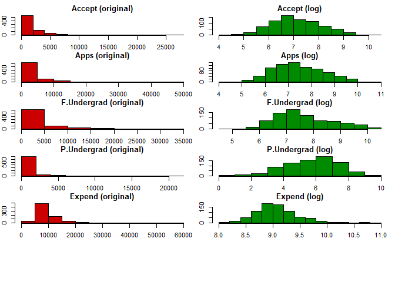
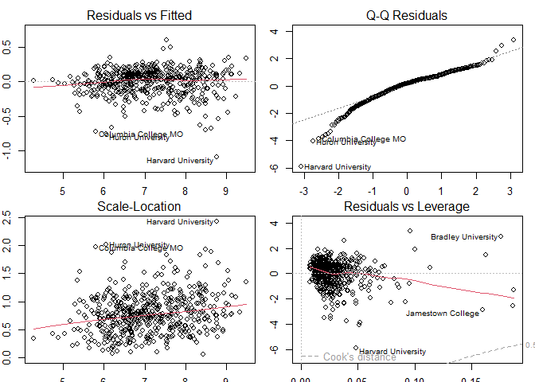
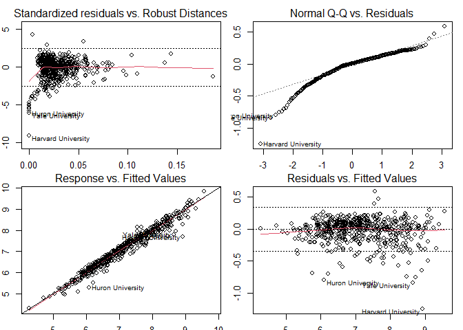
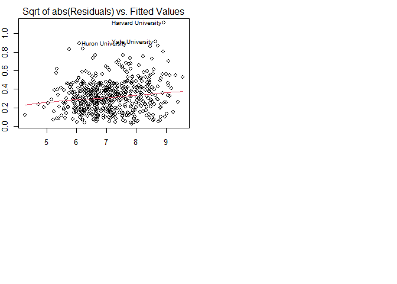
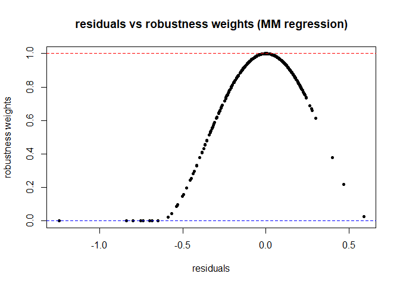
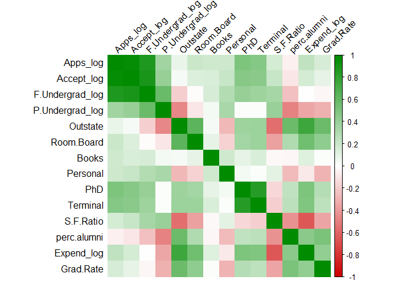
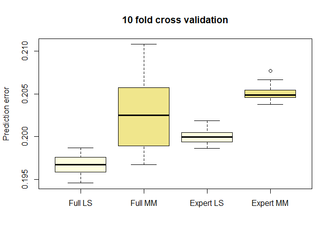
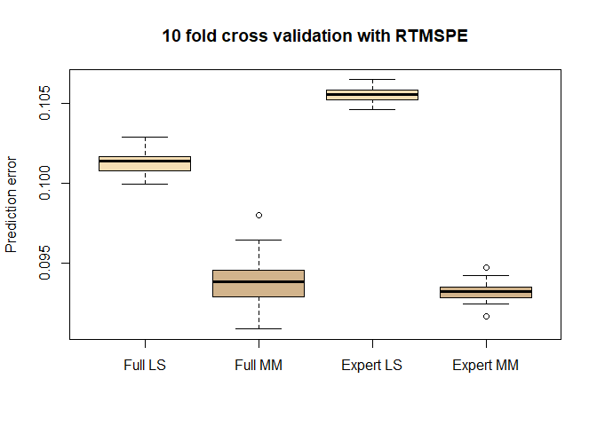
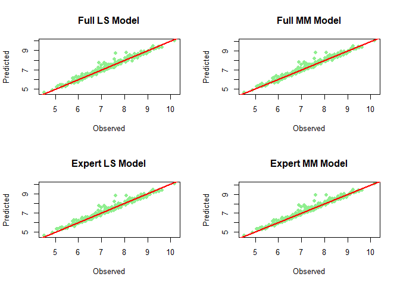

Robust regression for college acceptance prediction
================
Georgios Papadopoulos \|
2025-11-01

*Comparing least squares and robust regression models for predicting
college acceptance rates in R*

# Preparation

After loading and summarizing, I removed the three unwanted variables.
Applied log transformation where needed and renamed columns.
Additionally I visualize the skewness of before vs after log transforms.

``` r
library(ISLR)
data("College")
#summary(College)

college_data <- College[, !(names(College) %in% c("Enroll", "Top10perc", "Top25perc"))]

college_data$Accept      <- log1p(college_data$Accept)
college_data$Apps        <- log1p(college_data$Apps)
college_data$F.Undergrad <- log1p(college_data$F.Undergrad)
college_data$P.Undergrad <- log1p(college_data$P.Undergrad)
college_data$Expend      <- log1p(college_data$Expend)

names(college_data)[names(college_data) == "Accept"]      <- "Accept_log"
names(college_data)[names(college_data) == "Apps"]        <- "Apps_log"
names(college_data)[names(college_data) == "F.Undergrad"] <- "F.Undergrad_log"
names(college_data)[names(college_data) == "P.Undergrad"] <- "P.Undergrad_log"
names(college_data)[names(college_data) == "Expend"]      <- "Expend_log"

par(mfrow = c(6, 2), mar = c(1.5, 2, 2, 1), oma = c(0, 0, 0, 0))

hist(College$Accept, main = "Accept (original)", col = "red3")
hist(college_data$Accept_log, main = "Accept (log)", col = "green4")

hist(College$Apps, main = "Apps (original)", col = "red3")
hist(college_data$Apps_log, main = "Apps (log)", col = "green4")

hist(College$F.Undergrad, main = "F.Undergrad (original)", col = "red3")
hist(college_data$F.Undergrad_log, main = "F.Undergrad (log)", col = "green4")

hist(College$P.Undergrad, main = "P.Undergrad (original)", col = "red3")
hist(college_data$P.Undergrad_log, main = "P.Undergrad (log)", col = "green4")

hist(College$Expend, main = "Expend (original)", col = "red3")
hist(college_data$Expend_log, main = "Expend (log)", col = "green4")
```



``` r
set.seed(123)

n <- nrow(college_data)
train_index <- sample(1:n, size = round(2/3 * n))

train <- college_data[train_index, ]
test  <- college_data[-train_index, ]
```

# 1. Full least squares regression model

The OLS regression model was fitted on the training data using all
available predictors after log-transforming the skewed variables. With
$R^2$ of 0.9618 and high F statistic of 904.1 with small p it confirms
that the overall model is highly significant.

- Among the predictors, the most influential predictors are `Apps_log`,
  `F.Undergrad_log`, and `Outstate`
- Significant negative predictors are Books`and`Expend_log\`

The residuals are approximately symmetric around zero, therefore we
assume no major violations of model assumptions and no bias.

**Regarding each plot:**

- The residuals vs fitted plot shows residuals primarily between 0 and
  ±0.5. The distribution is slightly asymmetric, with more colleges
  showing small positive residuals and fewer with larger negative
  residuals. The lower part of the plot is sparser and Harvard
  University stands out with a residual below –1 which I think means
  that it accepted fewer students than the model captures.
- The QQ plot shows that most residuals lie close to the diagonal line
  which means close to normality. On the upper right tail, there are few
  to no deviations, whereas on the lower left side several points
  deviate from the line. These outliers I think represent universities
  that accepted far fewer students than the regression captures. The
  most pronounced outlier is Harvard University which means that this
  University’s acceptance behavior differs a lot from the regression
  model.
- The scale location plot shows a good spread of points that are are
  evenly scattered without a clear increasing or decreasing pattern.
  Therefore homoscedasticity holds.
- The Residuals vs Leverage plot shows most colleges have small
  residuals, therefore there is a dense cluster. A few high-leverage
  cases on the right side stand out. Harvard University appears on the
  lower-left side which means low leverage but a large negative
  residual. This means that Harvard’s predictor values are not extreme
  compared to other colleges, yet the model substantially overestimates
  its number of accepted students.

``` r
model_ls <- lm(Accept_log ~ ., data = train)

summary(model_ls)
```

    ## 
    ## Call:
    ## lm(formula = Accept_log ~ ., data = train)
    ## 
    ## Residuals:
    ##      Min       1Q   Median       3Q      Max 
    ## -1.09503 -0.09892  0.03393  0.11435  0.60872 
    ## 
    ## Coefficients:
    ##                   Estimate Std. Error t value Pr(>|t|)    
    ## (Intercept)      1.650e+00  3.551e-01   4.647 4.31e-06 ***
    ## PrivateYes       8.458e-02  3.418e-02   2.474 0.013675 *  
    ## Apps_log         8.060e-01  2.047e-02  39.378  < 2e-16 ***
    ## F.Undergrad_log  1.526e-01  2.493e-02   6.120 1.88e-09 ***
    ## P.Undergrad_log  5.019e-03  8.020e-03   0.626 0.531679    
    ## Outstate         1.452e-05  4.370e-06   3.323 0.000956 ***
    ## Room.Board      -3.095e-05  1.096e-05  -2.824 0.004936 ** 
    ## Books           -1.855e-04  5.442e-05  -3.409 0.000704 ***
    ## Personal         8.281e-06  1.442e-05   0.574 0.565983    
    ## PhD             -9.222e-04  1.038e-03  -0.888 0.374721    
    ## Terminal         2.011e-03  1.128e-03   1.783 0.075215 .  
    ## S.F.Ratio       -1.715e-03  3.173e-03  -0.541 0.589013    
    ## perc.alumni      1.748e-04  9.051e-04   0.193 0.846940    
    ## Expend_log      -1.837e-01  4.026e-02  -4.563 6.34e-06 ***
    ## Grad.Rate       -1.803e-03  6.476e-04  -2.784 0.005564 ** 
    ## ---
    ## Signif. codes:  0 '***' 0.001 '**' 0.01 '*' 0.05 '.' 0.1 ' ' 1
    ## 
    ## Residual standard error: 0.1904 on 503 degrees of freedom
    ## Multiple R-squared:  0.9618, Adjusted R-squared:  0.9607 
    ## F-statistic: 904.1 on 14 and 503 DF,  p-value: < 2.2e-16

``` r
par(mfrow = c(2, 2), mar = c(1.5, 2, 2, 1), oma = c(0, 0, 0, 0))
plot(model_ls)
```



# 2. Full MM-regression model

The MM regression achieved a robust residual standard error of 0.1369
and an $R^2$ of 0.9767, slightly better than the LS model. Most
predictors kept their direction and significance. `Apps_log` remains the
dominant predictors while others became less significant. Eight
observations incl. Harvard university received zero robustness weights
which means that they were completely excluded from influencing the fit.
This highlights the advantage of MM-regression, which stabilizes
coefficient estimates by downweighting such outliers.

``` r
rownames(train)[c(29,49,61,158,197,261,463,476)]
```

    ## [1] "Columbia College MO"            "Yale University"               
    ## [3] "Dartmouth College"              "Huron University"              
    ## [5] "Georgetown University"          "Duke University"               
    ## [7] "Harvard University"             "California Lutheran University"

- The standardized residuals vs robust mahalanobis distances plot shows
  that most colleges are close to the center, meaning their predictor
  values and residuals are typical. Outliers like Harvard and Yale were
  downweighted by the robust method, so they no longer affect the model.
- The Normal QQ plot for the MM regression shows a much narrower range
  of residuals compared to the LS model. Outliers such as Harvard and
  Yale which previously had extreme negative residuals around –4, now
  appear between –0.5 and –1. This indicates that the robust estimation
  successfully reduced their influence
- The response vs fitted plot shows most colleges lying close to the
  diagonal line therefore the predicted and observed log-acceptance
  values match closely. A few institutions, such as Harvard and Yale,
  fall below the line, meaning the model overestimates their
  acceptances.
- The squared residuals vs fitted values plot, also known as the scale
  location plot, shows a horizontal pattern that the variance of
  residuals remains constant across fitted values. The squared residuals
  on the y axis from the MM regression are smaller by 1 compared to the
  OLS regression.

``` r
library(robustbase)
model_mm <- lmrob(Accept_log ~ ., data = train)
summary(model_mm)
```

    ## 
    ## Call:
    ## lmrob(formula = Accept_log ~ ., data = train)
    ##  \--> method = "MM"
    ## Residuals:
    ##       Min        1Q    Median        3Q       Max 
    ## -1.245523 -0.115989  0.006317  0.088900  0.588172 
    ## 
    ## Coefficients:
    ##                   Estimate Std. Error t value Pr(>|t|)    
    ## (Intercept)      7.606e-01  4.783e-01   1.590  0.11245    
    ## PrivateYes       1.138e-01  3.659e-02   3.109  0.00199 ** 
    ## Apps_log         8.070e-01  3.484e-02  23.163  < 2e-16 ***
    ## F.Undergrad_log  1.727e-01  4.160e-02   4.152 3.88e-05 ***
    ## P.Undergrad_log -3.801e-04  9.097e-03  -0.042  0.96669    
    ## Outstate         1.204e-05  4.640e-06   2.594  0.00977 ** 
    ## Room.Board      -2.602e-05  1.018e-05  -2.557  0.01084 *  
    ## Books           -1.771e-04  1.194e-04  -1.483  0.13870    
    ## Personal         9.505e-07  1.526e-05   0.062  0.95035    
    ## PhD              2.098e-04  8.595e-04   0.244  0.80722    
    ## Terminal         3.171e-04  8.925e-04   0.355  0.72248    
    ## S.F.Ratio        2.425e-03  3.451e-03   0.703  0.48252    
    ## perc.alumni      4.645e-04  7.469e-04   0.622  0.53432    
    ## Expend_log      -9.714e-02  5.583e-02  -1.740  0.08247 .  
    ## Grad.Rate       -2.135e-03  6.721e-04  -3.177  0.00158 ** 
    ## ---
    ## Signif. codes:  0 '***' 0.001 '**' 0.01 '*' 0.05 '.' 0.1 ' ' 1
    ## 
    ## Robust residual standard error: 0.1369 
    ## Multiple R-squared:  0.9767, Adjusted R-squared:  0.9761 
    ## Convergence in 32 IRWLS iterations
    ## 
    ## Robustness weights: 
    ##  8 observations c(29,49,61,158,197,261,463,476)
    ##   are outliers with |weight| = 0 ( < 0.00019); 
    ##  54 weights are ~= 1. The remaining 456 ones are summarized as
    ##    Min. 1st Qu.  Median    Mean 3rd Qu.    Max. 
    ## 0.02397 0.85210 0.94330 0.87310 0.98320 0.99900 
    ## Algorithmic parameters: 
    ##        tuning.chi                bb        tuning.psi        refine.tol 
    ##         1.548e+00         5.000e-01         4.685e+00         1.000e-07 
    ##           rel.tol         scale.tol         solve.tol          zero.tol 
    ##         1.000e-07         1.000e-10         1.000e-07         1.000e-10 
    ##       eps.outlier             eps.x warn.limit.reject warn.limit.meanrw 
    ##         1.931e-04         3.947e-08         5.000e-01         5.000e-01 
    ##      nResample         max.it       best.r.s       k.fast.s          k.max 
    ##            500             50              2              1            200 
    ##    maxit.scale      trace.lev            mts     compute.rd fast.s.large.n 
    ##            200              0           1000              0           2000 
    ##                   psi           subsampling                   cov 
    ##            "bisquare"         "nonsingular"         ".vcov.avar1" 
    ## compute.outlier.stats 
    ##                  "SM" 
    ## seed : int(0)

``` r
par(mfrow = c(2, 2), mar = c(1.5, 2, 2, 1), oma = c(0, 0, 0, 0))
plot(model_mm)
```



# 3. Residuals and robustness weights

The residuals vs robustness weights plot shows that most observations
have weights near 1, meaning they were fully included in the MM
regression estimation. The 8 universities with weights of 0 show they
were identified as strong outliers. These 8 universities show large
residuals but have been effectively downweighted to zero.

``` r
plot(model_mm$residuals, model_mm$rweights,
     xlab = "residuals",
     ylab = "robustness weights",
     main = "residuals vs robustness weights (MM regression)",
     pch = 20)
abline(h = 1, col = "red", lty = 2)
abline(h = 0, col = "blue", lty = 2)
```



To doublecheck that the identified outliers matched the observations
with a robustness weight of zero, I created a residual weight table to
confirm the weights equal to zero. The points on the blue line represent
these observations.

``` r
library(tidyverse)
#head(cbind(model_mm$residuals, model_mm$rweights))

cbind(residuals = model_mm$residuals, weights = model_mm$rweights) %>%
  as.data.frame() %>%
  filter(model_mm$rweights == 0)
```

    ##                                 residuals weights
    ## Columbia College MO            -0.6841154       0
    ## Yale University                -0.8383657       0
    ## Dartmouth College              -0.7390092       0
    ## Huron University               -0.8007245       0
    ## Georgetown University          -0.7552885       0
    ## Duke University                -0.6482401       0
    ## Harvard University             -1.2455227       0
    ## California Lutheran University -0.6994034       0

# 4. Limitations of LTS regression

The LTS regression method aims to obtain a robust fit by minimizing the
sum of the smallest squared residuals, basically ignoring extreme obs.
This makes it less sensitive to outliers than OLS. But when attempting
to apply the ltsReg() function to the full multivariate model in the
College dataset, the estimation fails with the error for following code:

``` r
model_lts_full <- ltsReg(Accept_log ~ ., data = train)
```

> Error in rdiag(x, id.n = id.n, …) : The MCD covariance matrix was
> singular.

This issue arises because ltsReg() relies on the Minimum Covariance
Determinant (MCD) estimator to identify a robust subset of the data.
When the design matrix includes many predictors or when some of them are
strongly correlated, as is the case here (e.g. Apps_log and
F.Undergrad_log are highly related), the covariance matrix of certain
subsets becomes singular and not invertible. Consequently, the algorithm
cannot compute the regression coefficients and the estimation process
stops.

``` r
numeric_vars <- train[, sapply(train, is.numeric)]
cor_matrix <- cor(numeric_vars, use = "pairwise.complete.obs")
library(corrplot)
corrplot(cor_matrix, method = "color", col = colorRampPalette(c("red3", "white", "green4"))(200), tl.col = "black", tl.srt = 45)
```



To make ltsReg() work, the model must be simplified to avoid
multicollinearity and reduce dimensionality. I only used the most
dominant predictor `Apps_log` that allows LTS regression to run.
Simplifying the model ensures that the covariance matrix can be
inverted.

``` r
model_lts_simple <- ltsReg(Accept_log ~ Apps_log , data = train)
```

# 5. Expert-specified acceptance model

Both models yield nearly identical conclusions, but the MM regression
provides a cleaner fit by ignoring extreme outliers. The LS model
achieved $R^2$ =0.958 with a residual standard error of 0.197. The MM
regression slightly improved the fit with $R^2$ = 0.976, residual error
= 0.137 and automatically downweighted the outlying colleges (e.g.,
Harvard, Yale, Duke) to reduce their influence on the results. The
significant predictors were consistent across both methods with
`Apps_log` and `F.Undergrad_log` showing the strongest positive effects
on acceptance rates.

``` r
model_ls_expert <- lm(Accept_log ~ Private + Apps_log + F.Undergrad_log + Outstate + Room.Board + Grad.Rate, data = train)
summary(model_ls_expert)
```

    ## 
    ## Call:
    ## lm(formula = Accept_log ~ Private + Apps_log + F.Undergrad_log + 
    ##     Outstate + Room.Board + Grad.Rate, data = train)
    ## 
    ## Residuals:
    ##      Min       1Q   Median       3Q      Max 
    ## -1.19368 -0.09454  0.04493  0.12539  0.59379 
    ## 
    ## Coefficients:
    ##                   Estimate Std. Error t value Pr(>|t|)    
    ## (Intercept)      1.901e-01  1.078e-01   1.764 0.078268 .  
    ## PrivateYes       7.501e-02  3.416e-02   2.196 0.028545 *  
    ## Apps_log         7.816e-01  2.049e-02  38.138  < 2e-16 ***
    ## F.Undergrad_log  1.671e-01  2.297e-02   7.272 1.34e-12 ***
    ## Outstate         3.365e-06  3.563e-06   0.945 0.345330    
    ## Room.Board      -3.480e-05  1.044e-05  -3.332 0.000924 ***
    ## Grad.Rate       -1.599e-03  6.149e-04  -2.600 0.009598 ** 
    ## ---
    ## Signif. codes:  0 '***' 0.001 '**' 0.01 '*' 0.05 '.' 0.1 ' ' 1
    ## 
    ## Residual standard error: 0.1973 on 511 degrees of freedom
    ## Multiple R-squared:  0.9583, Adjusted R-squared:  0.9578 
    ## F-statistic:  1958 on 6 and 511 DF,  p-value: < 2.2e-16

``` r
model_mm_expert <- lmrob(Accept_log ~ Private + Apps_log + F.Undergrad_log + Outstate + Room.Board + Grad.Rate, data = train)
summary(model_mm_expert)
```

    ## 
    ## Call:
    ## lmrob(formula = Accept_log ~ Private + Apps_log + F.Undergrad_log + Outstate + 
    ##     Room.Board + Grad.Rate, data = train)
    ##  \--> method = "MM"
    ## Residuals:
    ##       Min        1Q    Median        3Q       Max 
    ## -1.330544 -0.115126  0.009235  0.092187  0.496432 
    ## 
    ## Coefficients:
    ##                   Estimate Std. Error t value Pr(>|t|)    
    ## (Intercept)      1.533e-03  1.008e-01   0.015  0.98787    
    ## PrivateYes       8.887e-02  3.389e-02   2.623  0.00899 ** 
    ## Apps_log         8.250e-01  3.380e-02  24.410  < 2e-16 ***
    ## F.Undergrad_log  1.471e-01  3.701e-02   3.973 8.12e-05 ***
    ## Outstate         5.770e-06  3.991e-06   1.446  0.14886    
    ## Room.Board      -3.277e-05  8.719e-06  -3.759  0.00019 ***
    ## Grad.Rate       -1.435e-03  6.281e-04  -2.284  0.02276 *  
    ## ---
    ## Signif. codes:  0 '***' 0.001 '**' 0.01 '*' 0.05 '.' 0.1 ' ' 1
    ## 
    ## Robust residual standard error: 0.1374 
    ## Multiple R-squared:  0.9764, Adjusted R-squared:  0.9761 
    ## Convergence in 24 IRWLS iterations
    ## 
    ## Robustness weights: 
    ##  9 observations c(19,49,61,158,197,261,455,463,476)
    ##   are outliers with |weight| = 0 ( < 0.00019); 
    ##  40 weights are ~= 1. The remaining 469 ones are summarized as
    ##    Min. 1st Qu.  Median    Mean 3rd Qu.    Max. 
    ## 0.01524 0.85430 0.94610 0.87350 0.98260 0.99900 
    ## Algorithmic parameters: 
    ##        tuning.chi                bb        tuning.psi        refine.tol 
    ##         1.548e+00         5.000e-01         4.685e+00         1.000e-07 
    ##           rel.tol         scale.tol         solve.tol          zero.tol 
    ##         1.000e-07         1.000e-10         1.000e-07         1.000e-10 
    ##       eps.outlier             eps.x warn.limit.reject warn.limit.meanrw 
    ##         1.931e-04         3.947e-08         5.000e-01         5.000e-01 
    ##      nResample         max.it       best.r.s       k.fast.s          k.max 
    ##            500             50              2              1            200 
    ##    maxit.scale      trace.lev            mts     compute.rd fast.s.large.n 
    ##            200              0           1000              0           2000 
    ##                   psi           subsampling                   cov 
    ##            "bisquare"         "nonsingular"         ".vcov.avar1" 
    ## compute.outlier.stats 
    ##                  "SM" 
    ## seed : int(0)

# 6. Cross validation with standard prediction error

The MM regressions provide slightly more robust fits to the data, but
the Expert LS and Expert MM models achieve comparable accuracy with less
complexity. This makes the expert models more efficient. All four models
perform similarly in terms of predictive accuracy, with only minor
differences in their median errors and variability. Both expert models
despite using fewer predictors, show very compact error distributions
and stable results across repetitions. This demonstrates that reducing
the number of predictors does not harm predictive performance.

``` r
library(cvTools)
set.seed(123)

cv_ls         <- cvFit(lm,   Accept_log ~ .  , 
                       data = train,    y = train$Accept_log, K = 10, R = 50)
cv_mm         <- cvFit(lmrob,Accept_log ~ .  , 
                       data = train,    y = train$Accept_log, K = 10, R = 50)
cv_ls_expert  <- cvFit(lm,   Accept_log ~ Private + Apps_log + F.Undergrad_log + Outstate + Room.Board + Grad.Rate, 
                       data = train, y = train$Accept_log, K = 10, R = 50)
cv_mm_expert  <- cvFit(lmrob,Accept_log ~ Private + Apps_log + F.Undergrad_log + Outstate + Room.Board + Grad.Rate, 
                       data = train, y = train$Accept_log, K = 10, R = 50)

cv_errors <- data.frame(
  LS_Full    = cv_ls$reps,
  MM_Full    = cv_mm$reps,
  LS_Expert  = cv_ls_expert$reps,
  MM_Expert  = cv_mm_expert$reps
)

boxplot(cv_errors,
        col   = c("lightyellow", "khaki", "lightyellow", "khaki"),
        names = c("Full LS", "Full MM", "Expert LS", "Expert MM"),
        ylab  = "Prediction error",
        main  = "10 fold cross validation")
```



# 7. Cross validation with robust trimmed prediction error

I repeated the cross validation with root trimmed mean squared
prediction error (RTMSPE) as the cost function. RTMSPE trims a small
proportion of extreme prediction errors which makes it less sensitive to
outliers. This allows to evaluate the typical predictive performance of
each model rather than being influenced by a few extreme cases. So we
can compare all models based on a more robust error measure that
downweights the effect of outliers in the cross validation results.

This model comparison is more useful because it is more informative and
reliable because RTMSPE provides a fairer assessment of model
performance when outliers are present such as `Harvard` and `Yale`. From
the boxplots both LS models show higher prediction errors and the MM
regression models achieve lower and more consistent ones. The two MM
models perform similarly but the expert MM model is more compact and
narrower which means that its errors are more stable.

``` r
set.seed(123)

cv_ls_rtmspe         <- cvFit(lm,   Accept_log ~ .  , 
                       data = train,    y = train$Accept_log, K = 10, R = 50, cost = rtmspe)
cv_mm_rtmspe         <- cvFit(lmrob,Accept_log ~ .  , 
                       data = train,    y = train$Accept_log, K = 10, R = 50, cost = rtmspe)
cv_ls_expert_rtmspe  <- cvFit(lm,   Accept_log ~ Private + Apps_log + F.Undergrad_log + Outstate + Room.Board + Grad.Rate, 
                       data = train, y = train$Accept_log, K = 10, R = 50, cost = rtmspe)
cv_mm_expert_rtmspe  <- cvFit(lmrob,Accept_log ~ Private + Apps_log + F.Undergrad_log + Outstate + Room.Board + Grad.Rate, 
                       data = train, y = train$Accept_log, K = 10, R = 50, cost = rtmspe)

cv_errors_rtmspe <- data.frame(
  LS_Full    = cv_ls_rtmspe$reps,
  MM_Full    = cv_mm_rtmspe$reps,
  LS_Expert  = cv_ls_expert_rtmspe$reps,
  MM_Expert  = cv_mm_expert_rtmspe$reps
)

boxplot(cv_errors_rtmspe,
        col   = c("wheat", "tan", "wheat", "tan"),
        names = c("Full LS", "Full MM", "Expert LS", "Expert MM"),
        ylab  = "Prediction error",
        main  = "10 fold cross validation with RTMSPE")
```



# 8. Test set prediction and graphical evaluation

The plots compare the observed values of Accept_log with the predicted
values from each model. The red diagonal line represents perfect
prediction, where observed and predicted values are equal. Points close
to this line indicate accurate predictions, while larger deviations
indicate prediction errors.

Overall, all models show a clear positive relationship between observed
and predicted values, meaning that they capture the main structure in
the data reasonably well. The LS models show somewhat larger deviations
for some observations, which may be caused by the influence of outliers
or high-leverage points.

The MM regression models appear more robust, with predictions that are
less affected by extreme observations. The expert MM model performs
similarly to the full MM model, despite using fewer predictors. This
suggests that the expert selected variables contain most of the relevant
predictive information and that the simpler robust model may be
preferable.

Thus the expert MM model seems to provide a good compromise between
prediction accuracy, robustness, and model simplicity.

``` r
pred_ls        <- predict(model_ls, newdata = test)
pred_mm        <- predict(model_mm, newdata = test)
pred_ls_expert <- predict(model_ls_expert, newdata = test)
pred_mm_expert <- predict(model_mm_expert, newdata = test)

pred_df <- data.frame(
  Observed = test$Accept_log,
  LS_Full = pred_ls,
  MM_Full = pred_mm,
  LS_Expert = pred_ls_expert,
  MM_Expert = pred_mm_expert
)

par(mfrow = c(2, 2))
plot(pred_df$Observed, pred_df$LS_Full, 
     main = "Full LS Model", xlab = "Observed", ylab = "Predicted", pch = 19, col = "lightgreen")
abline(0, 1, lwd = 2, col = "red")

plot(pred_df$Observed, pred_df$MM_Full, 
     main = "Full MM Model", xlab = "Observed", ylab = "Predicted", pch = 19, col = "lightgreen")
abline(0, 1, lwd = 2, col = "red")

plot(pred_df$Observed, pred_df$LS_Expert, 
     main = "Expert LS Model", xlab = "Observed", ylab = "Predicted", pch = 19, col = "lightgreen")
abline(0, 1, lwd = 2, col = "red")

plot(pred_df$Observed, pred_df$MM_Expert, 
     main = "Expert MM Model", xlab = "Observed", ylab = "Predicted", pch = 19, col = "lightgreen")
abline(0, 1, lwd = 2, col = "red")
```


