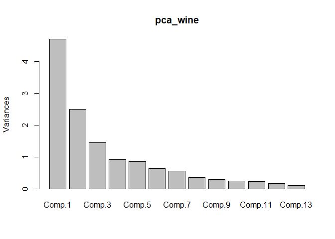
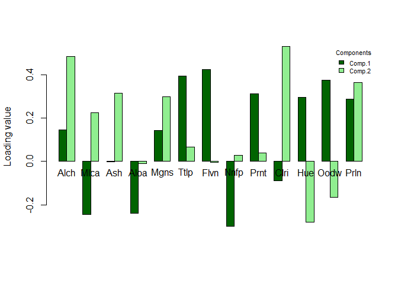
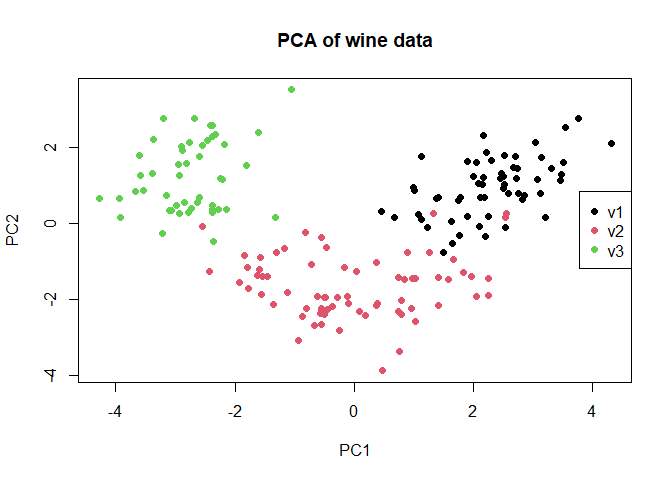
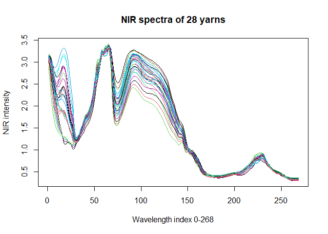
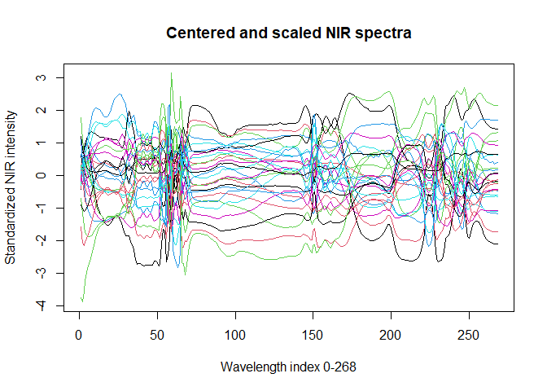
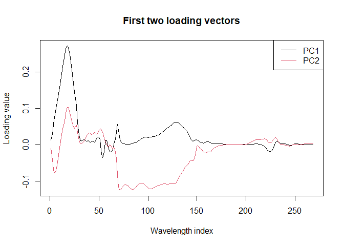
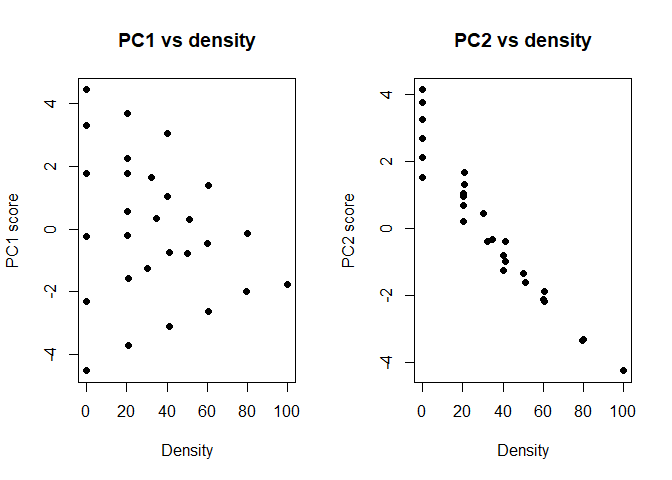

Principal component analysis for wine and spectral data
================
Georgios Papadopoulos
2025-11-08

*Dimensionality reduction and score interpretation using standardized
wine profiles and NIR spectra*

# 1. PCA of standardized wine characteristics

We performed a principal component analysis on the standardized wine
data using princomp() with the correlation matrix option. I ran PCA on
standardized data by excluding `Cult`

## 1.1 Variance explained by principal components

The output shows that the first few principal components explain most of
the total variance, suggesting a strong dimensional reduction potential.
The first component explains 36.2% of total variance, the second 19.2%,
and the first three together 66.5%. Five components already capture 80%,
while the remaining ones contribute little.

The plot shows a sharp drop after PC1–PC2, confirming that most
structure lies in the first few components.

``` r
library(doBy)
data("wine")
#?wine

pca_wine <- princomp(wine[, -1], cor = TRUE)

summary(pca_wine)
```

    ## Importance of components:
    ##                           Comp.1    Comp.2    Comp.3    Comp.4     Comp.5
    ## Standard deviation     2.1692972 1.5801816 1.2025273 0.9586313 0.92370351
    ## Proportion of Variance 0.3619885 0.1920749 0.1112363 0.0706903 0.06563294
    ## Cumulative Proportion  0.3619885 0.5540634 0.6652997 0.7359900 0.80162293
    ##                            Comp.6     Comp.7     Comp.8     Comp.9    Comp.10
    ## Standard deviation     0.80103498 0.74231281 0.59033665 0.53747553 0.50090167
    ## Proportion of Variance 0.04935823 0.04238679 0.02680749 0.02222153 0.01930019
    ## Cumulative Proportion  0.85098116 0.89336795 0.92017544 0.94239698 0.96169717
    ##                           Comp.11    Comp.12     Comp.13
    ## Standard deviation     0.47517222 0.41081655 0.321524394
    ## Proportion of Variance 0.01736836 0.01298233 0.007952149
    ## Cumulative Proportion  0.97906553 0.99204785 1.000000000

``` r
plot(pca_wine, npcs=13)
```



## 1.2 Interpretation of the first two loading vectors

Names of each can be found here `?wine`.

*PC1* has high positive loadings for flavanoids (0.4), total phenols
(0.39), OD280/OD315 (0.37), proanthocyanins (0.3), and proline (0.28),
as well as moderate contributions from alcohol and magnesium. It has
negative loadings for malic acid (-0.2), alcalinity of ash (-0.2) and
Nonflavanoid phenols (-0.29). This indicates that PC1 contrasts wines
with high phenolic and flavonoid content against those with nonflavanoid
levels.

*PC2* is mainly driven by color intensity (0.5), alcohol (0.48), proline
(0.36), ash (0.3) and magnesium (0.3), while hue (-0.28) contributes
negatively. This suggests that PC2 separates wines by color and
intensity. I imagine it as distinguishing darker from lighter wines with
lower color intensity and hue values. PC2 can be viewed as a so to say
“color and body” dimension.

``` r
pca_wine$loadings[, 1:2]
```

    ##            Comp.1       Comp.2
    ## Alch  0.144329395  0.483651548
    ## Mlca -0.245187580  0.224930935
    ## Ash  -0.002051061  0.316068814
    ## Aloa -0.239320405 -0.010590502
    ## Mgns  0.141992042  0.299634003
    ## Ttlp  0.394660845  0.065039512
    ## Flvn  0.422934297 -0.003359812
    ## Nnfp -0.298533103  0.028779488
    ## Prnt  0.313429488  0.039301722
    ## Clri -0.088616705  0.529995672
    ## Hue   0.296714564 -0.279235148
    ## Oodw  0.376167411 -0.164496193
    ## Prln  0.286752227  0.364902832

``` r
loadings_df <- as.data.frame(pca_wine$loadings[, 1:2])

barplot1b <- barplot(t(as.matrix(loadings_df)), beside = TRUE,
                     col = c("darkgreen", "lightgreen"),
                     ylab = "Loading value", xaxt = "n")

text(colMeans(barplot1b), -0.05, labels = rownames(loadings_df), xpd = TRUE)

legend("topright",legend = colnames(loadings_df), fill = c("darkgreen", "lightgreen"),title = "Components", bty = "n", cex = 0.7,pt.cex = 0.7)
```



## 1.3 Score plot by wine cultivar

We stay again with the first 2 components by extracting and plotting the
scores of them.

The scatterplot of the first two PCs reveals clear clustering among the
three wine varieties. Along PC1 axis –4 to 4: clut v3 dominates the
range from about –4 to –2, forming a tight, distinct cluster. Cult v2
occupies the central region from –2 to 2 with only a few wines from cult
v1 overlapping. In the positive range 0 to 4, cult v1 forms a compact
group, slightly overlapping with a few samples of v2.

Along PC2 axis from 0 to 2 mainly include v1 and v3, each forming its
own distinct cluster. Although v1 and v3 share similar PC2 values, they
differ strongly along PC1.

v2 dominates the lower region of PC2 from 0 to –4 which separates it
from the other two varieties.

Therefore the plot confirms part b: - PC1 distinguishes wines flavonoid
content against those with nonflavanoid levels, - PC2 separates them by
color intensity and body.

``` r
scores <- pca_wine$scores

plot(scores[, 1], scores[, 2],
     col = wine$Cult, pch = 19, xlab = "PC1", ylab = "PC2",
     main = "PCA of wine data")

legend("right", legend = levels(wine$Cult),
       col = 1:length(levels(wine$Cult)), pch = 19)
```



## 1.4 Robust PCA with princomp

The standard PCA computed with `princomp()` relies on the classical
sample covariance matrix, which assumes that the data are normally
distributed and free of outliers. However, when a dataset contains
extreme or atypical observations, these points can distort the
covariance structure and thus the direction of the principal components.

To make PCA more resistant to such distortions, a robust covariance
estimator can be used in place of the classical one. A common choice is
the Minimum Covariance Determinant (MCD) estimator, which identifies a
subset of observations whose covariance matrix has the smallest
determinant and then uses it to represent the overall data structure.
This reduces the effect of outliers on the estimated variances and
correlations.

By supplying this robust covariance matrix to the PCA computation, the
resulting robust principal components reflect the dominant structure of
the majority of the data rather than being influenced by a few extreme
values. This approach is particularly useful when working with unusual
samples that could heavily bias the results.

# 2. PCA of NIR spectra from PET yarns

The yarn dataset contains measurements from 28 yarn samples analyzed
using Near Infrared (NIR). For each of the 28 yarns there are 268
different NIR wavelengths, stored as a matrix in the variable
`yarn$NIR`. The dataset includes `yarn$density` as a numeric value for
each yarn how dense it is, and `yarn$train` that shows whether the
sample belongs to the training or test subset.

``` r
library(pls)
data("yarn")
str(yarn)
```

    ## 'data.frame':    28 obs. of  3 variables:
    ##  $ NIR    : num [1:28, 1:268] 3.07 3.07 3.08 3.08 3.1 ...
    ##   ..- attr(*, "dimnames")=List of 2
    ##   .. ..$ : NULL
    ##   .. ..$ : NULL
    ##  $ density: num  100 80.2 79.5 60.8 60 ...
    ##  $ train  : logi  TRUE TRUE TRUE TRUE TRUE TRUE ...

# 2.1 Visualization of raw spectra

Each of the 28 yarn samples appears as a smooth curve showing NIR
intensity across 268 wavelengths. All yarns follow a similar shape,
which reflects their common PET composition. Small differences in
intensity are visible between samples. These subtle differences are what
PCA will capture as the main sources of variation in the dataset.

``` r
matplot(t(yarn$NIR), type = "l", lty = 1,
        xlab = "Wavelength index 0-268",
        ylab = "NIR intensity",
        main = "NIR spectra of 28 yarns")
```



# 2.2 Visualization of centered and scaled spectra

After centering and scaling the plot shows all 28 yarn spectra now
centered around zero. Because each wavelength variable was standardized
to have equal variance, the curves overlap more densely and appear less
smooth. I expected this because scaling removes the absolute intensity
differences and focuses only on relative variation around the mean
spectrum.

Scaling is important because it ensures that all wavelengths contribute
equally to the PCA. Without scaling, high variance wavelength regions
like 100–150 would dominate the components which causes PCA to reflect
differences in magnitude rather than overall curve form. By centering
and scaling, the analysis focuses instead on the relative patterns and
shapes of the spectra across yarns, which is more appropriate for
interpreting chemical or structural variation.

However in this case, scaling means we lose the variation around all
wavelengths, for example we know from 1 a that most variation that would
PCA show as is around 0-35 wavelenth and then afain from 75 -150
wavelentghs. With scaling it looks messier and it would also give a
chance for PCA to include the wavelengths between 150-268 which in 1 a
we see they dont have enough variance for us to get significant
information for PCA. So long story short, scaling may not be preferable
here.

``` r
matplot(t(scale(yarn$NIR)), type = "l", lty = 1,
        xlab = "Wavelength index 0-268",
        ylab = "Standardized NIR intensity",
        main = "Centered and scaled NIR spectra")
```



# 2.3 Limitations of princomp for high-dimensional spectra

I attempted to compute the PCA using `princomp(yarn$NIR)`. This resulted
in an error message indicating that it can only be used with more units
than variables.

Basically the error happens because the data matrix has p = 268
variables (wavelengths) but only n = 28 obs of yarns. When `p>n` then
the covariance matrix that princomp() tries to compute is singular. It
cannot be inverted because the number of variables exceeds the number of
samples. The covariance matrix doesn’t have full rank, so princomp()
cannot perform the eigenvalue decomposition and fails.

This happens because princomp() performs PCA through eigen decomposition
of the covariance matrix, which requires that matrix to be invertible.
In this case, the covariance matrix is square 268 x 268 but not full
rank, and therefore not invertible, causing the function to fail.

With following snippet I show that it is indeed a singular eigenvector.

``` r
#cov_yarn <- cov(yarn$NIR)
#eigen(cov_yarn)$values
```

# 2.4 PCA with prcomp and loading interpretation

prcomp() works because it does not require inverting the covariance
matrix. Instead, it directly decomposes the yarn data matrix X into: $$
X = U D V^{\top} $$

- U is the left singular vectors (n×n). It describes how each
  observation relates to the principal components `scores`.

- D is the diagonal matrix of singular values (n×p). It shows the
  importance or variance strength of each principal component.

- V (the rotation matrix) contains the `loadings` (p×p). It shows
  represent how each variable contributes to the principal components
  (loadings).

When we visualize the directions of the first two loadings I observed
that PC1 represents wavelength regions with consistently lower loading
values and negative direction, while PC2 emphasizes those with moderate
positive contributions.

For the first component the loadings are mostly negative over the first
40 wavelength positions, whereas PC2 shows positive values in that
region. Between wavelengths 40 and 60, both components fluctuate around
zero, indicating limited contribution from this range. From
approximately 60 to 200, PC1 remains strongly negative, while PC2 is
moderately positive, suggesting that these wavelength regions drive most
of the variation captured by the first two components.

For `prcomp()` center = TRUE is the default.

``` r
pca_yarn <- prcomp(yarn$NIR, center = TRUE, scale = FALSE)

summary(pca_yarn)
```

    ## Importance of components:
    ##                           PC1    PC2    PC3     PC4     PC5     PC6     PC7
    ## Standard deviation     2.2746 2.1461 0.2937 0.15205 0.13290 0.09501 0.02885
    ## Proportion of Variance 0.5217 0.4644 0.0087 0.00233 0.00178 0.00091 0.00008
    ## Cumulative Proportion  0.5217 0.9860 0.9947 0.99704 0.99882 0.99973 0.99982
    ##                            PC8     PC9    PC10    PC11    PC12     PC13
    ## Standard deviation     0.02474 0.01568 0.01515 0.01368 0.01076 0.009336
    ## Proportion of Variance 0.00006 0.00002 0.00002 0.00002 0.00001 0.000010
    ## Cumulative Proportion  0.99988 0.99990 0.99993 0.99995 0.99996 0.999970
    ##                            PC14     PC15     PC16     PC17     PC18     PC19
    ## Standard deviation     0.007795 0.007364 0.006911 0.005997 0.005734 0.005212
    ## Proportion of Variance 0.000010 0.000010 0.000000 0.000000 0.000000 0.000000
    ## Cumulative Proportion  0.999970 0.999980 0.999980 0.999990 0.999990 0.999990
    ##                            PC20     PC21     PC22     PC23    PC24     PC25
    ## Standard deviation     0.004029 0.003878 0.003573 0.002814 0.00243 0.002291
    ## Proportion of Variance 0.000000 0.000000 0.000000 0.000000 0.00000 0.000000
    ## Cumulative Proportion  0.999990 1.000000 1.000000 1.000000 1.00000 1.000000
    ##                            PC26     PC27      PC28
    ## Standard deviation     0.002089 0.001555 1.239e-15
    ## Proportion of Variance 0.000000 0.000000 0.000e+00
    ## Cumulative Proportion  1.000000 1.000000 1.000e+00

``` r
matplot(pca_yarn$rotation[, 1:2], type = "l", lty = 1,
        xlab = "Wavelength index",
        ylab = "Loading value",
        main = "First two loading vectors")
legend("topright", legend = c("PC1", "PC2"), col = 1:2, lty = 1)
```



# 2.5 Relationship between PCA scores and yarn density

In the PC1 vs density plot, yarns with lower density have the highest
PC1 scores, while those with higher density show much lower PC1 scores.
This indicates a negative relationship between density and the PC1.
Since PC1 represents the dominant source of spectral variation, this
suggests that the main spectral trend captured by PCA is inversely
related to yarn density. Basically denser yarns have lower values along
PC1, likely reflecting differences in NIR wavelength intensity linked to
material compactness I would argue.

However the PC2 vs density plot shows no clear pattern, meaning that PC2
describes variations unrelated to density.

``` r
scores_yarn <- pca_yarn$x

par(mfrow = c(1, 2))

plot(yarn$density, pca_yarn$x[, 1],
     pch = 19,
     xlab = "Density", ylab = "PC1 score",
     main = "PC1 vs density")

plot(yarn$density, pca_yarn$x[, 2],
     pch = 19,
     xlab = "Density", ylab = "PC2 score",
     main = "PC2 vs density")
```



# 2.6 Robust PCA with prcomp

The standard `prcomp()` computes PCA using the classical covariance
structure which is sensitive to outliers. To obtain robust principal
components we could first compute a robust covariance matrix using the
Minimum Covariance Determinant MCD estimator from the `robustbase`
package and then use this matrix as the basis for PCA.
