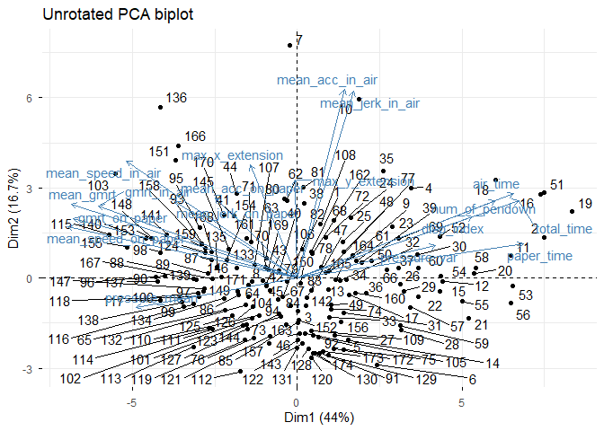
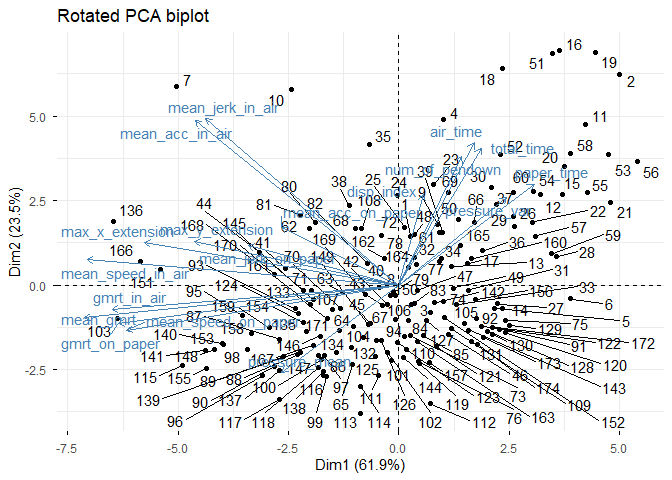
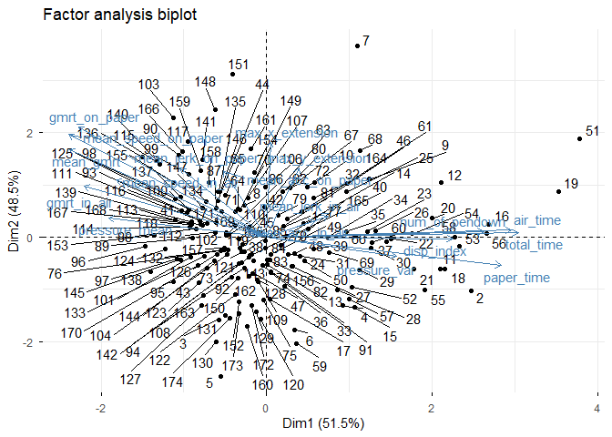

Rotated PCA and factor analysis of handwriting features
================
Georgios Papadopoulos \|
2025-11-22

*Comparing rotated principal components and latent factor structures in
handwriting measurements*

# 1. Rotated principal components

The darwinM dataset contains 19 handwriting measurements collected from
two groups/classes of participants: healthy people `H` and patients
diagnosed with Alzheimer’s `P`. Each participant completed 25
standardized writing tasks and our data has the median per
measurement/variable. The dataset includes variables describing timing,
speed, acceleration, pressure, jerk etc.

With `summary(PCA)` I can explore that cumulative proportion of PC1 and
PC2 is 0.61, meaning that the first two components account for 61% of
total variance in the data. So a large part of the multivariate dataset
can be represented in a two-dimensional PCA plot, making PC1 and PC2
suitable for visualizing.

``` r
load("darwinM.RData")

X <- darwinM[, -19]

pca <- princomp(X, cor = TRUE, center = TRUE)

summary(pca)
```

    ## Importance of components:
    ##                          Comp.1    Comp.2    Comp.3     Comp.4     Comp.5
    ## Standard deviation     2.813338 1.7320300 1.3682089 1.21246674 0.82435004
    ## Proportion of Variance 0.439715 0.1666627 0.1039998 0.08167087 0.03775294
    ## Cumulative Proportion  0.439715 0.6063777 0.7103774 0.79204831 0.82980125
    ##                            Comp.6     Comp.7     Comp.8     Comp.9    Comp.10
    ## Standard deviation     0.77676985 0.73728472 0.64778689 0.63985388 0.51293098
    ## Proportion of Variance 0.03352063 0.03019938 0.02331266 0.02274517 0.01461657
    ## Cumulative Proportion  0.86332189 0.89352126 0.91683392 0.93957909 0.95419565
    ##                           Comp.11     Comp.12     Comp.13     Comp.14
    ## Standard deviation     0.48755466 0.400704045 0.378965004 0.315638027
    ## Proportion of Variance 0.01320609 0.008920207 0.007978582 0.005534854
    ## Cumulative Proportion  0.96740174 0.976321946 0.984300528 0.989835381
    ##                            Comp.15     Comp.16     Comp.17     Comp.18
    ## Standard deviation     0.244118391 0.240151168 0.201587857 0.158300665
    ## Proportion of Variance 0.003310766 0.003204032 0.002257648 0.001392172
    ## Cumulative Proportion  0.993146147 0.996350180 0.998607828 1.000000000

## 1.1 Selecting the number of components

I selected k=3 principal components so the cumulative explained variance
is more than 70% because rotation should only be applied to the
meaningful part of the PCA solution. 60% variance with the first 2 PCs
leaves a lot of information out and leads to incomplete rotated result.

## 1.2 Varimax rotation of PCA loadings

I extracted the unrotated loadings of the first k components and applied
varimax rotation to make the structure easier to interpret. Varimax
rotation makes the components easier to interpret by pushing loadings
either very high or near zero. That’s why each variable ends up clearly
associated with one specific component instead of being spread across
several.

`varimax_res`contains `loadings` and `rotmat` rotation matrix

Then I created the rotated scores by multiplying the PCA scores with the
rotation matrix.

``` r
k <- 3

loadings_unrot <- unclass(pca$loadings)[, 1:k]

varimax_res <- varimax(loadings_unrot)

loadings_rot <- varimax_res$loadings
```

## 1.3 Rotation of PCA scores

I applied the same orthogonal rotation matrix used for the loadings to
rotate the PC scores.

Then I multiplied the PCA scores with the rotation matrix.

``` r
rotation_matrix <- varimax_res$rotmat
scores_rot <- pca$scores[, 1:k] %*% rotation_matrix
```

## 1.4 Biplot comparison of rotated and unrotated PCA

In the unrotated PCA biplot, PC1 captures the largest proportion of
variance and PC2 captures the second largest, but the loading structure
is difficult to interpret because many variables have moderate
contributions to both dimensions. For example pressure_mean loads
heavily on PC1 but only weakly on PC2. Another example is
max_y_extension because it contributes strongly to PC2 and nothing to
PC1.

Before rotation:

- PC1 explains 44% variance

- PC2 explains 16.7% variance

These percentages come directly from the eigenvalues of PCA. After
rotation the rotation redistributes the variance among the k PCs.

After rotating here for k = 3 the rotation tries to even out and
simplify the loadings. The percentages on the rotated axes refer to how
much of the total variance of k components is explained by RC1 and RC2

- Rotated PC1 = 61.9%

- Rotated PC2 = 23.5%

- Rotated PC3 = 100% - (61.9% + 23.5%) = 14.6% since k = 3

The loadings become clearer because variables cluster more distinctly
along the rotated axes. Now pressure_mean shows a more balanced
influence on both RC1 and RC2. Similarly, max_y_extension still loads
strongly on RC1 but I can now also see a loading on the second rotated
component. This reveals that within the selected k = 3 subspace,
max_y_extension contributes primarily to one latent dimension but also
plays a secondary role in another.

I used `repel = TRUE` so that variable names in the biplot don’t
overlap.

``` r
library(factoextra)

fviz_pca_biplot(
  pca,
  repel = TRUE,
  title = "Unrotated PCA biplot"
)
```



``` r
pca_rotated <- list(
  x = scores_rot,     
  rotation = loadings_rot,
  center = pca$center,
  scale = pca$scale,
  sdev = pca$sdev[1:k]
)

class(pca_rotated) <- "prcomp"     # trick fviz_pca_biplot into accepting it

fviz_pca_biplot(
  pca_rotated,
  repel = TRUE,
  title = "Rotated PCA biplot"
)
```



# 2. Factor analysis of handwriting features

I selected k=3 because before I found out that 3 PCs explain 70%
cumulative variance of the data which is sufficient.

## 2.1 Factor model estimation

The factor analysis with 3 factors explains 63.1% of the total variance.
Variables with low values like air_time, gmrt_on_paper, mean_acc_in_air
and in-air jerk total_time have low uniqueness. That means the factor
analysis explain these variables well. Variables with high uniqueness
are less related to the 3 factors.

The chi-square test indicates that 3 factors do not fully reproduce the
correlation matrix.

``` r
k <- 3

fa <- factanal(scale(X), factors = k, scores = "regression")

fa
```

    ## 
    ## Call:
    ## factanal(x = scale(X), factors = k, scores = "regression")
    ## 
    ## Uniquenesses:
    ##            air_time          disp_index         gmrt_in_air       gmrt_on_paper 
    ##               0.100               0.508               0.383               0.049 
    ##     max_x_extension     max_y_extension     mean_acc_in_air   mean_acc_on_paper 
    ##               0.662               0.803               0.012               0.804 
    ##           mean_gmrt    mean_jerk_in_air  mean_jerk_on_paper   mean_speed_in_air 
    ##               0.154               0.049               0.703               0.398 
    ## mean_speed_on_paper      num_of_pendown          paper_time       pressure_mean 
    ##               0.058               0.314               0.197               0.633 
    ##        pressure_var          total_time 
    ##               0.741               0.070 
    ## 
    ## Loadings:
    ##                     Factor1 Factor2 Factor3
    ## air_time             0.917           0.240 
    ## disp_index           0.697                 
    ## gmrt_in_air         -0.685   0.310   0.229 
    ## gmrt_on_paper       -0.705   0.674         
    ## max_x_extension              0.580         
    ## max_y_extension      0.123   0.425         
    ## mean_acc_in_air      0.181   0.101   0.972 
    ## mean_acc_on_paper   -0.163   0.404         
    ## mean_gmrt           -0.738   0.534   0.129 
    ## mean_jerk_in_air     0.229   0.127   0.940 
    ## mean_jerk_on_paper  -0.325   0.422   0.117 
    ## mean_speed_in_air   -0.564   0.350   0.400 
    ## mean_speed_on_paper -0.742   0.626         
    ## num_of_pendown       0.812           0.159 
    ## paper_time           0.877  -0.173         
    ## pressure_mean       -0.592   0.114         
    ## pressure_var         0.486  -0.115         
    ## total_time           0.941           0.208 
    ## 
    ##                Factor1 Factor2 Factor3
    ## SS loadings      6.839   2.294   2.230
    ## Proportion Var   0.380   0.127   0.124
    ## Cumulative Var   0.380   0.507   0.631
    ## 
    ## Test of the hypothesis that 3 factors are sufficient.
    ## The chi square statistic is 664.75 on 102 degrees of freedom.
    ## The p-value is 2.09e-83

## 2.2 Maximum number of factors

The largest number of factors I could technically use is the number of
variables minus one. Since we have 18 variables because I removed
`class`, the maximum possible number of factors is k = 17.

However large k don’t make sense in practice. Factor analysis is only
useful with a small number of factors, usually around k=5.

## 2.3 PCA and factor analysis comparison

In PCA, the loadings show how much each variable contributes to the
principal components, which represent directions of maximum variation in
the data. In factor analysis, the loadings show how strongly each
variable relates to hidden factors that explain the common patterns in
the dataset. So basically PCA looks at total variance, while factor
analysis looks only at shared variance.

The scores also differ. PCA scores come from projecting each observation
onto the principal components. Factor scores are estimates of how much
each observation expresses each latent factor. They depend on the
statistical model and the method used to compute them.

Uniquenesses are special to factor analysis. They show how much of a
variable’s variance the factors cannot explain. I already described them
in section 2.1 but basically:

- A low uniqueness means the factors explain the variable well closer to
  0.

- A high uniqueness means the variable mostly contains its own specific
  variation or noise closer to 1.

## 2.4 Factor biplot and interpretation

Similar to PCA, I assign the factor scores and factor loadings for the
first two factors for the biplot. I put them in a list structure so
visualization works. Compared to PCA the first two factors from factor
analysis are easier to interpret.

- Factor 1 has strong loadings on air_time, paper_time and total_time.
  It represents the time a person writes.

- Factor 2 has high loadings on gmrt_on_paper, mean_speed_on_paper, and
  the extension variables. It shows how fast a person writes. PCA
  combined these patterns more loosely, while factor analysis separates
  them into two clear underlying dimensions.

``` r
FA_scores   <- fa$scores[, 1:2]
FA_loadings <- fa$loadings[, 1:2]

fa_biplot_obj <- list(
  sdev     = apply(FA_scores, 2, sd),
  rotation = FA_loadings,
  center   = FALSE,
  scale    = FALSE,
  x        = FA_scores
)
class(fa_biplot_obj) <- "prcomp" #trick fviz_pca_biplot into accepting it

fviz_pca_biplot(fa_biplot_obj, repel = TRUE, title = "Factor analysis biplot")
```


