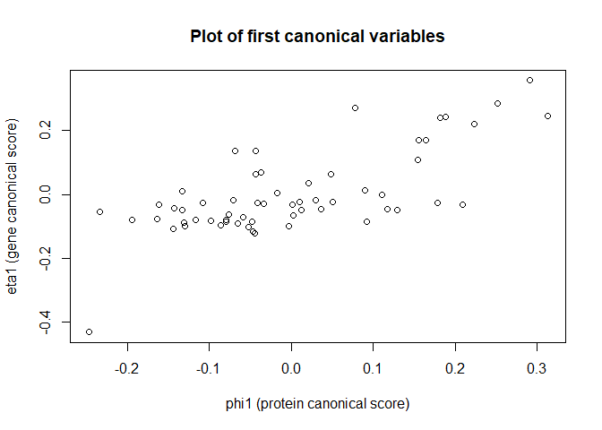
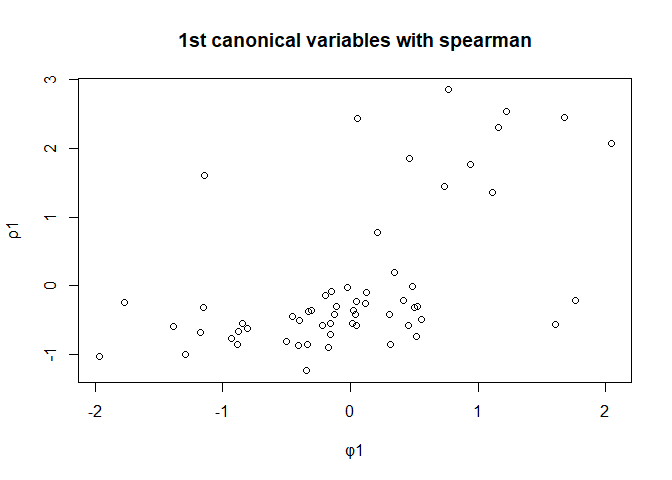
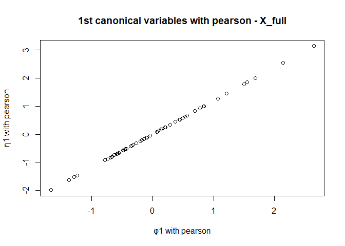
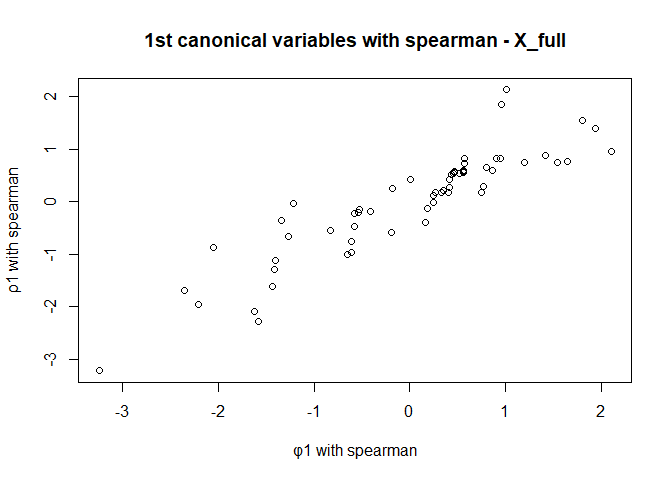
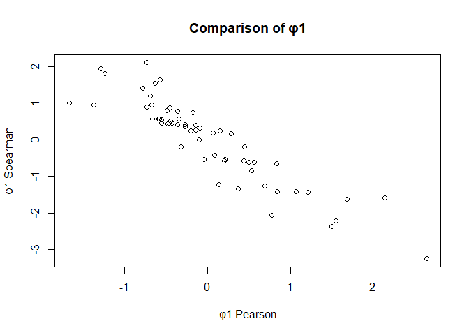

Canonical correlation analysis of gene and protein data
================
Georgios Papadopoulos
2025-12-06

*Exploring linear and rank-based associations between gene expression
and protein measurements*

## 1. Classical canonical correlation for selected variables

The nci60 data has two matrices: a protein dataset with 162 log
transformed protein measurements, and a gene dataset with 22,283
normalized values. On `?gene` help page I realized scaling and centering
the data is needed because the protein variables are already
log-transformed, while the gene variables come from a different
normalization method (GCRMA). If left unscaled, the variables with
higher variance dominate the canonical directions, and the coefficients
become hard to interpret.

``` r
library(robustHD)
data("nci60")

X <- scale(protein[, 1:5])
Y <- scale(gene[, 1:5])

cc <- cancor(X, Y)
```

The first canonical correlation of 0.72 shows a strong linear
relationship between a weighted combination of the protein variables and
a weighted combination of the gene variables. The other correlations are
weaker and drop quickly which shows very weak linear relationships.

This pattern means that most of the shared information between the two
datasets X and Y is captured by the first one or even first two
canonical variable pairs, and the rest contribute little to nothing.

``` r
cc$cor
```

    ## [1] 0.71513333 0.45656616 0.24826403 0.09623103 0.01715316

These coefficients show how each protein and gene contributes to the
canonical direction. Large positive or negative coefficients identify
the variables that drive the association in each canonical pair.

protein coefficients:

``` r
cc$xcoef     
```

    ##             [,1]        [,2]         [,3]        [,4]         [,5]
    ## [1,]  0.03818012  0.04943842 -0.108483082  0.01907764 -0.060987135
    ## [2,] -0.02720909 -0.10288729 -0.026213556  0.09778877  0.002146763
    ## [3,] -0.12703364  0.04151346 -0.002157094 -0.06529015  0.004697250
    ## [4,]  0.05652640 -0.08493246 -0.034366987 -0.08481816  0.015116978
    ## [5,] -0.01339761 -0.00297283  0.085813144 -0.03665419 -0.105079282

gene coefficients:

``` r
cc$ycoef     
```

    ##           [,1]         [,2]        [,3]        [,4]          [,5]
    ## 1 -0.020012658  0.047657177 -0.01980500  0.09531563 -0.0781920206
    ## 2 -0.025548728  0.053953014  0.09991216  0.01945139  0.0640672476
    ## 3  0.005893085 -0.009298716 -0.09047563  0.09643467  0.0831685695
    ## 4  0.119305874  0.001177933  0.03744816  0.05603589 -0.0006946554
    ## 5 -0.064820716 -0.098925678  0.09312096 -0.01332854 -0.0478420657

I compute the canonical scores by multiplying the scaled data with the
coefficient matrices. Each column of phi and eta represents one
canonical variable, and each row gives the score for a specific
observation. These scores show how strongly each observation expresses
the canonical patterns defined by the weights in xcoef and ycoef. Both
canonical variables phi and eta have dimensions of p=5 with n=60

$\phi = a^\top x$ where a is xcoef

$\eta = b^\top y$ where b is ycoef

``` r
phi <- as.matrix(X) %*% cc$xcoef
eta <- as.matrix(Y) %*% cc$ycoef
```

## 2. First canonical variable pair

When I plot ϕ1 for protein against η1 for gene , I see that the points
rise together in a loose upward pattern. As ϕ1 increases, η1 also tends
to increase. This tells me that the first canonical variables move in
the same direction and share a noticeable linear relationship.

``` r
plot(phi[,1], eta[,1],
     xlab = "phi1 (protein canonical score)",
     ylab = "eta1 (gene canonical score)",
     main = "Plot of first canonical variables")
```



Since each column of each variable is one canonical variate, we can use
the pearson correlation between each i-th canonical variate to get the
i-th canonical correlation. On page 103/129 we have the Pearson
correlation `Corr(φk,ηk) = ρk`

Each does equal with `cc$cor[i]` and so I can verify that for i=1
there’s the same correlation of 0.72.

``` r
cor(phi[,1], eta[,1]) 
```

    ## [1] 0.7151333

``` r
cor(phi[,2], eta[,2])
```

    ## [1] 0.4565662

``` r
cor(phi[,3], eta[,3])
```

    ## [1] 0.248264

``` r
cor(phi[,4], eta[,4])
```

    ## [1] 0.09623103

``` r
cor(phi[,5], eta[,5])
```

    ## [1] 0.01715316

## 3. Pearson grid based canonical correlation

I estimate the canonical correlations by directly searching for the
linear combinations of X and Y that maximize the Pearson correlation.
This method uses an optimization grid search instead of the matrix based
approach used by `cancor()`. Because both methods maximize the same
Pearson correlation, the resulting canonical correlations are the same
from section 1.

``` r
library(ccaPP)
#?maxCorGrid

cca_pearson <- maxCorGrid(X, Y, method = "pearson")
cca_pearson
```

    ## 
    ## Call:
    ## maxCorGrid(x = X, y = Y, method = "pearson")
    ## 
    ## Maximum correlation:
    ## [1] 0.7151333

## 4. Spearman grid based canonical correlation

When Spearman correlation is computed, the algorithm finds canonical
variables by maximizing the spearman rank correlation. This makes the
method less sensitive to outliers and does not assume a perfectly linear
relationship. Therefore the canonical correlation is lower.

``` r
cca_spearman <- maxCorGrid(X, Y, method = "spearman")
cca_spearman
```

    ## 
    ## Call:
    ## maxCorGrid(x = X, y = Y, method = "spearman")
    ## 
    ## Maximum correlation:
    ## [1] 0.6059614

In maxCorGrid(), the canonical coefficient vectors are stored as:

- cca_spearman\$a for x-coefficients (same role as xcoef in cancor)

- cca_spearman\$b for y-coefficients (same role as ycoef in cancor)

The Spearman plot shows a clear monotone increasing pattern. As ϕ1
increases, η1 also increases. The pattern is weaker and less linear than
in the pearson plot.

``` r
phi_spearman <- as.matrix(X) %*% cca_spearman$a
eta_spearman <- as.matrix(Y) %*% cca_spearman$b

plot(phi_spearman[,1], eta_spearman[,1],
     xlab = "φ1",
     ylab = "ρ1",
     main = "1st canonical variables with spearman")
```



To confirm correlation

``` r
cor(phi_spearman[,1], eta_spearman[,1], method = "spearman")
```

    ## [1] 0.6059614

``` r
cca_spearman$cor
```

    ## [1] 0.6059614

## 5. Classical canonical correlation with complete protein data

When I use all 162 protein variables with only 59 observations,
classical canonical correlation fails. The method tries to invert the
covariance matrix of the protein data, but this matrix cannot be
inverted because there are more variables than samples. As a result all
canonical correlations equal 1. These values do not reflect any real
relationship between proteins and genes but appear only because the
method is mathematically unstable when $p>n$.

``` r
X_full <- scale(protein)

cc_full <- cancor(X_full, Y)
cc_full$cor
```

    ## [1] 1 1 1 1 1

The protein matrix has dimension 59 × 162, while the coefficient matrix
returned by cancor() has dimension 58 × 58. These sizes do not match, so
we cannot multiply the data by the coefficients to compute the canonical
scores. This mismatch happens after centering the data, the covariance
matrix has rank at most 58. Because of this we cannot compute φ and η
and cannot create a meaningful plot for this section.

``` r
dim(as.matrix(X_full))
```

    ## [1]  59 162

``` r
dim(cc_full$xcoef)
```

    ## [1] 58 58

> Error in cc_full\$xcoef %\*% as.matrix(X_full) : non-conformable
> arguments

``` r
#phi_full <-  cc_full$xcoef %*% as.matrix(X_full)
#eta_full <- as.matrix(Y) %*% cc_full$ycoef
```

## 6. Pearson grid based CCA with complete protein data

The `maxCorGrid` function doesn’t rely on inverting the covariance
matrix. It avoids the direct covariance inversion used by classical CCA,
making it more stable in high-dimensional settings. However, the nearly
perfect association still suggests overfitting. With all 162 protein
variables with grid search on pearson correlation creates canonical
correlations. Plotting now also works. The results no longer collapse to
correlations of 1, and the φ1 η1 plot shows a real pattern.

``` r
cca_pearson_full <- maxCorGrid(X_full, Y, method = "pearson")
cca_pearson_full
```

    ## 
    ## Call:
    ## maxCorGrid(x = X_full, y = Y, method = "pearson")
    ## 
    ## Maximum correlation:
    ## [1] 0.9999994

The plot is perfectly linear so φ1 and η1 line up exactly. This is
overfitting, not meaningful.

``` r
phi_pearson_full <- as.matrix(X_full) %*% cca_pearson_full$a
eta_pearson <- as.matrix(Y)    %*% cca_pearson_full$b

plot(phi_pearson_full[,1], eta_pearson[,1],
     xlab = "φ1 with pearson",
     ylab = "η1 with pearson",
     main = "1st canonical variables with pearson - X_full")
```



## 7. Spearman grid based CCA with complete protein data

The Spearman results are more useful here. The canonical correlation is
still strong at 0.96 but it is no longer artificially equal to 1, and
the φ1–η1 plot shows a realistic monotone pattern instead of a perfect
straight line. Because Spearman uses ranks, it avoids the overfitting
and numerical problems I had with pearson.

``` r
cca_spearman_full <- maxCorGrid(X_full, Y, method = "spearman")
cca_spearman_full
```

    ## 
    ## Call:
    ## maxCorGrid(x = X_full, y = Y, method = "spearman")
    ## 
    ## Maximum correlation:
    ## [1] 0.9565167

In the spearman plot the points move upward in a wavy pattern. As ϕ1
increases, η1 also tends to increase, which shows a clear monotone
relationship, but the nonlinear “wave” shape shows that the association
is not strictly linear.

``` r
phi_spearman_full <- as.matrix(X_full) %*% cca_spearman_full$a
eta_spearman <- as.matrix(Y)    %*% cca_spearman_full$b

plot(phi_spearman_full[,1], eta_spearman[,1],
     xlab = "φ1 with spearman",
     ylab = "ρ1 with spearman",
     main = "1st canonical variables with spearman - X_full")
```



## 8. Comparing Pearson and Spearman canonical variables

The plot shows a clear monotone decreasing relationship: when the
Pearson φ1 increases, the Spearman φ1 tends to decrease. This tells me
that both methods pick up the same underlying direction in the data, but
they scale it differently. Pearson exaggerates linear structure and
overfits, while Spearman gives a smoother, more robust version of the
same trend. The overall monotone pattern shows that the two φ1 scores
are related.

``` r
phi_pearson <- as.matrix(X_full) %*% cca_pearson_full$a

phi_spearman <- as.matrix(X_full) %*% cca_spearman_full$a

plot(phi_pearson[,1], phi_spearman[,1],
     xlab = "φ1 Pearson",
     ylab = "φ1 Spearman",
     main = "Comparison of φ1")
```


