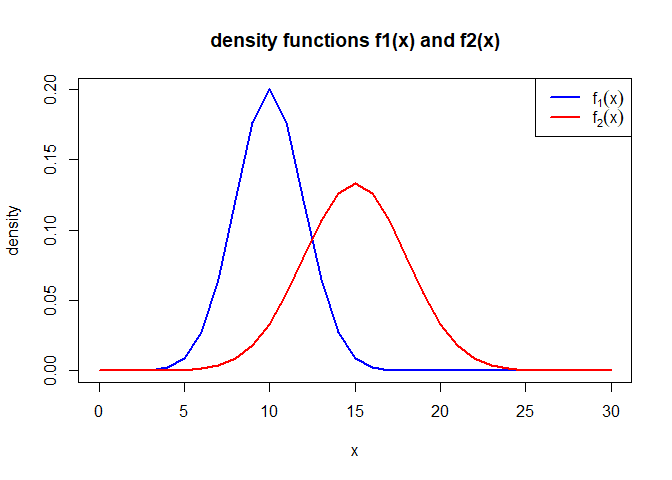
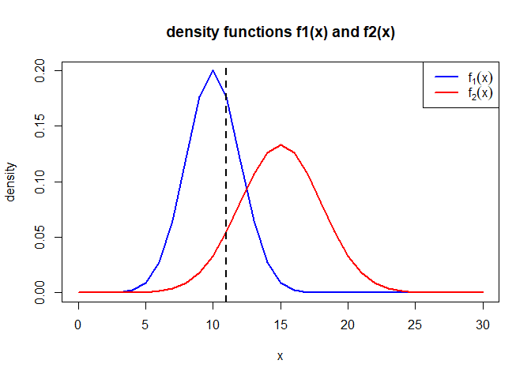
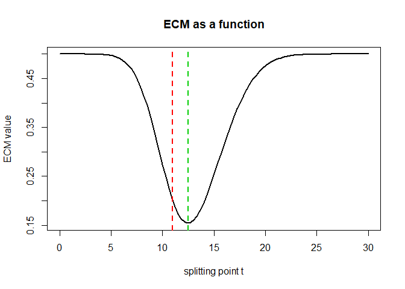
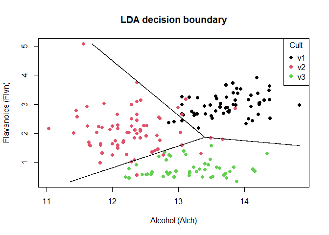
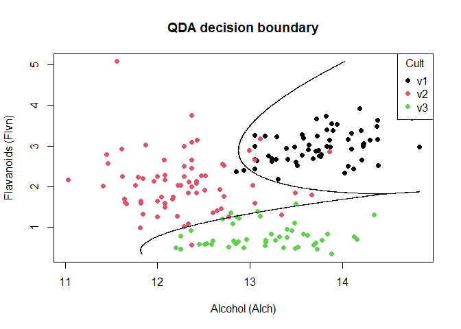
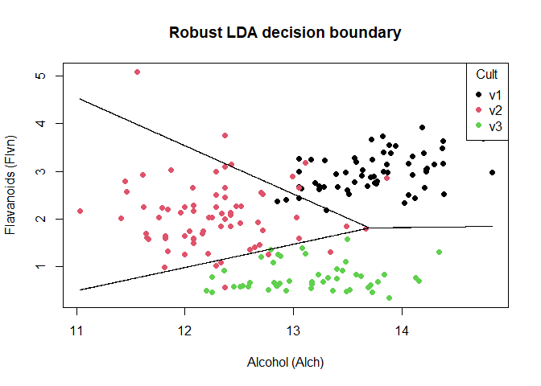
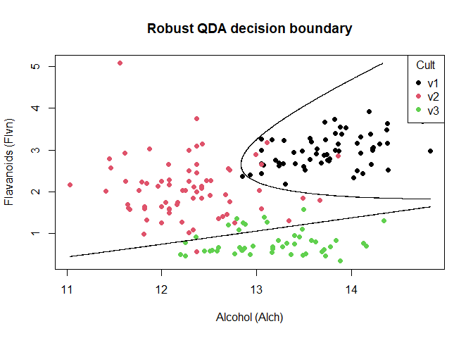

Discriminant analysis and decision boundaries
================
Georgios Papadopoulos \|
2025-12-13

*Comparing classical and robust discriminant analysis methods for
univariate normal groups and wine cultivar classification*

## 1. Density functions for two normal groups

Ι considered for the two populations $π_1$ and $π_2$ the normal
distributions $N(10,2^2)$ and $N(15,3^2)$ respectively.I selected the
sequence 0-30 as the grid of values on the horizontal axis, because it
safely covers all probability mass of both distributions including their
tails.

The density plot shows how obs from the two populations are distributed.
Where we have the overlap between the densities, misclassification is
unavoidable.

``` r
x <- seq(0, 30) 

f1 <- dnorm(x, mean = 10, sd = 2)
f2 <- dnorm(x, mean = 15, sd = 3)

plot(x, f1, type = "l", lwd = 2, col = "blue",
     main = "density functions f1(x) and f2(x)", ylab = "density")
lines(x, f2, lwd = 2, col = "red")

legend("topright",
       legend = c(expression(f[1](x)), expression(f[2](x))),
       col = c("blue", "red"), lwd = 2)
```



## 2. Expected costs of misclassification

Assumptions:

- Two groups prior probability `p` must sum to 1: $p_1 + p_2 = 1$. So
  for same prior probabilities we have $p_1 = p_2 = 0.5$. Basically
  before seeing each x, we assume both groups are equally likely.

- Same misclassification costs c(2∣1)=c(1∣2). So basically both types of
  mistakes are considered equally bad.

  - c(2∣1) is the cost of wrongly classifying a true $π_1$ observation
    as $π_2$

  - c(1∣2) is the cost of wrongly classifying a true $π_2$ observation
    as $π_2$

Therefore the general Expected Cost for Misclassification is:

$$
ECM=c(2∣1)P(2∣1)p_1 +c(1∣2)P(1∣2)p_2
$$

Expected cost = (cost of mistake 1 X probability of mistake 1 x how
often it occurs) + (cost of mistake 2 X probability of mistake 2 x how
often it occurs)

Now I plugged in the upper values and I set the costs c(2∣1)=c(1∣2)=1
for simplicity and therefore:

$$
ECM = 0.5P(2|1) + 0.5P(1|2)
$$

I randomly assign splitting point t=11

Observations with values less than or equal to 11 are assigned to π1 and
larger values to π2. We get the ECM value by averaging the probabilities
of misclassifying observations from each population.

``` r
x <- seq(0, 30) 

f1 <- dnorm(x, mean = 10, sd = 2)
f2 <- dnorm(x, mean = 15, sd = 3)


plot(x, f1, type = "l", lwd = 2, col = "blue",
     main = "density functions f1(x) and f2(x)", ylab = "density")
lines(x, f2, lwd = 2, col = "red")

legend("topright",
       legend = c(expression(f[1](x)), expression(f[2](x))),
       col = c("blue", "red"),
       lwd = 2)


t <- 11

abline(v = t, lty = 2, lwd = 2)
```



Probability values and ECM value. For t=11 we see that the ECM value is
0.2

``` r
P_2_given_1 <- 1 - pnorm(t, mean = 10, sd = 2)
P_1_given_2 <- pnorm(t, mean = 15, sd = 3)

P_2_given_1
```

    ## [1] 0.3085375

``` r
P_1_given_2
```

    ## [1] 0.09121122

``` r
ECM_t <- 0.5 * P_2_given_1 + 0.5 * P_1_given_2
ECM_t
```

    ## [1] 0.1998744

While we know that we can find the optimal splitting point by minimizing
the ECM function, here we want to visualize ECM over the grid 0-30 of
splitting points. The plot shows that we can get the minimum expected
cost for t=12.5 (green line) and t=11 is our example split (red line).

``` r
t_grid <- seq(0, 30, length.out=100) #used length.out to smooth the curve

P_2_given_1 <- 1 - pnorm(t_grid, mean = 10, sd = 2)
P_1_given_2 <- pnorm(t_grid, mean = 15, sd = 3)

ECM <- 0.5 * P_2_given_1 + 0.5 * P_1_given_2

plot(t_grid, ECM, type = "l", lwd = 2,
     xlab = "splitting point t",
     ylab = "ECM value",
     main = "ECM as a function")

abline(v = t, lty = 2, lwd = 2, col="red")
abline(v = 12.5, lty = 2, lwd = 2, col="green3")
```



## 3. Linear discriminant analysis (LDA)

``` r
library(doBy)
library(MASS)

data(wine)

winedata <- wine[, c("Alch", "Flvn", "Cult")]
```

- Prior probabilities of groups: These are the class proportions in the
  data and are used as prior information in the LDA classification rule

- Group means: The group means show differences between groups.

  - v1 has highest Alch and highest Flvn

  - v2 has lowest Alch and moderate Flvn

  - v3 has moderate Alch and lowest Flvn

- Coefficients of linear discriminants: The coefficients define two
  discriminant directions, with the first mainly driven by flavanoids
  and the second by alcohol

- Proportion of trace: The first discriminant explains most of the
  between-group separation, while the second adds additional
  discriminatory information

``` r
lda_fit <- lda(Cult ~ Alch + Flvn, data = winedata)
lda_fit
```

    ## Call:
    ## lda(Cult ~ Alch + Flvn, data = winedata)
    ## 
    ## Prior probabilities of groups:
    ##        v1        v2        v3 
    ## 0.3314607 0.3988764 0.2696629 
    ## 
    ## Group means:
    ##        Alch      Flvn
    ## v1 13.74475 2.9823729
    ## v2 12.27873 2.0808451
    ## v3 13.15375 0.7814583
    ## 
    ## Coefficients of linear discriminants:
    ##            LD1        LD2
    ## Alch -0.581739  1.8721525
    ## Flvn -1.774079 -0.7203934
    ## 
    ## Proportion of trace:
    ##    LD1    LD2 
    ## 0.6772 0.3228

The LDA model was used to predict class memberships for the training
data, providing the basis for the confusion matrix and apparent error
rate.

``` r
lda_prediction <- predict(lda_fit)$class
lda_prediction
```

    ##   [1] v1 v1 v1 v1 v1 v1 v1 v1 v1 v1 v1 v1 v1 v1 v1 v1 v1 v1 v1 v1 v1 v2 v1 v2 v1
    ##  [26] v1 v1 v1 v1 v1 v1 v1 v1 v1 v1 v1 v1 v2 v1 v1 v1 v1 v1 v1 v1 v1 v1 v1 v1 v1
    ##  [51] v1 v1 v1 v1 v1 v1 v1 v1 v1 v3 v2 v2 v3 v2 v2 v2 v1 v2 v3 v2 v3 v1 v3 v1 v2
    ##  [76] v2 v2 v2 v2 v2 v2 v2 v2 v3 v2 v2 v2 v2 v2 v2 v2 v2 v2 v2 v2 v2 v2 v2 v2 v2
    ## [101] v2 v2 v2 v2 v2 v2 v2 v2 v2 v2 v2 v2 v2 v2 v2 v2 v2 v2 v3 v2 v2 v2 v2 v1 v2
    ## [126] v2 v2 v2 v2 v2 v3 v3 v3 v3 v3 v3 v3 v3 v3 v3 v3 v3 v3 v3 v3 v3 v3 v3 v3 v3
    ## [151] v3 v3 v3 v3 v3 v3 v3 v3 v3 v3 v3 v3 v3 v3 v3 v3 v3 v3 v3 v3 v3 v3 v3 v3 v3
    ## [176] v3 v3 v3
    ## Levels: v1 v2 v3

### Confusion table - LDA

- cult v1 shows only 3 misclassifications with v2

- Cult v2 has most misclassifications (4 were misclassified into v1 and
  7 misclassified into v3)

- cult v3 is perfectly separated

``` r
confusiontable_lda <- table(truth = winedata$Cult, prediction = lda_prediction)
confusiontable_lda
```

    ##      prediction
    ## truth v1 v2 v3
    ##    v1 56  3  0
    ##    v2  4 60  7
    ##    v3  0  0 48

### AER - LDA (Apparent Error Rate)

The apparent error rate is computed as the proportion of observations
that are misclassified by the model when predictions are made on the
same data used for fitting.

$$
\widehat{AER} = \dfrac{\text{number of misclassified observations}}{n}
$$

It is called *apparent* because the dataset isn’t splittedinto training
and test dataset. The apparent error rate of the LDA model is
approximately 0.079, meaning that 7.9% of the observations are
misclassified when predictions are made on the training data itself.

``` r
AER_LDA <- mean(winedata$Cult != lda_prediction)
AER_LDA
```

    ## [1] 0.07865169

### Contour lines setup

- x1 creates 1000 evenly spaced values between the minimum and maximum
  observed alcohol content. These values represent possible alcohol
  levels across the plotting range (not real values, we are interested
  in the line).

- x2 creates 1000 evenly spaced values between the minimum and maximum
  observed flavanoid content. These values represent possible flavanoid
  levels across the plotting range (not real values, we are interested
  in the line).

- grid created a 1000 × 1000 grid (1.000.000 points total). Each row is
  one hypothetical wine with an alcohol value and a flavanoid value. The
  idea is what would the model predict for the points

- each point is assigned a predicted group this creates a classification
  map

``` r
x1 <- seq(min(winedata$Alch), max(winedata$Alch), length.out = 1000)
x2 <- seq(min(winedata$Flvn), max(winedata$Flvn), length.out = 1000)

grid <- expand.grid(Alch = x1, Flvn = x2)

grid$lda <- predict(lda_fit, grid)$class
```

### Plot - LDA

``` r
plot(winedata$Alch, winedata$Flvn, col = winedata$Cult, pch = 19,
     xlab = "Alcohol (Alch)",
     ylab = "Flavanoids (Flvn)",
     main = "LDA decision boundary")

legend("topright",
       legend = levels(winedata$Cult),
       col = 1:length(levels(winedata$Cult)),
       pch = 19,
       title = "Cult")

contour(x1, x2,
        matrix(as.numeric(grid$lda), length(x1)),
        add = TRUE,
        drawlabels = FALSE)
```



## 4. Quadratic discriminant analysis

- Prior probabilities of groups: These are the class proportions in the
  data and are used as prior information in QDA

- Group means: The group means show differences between groups, very
  similar to LDA

  - v1 has highest Alch and highest Flvn

  - v2 has lowest Alch and moderate Flvn

  - v3 has moderate Alch and lowest Flvn

``` r
qda_fit <- qda(Cult ~ Alch + Flvn, data = winedata)
qda_fit
```

    ## Call:
    ## qda(Cult ~ Alch + Flvn, data = winedata)
    ## 
    ## Prior probabilities of groups:
    ##        v1        v2        v3 
    ## 0.3314607 0.3988764 0.2696629 
    ## 
    ## Group means:
    ##        Alch      Flvn
    ## v1 13.74475 2.9823729
    ## v2 12.27873 2.0808451
    ## v3 13.15375 0.7814583

The QDA model was used to predict class memberships for the training
data, providing the basis for the confusion matrix and apparent error
rate.

``` r
qda_prediction <- predict(qda_fit)$class
```

### Confusion table - QDA

11 misclassifications in QDA

- Cult v1 is almost perfectly separated, with only 2 observations
  misclassified into v2 and none misclassified into v3

- Cult v2 has most misclassifications because 4 observations are
  misclassified into v1 and 2 observations are misclassified into v3

- Cult v3 shows a small number of misclassifications with 3 observations
  misclassified into v2 and none misclassified into v1

``` r
table(truth = winedata$Cult, prediction = qda_prediction)
```

    ##      prediction
    ## truth v1 v2 v3
    ##    v1 57  2  0
    ##    v2  4 65  2
    ##    v3  0  3 45

### AER - QDA

The QDA model has an apparent error rate of 0.062, which means 6.2%
misclassified observations.

QDA has a lower apparent error rate than LDA. It means it has an
improved classification performance on the training data. This is
expected because QDA is more flexible than LDA due to its use of class
specific covariance matrices. However, since both error rates are
apparent this improvement should be interpreted cautiously and does not
necessarily mean better performance on new data.

``` r
AER_QDA <- mean(winedata$Cult != qda_prediction)
AER_QDA
```

    ## [1] 0.06179775

### Plot - QDA

In contrast to LDA, the QDA decision boundary is nonlinear. The contour
lines are curved, reflecting the fact that QDA allows each class to have
its own covariance matrix. As a result, the separation between classes
is quadratic.

``` r
grid$qda <- predict(qda_fit, grid)$class

plot(winedata$Alch, winedata$Flvn,
     col = winedata$Cult,
     pch = 19,
     xlab = "Alcohol (Alch)",
     ylab = "Flavanoids (Flvn)",
     main = "QDA decision boundary")

contour(x1, x2,
        matrix(as.numeric(grid$qda), length(x1)),
        add = TRUE,
        drawlabels = FALSE)

legend("topright",
       legend = levels(winedata$Cult),
       col = 1:length(levels(winedata$Cult)),
       pch = 19,
       title = "Cult")
```



## 5. Robust linear discriminant analysis

Robust LDA yields linear decision rules similar to classical LDA, but
now the parameter estimates are less sensitive to outliers.

``` r
library(rrcov)

robust_lda_fit <- Linda(Cult ~ Alch + Flvn, data = winedata)
robust_lda_fit
```

    ## Call:
    ## Linda(Cult ~ Alch + Flvn, data = winedata)
    ## 
    ## Prior Probabilities of Groups:
    ##        v1        v2        v3 
    ## 0.3314607 0.3988764 0.2696629 
    ## 
    ## Group means:
    ##        Alch      Flvn
    ## v1 13.73740 2.9575681
    ## v2 12.24189 2.0378132
    ## v3 13.15393 0.6818903
    ## 
    ## Within-groups Covariance Matrix:
    ##            Alch       Flvn
    ## Alch 0.25573353 0.04336653
    ## Flvn 0.04336653 0.14210098
    ## 
    ## Linear Coeficients:
    ##        Alch        Flvn
    ## v1 52.92727   4.6607406
    ## v2 47.91769  -0.2829738
    ## v3 53.38512 -11.4934967
    ## 
    ## Constants:
    ##        v1        v2        v3 
    ## -371.5380 -293.9323 -348.5040

``` r
robust_lda_prediction <- predict(
  robust_lda_fit,
  newdata = winedata[, c("Alch", "Flvn")]
  )@classification
```

### Confusion table - robust LDA

We see 17 misclassification in robust LDA vs 14 misclassifications in
LDA.

Most misclassifications occurring between cultivars v1 and v2, while
cultivar v3 is perfectly separated as classical LDA.

``` r
table(truth = winedata$Cult, prediction = robust_lda_prediction)
```

    ##      prediction
    ## truth v1 v2 v3
    ##    v1 55  4  0
    ##    v2  7 58  6
    ##    v3  0  0 48

### AER - robust LDA

The apparent error rate of the robust LDA model is 0.096, so 9.6% of the
training observations are misclassified. Classical LDA has a lower AER
because it is optimized to fit the data, while robust LDA deliberately
sacrifices some in-sample accuracy to reduce sensitivity to outliers.

``` r
AER_robust_LDA <- mean(winedata$Cult != robust_lda_prediction)
AER_robust_LDA
```

    ## [1] 0.09550562

### Plot - robust LDA

The decision boundary from robust LDA is very similar to that of the
classical LDA. This shows that the data do not have influential outliers
that strongly affect the classical covariance estimates. The robust
method produces a slightly different classification in a few regions,
leading to a small number of additional misclassifications.

``` r
grid$rlda <- predict(
  robust_lda_fit,
  newdata = grid[, c("Alch", "Flvn")]
)@classification


plot(winedata$Alch, winedata$Flvn,
     col = winedata$Cult,
     pch = 19,
     xlab = "Alcohol (Alch)",
     ylab = "Flavanoids (Flvn)",
     main = "Robust LDA decision boundary")

legend("topright",
       legend = levels(winedata$Cult),
       col = 1:length(levels(winedata$Cult)),
       pch = 19,
       title = "Cult")

contour(x1, x2,
        matrix(as.numeric(grid$rlda),
               nrow = length(x1),
               ncol = length(x2)),
        add = TRUE,
        drawlabels = FALSE)
```



## 6. Robust quadratic discriminant analysis

Robust QDA allows curved decision boundaries and estimates the group
characteristics in a way that is less affected by outliers. This makes
the classification more flexible and more stable when the data has
extreme values.

``` r
robust_qda_fit <- QdaCov(Cult ~ Alch + Flvn, data = winedata)
robust_qda_fit
```

    ## Call:
    ## QdaCov(Cult ~ Alch + Flvn, data = winedata)
    ## 
    ## Prior Probabilities of Groups:
    ##        v1        v2        v3 
    ## 0.3314607 0.3988764 0.2696629 
    ## 
    ## Group means:
    ##        Alch      Flvn
    ## v1 13.73180 2.9454000
    ## v2 12.23629 2.0256452
    ## v3 13.14833 0.6697222
    ## 
    ## Group:  v1 
    ##           Alch      Flvn
    ## Alch 0.2433567 0.1112879
    ## Flvn 0.1112879 0.1302039
    ## 
    ## Group:  v2 
    ##            Alch       Flvn
    ## Alch 0.18838748 0.03592679
    ## Flvn 0.03592679 0.34146647
    ## 
    ## Group:  v3 
    ##            Alch       Flvn
    ## Alch 0.30620776 0.03440893
    ## Flvn 0.03440893 0.02403471

``` r
robust_qda_prediction <- predict(
  robust_qda_fit,
  newdata = winedata[, c("Alch", "Flvn")]
)@classification
```

### Confusion table - robust QDA

15 misclassifications in robust QDA vs 11 misclassifications in
classical QDA.

``` r
table(truth = winedata$Cult, prediction = robust_qda_prediction)
```

    ##      prediction
    ## truth v1 v2 v3
    ##    v1 58  1  0
    ##    v2  4 66  1
    ##    v3  0  9 39

### AER - robust QDA

The classical QDA has an AER of 0.062 but the robust QDA model has a
higher AER of 0.084, meaning 8.4% misclassified observations.

Robust QDA uses robust estimates of group means and covariance matrices
that reduce the influence of extreme observations. I guess this can
increase the AER but it leads to more stable and reliable decision
boundaries when we have many outliers.

``` r
AER_robust_QDA <- mean(winedata$Cult != robust_qda_prediction)
AER_robust_QDA
```

    ## [1] 0.08426966

### Plot - robust QDA

While robust QDA produces curved decision boundaries overall, the
separation between cultivar v3 and the other groups appears nearly
linear. This suggests that, after robust estimation, the variability
structure of v3 doesn’t differ from the other groups, reducing the curve
of the decision boundary.

``` r
grid$rqda <- predict(
  robust_qda_fit,
  newdata = grid[, c("Alch", "Flvn")]
)@classification


plot(winedata$Alch, winedata$Flvn,
     col = winedata$Cult,
     pch = 19,
     xlab = "Alcohol (Alch)",
     ylab = "Flavanoids (Flvn)",
     main = "Robust QDA decision boundary")

legend("topright",
       legend = levels(winedata$Cult),
       col = 1:length(levels(winedata$Cult)),
       pch = 19,
       title = "Cult")

contour(x1, x2,
        matrix(as.numeric(grid$rqda),
               nrow = length(x1),
               ncol = length(x2)),
        add = TRUE,
        drawlabels = FALSE)
```



## 7. Comparison of decision boundaries

Overall robustness does not lower the AER because classical methods fit
the training data more closely. However robustness pays off by producing
more stable and interpretable decision boundaries, especially when the
data contain outliers or deviate from normality. The data doesnt appear
to have many extreme outliers, but some observations near the class
boundaries influence the classical models. So robust methods reduce this
influence and lead to more stable decision boundaries.
