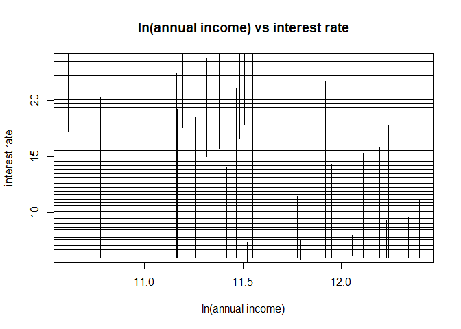
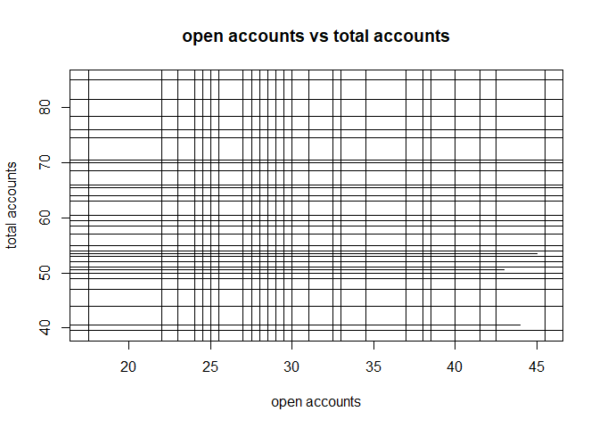
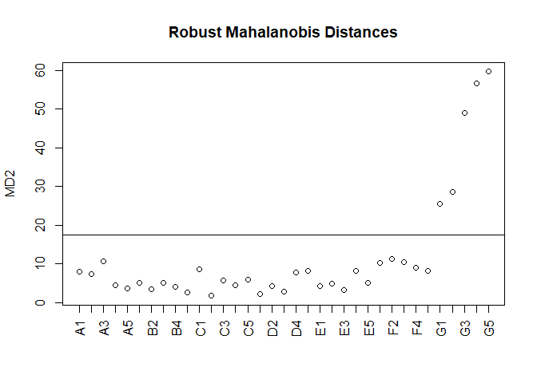
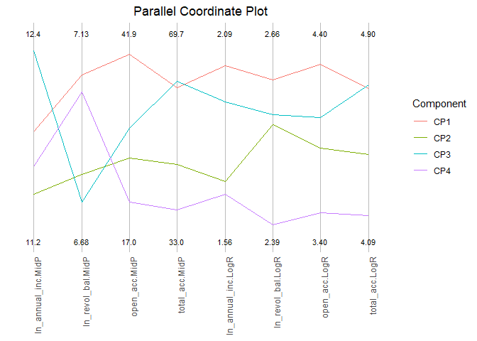

Symbolic data analysis of loan intervals
================
Georgios Papadopoulos
2026-01-17

*Interval based modeling, discriminant analysis and model based
clustering of loan risk profiles*

## 1. Construction of the interval loan dataset

``` r
library(MAINT.Data)
library(dplyr)
#?MAINT.Data

loan <- read.csv("loan_data.csv")
str(loan)
```

    ## 'data.frame':    887379 obs. of  9 variables:
    ##  $ id        : int  1077501 1077430 1077175 1076863 1075358 1075269 1069639 1072053 1071795 1071570 ...
    ##  $ annual_inc: num  24000 30000 12252 49200 80000 ...
    ##  $ int_rate  : num  10.6 15.3 16 13.5 12.7 ...
    ##  $ open_acc  : int  3 3 2 10 15 9 7 4 11 2 ...
    ##  $ total_acc : int  9 4 10 37 38 12 11 4 13 3 ...
    ##  $ revol_bal : int  13648 1687 2956 5598 27783 7963 17726 8221 5210 9279 ...
    ##  $ grade     : chr  "B" "C" "C" "C" ...
    ##  $ sub_grade : chr  "B2" "C4" "C5" "C1" ...
    ##  $ purpose   : chr  "credit_card" "car" "small_business" "other" ...

### 1.1 Log transformation of financial variables

``` r
loan <- loan %>% mutate(
  ln_annual_inc = log(annual_inc),
  ln_revol_bal  = log(revol_bal)
  )
```

### 1.2 Interval aggregation by subgrade

The analysis focuses on the requested loan variables, with each row
representing one loan application. Symbolic units of subgrades were
defined which will become the one interval observation. In other words,
all loans from the same subgrade are grouped together.

With classical aggregation each subgrade A1-G5 becomes an interval with
\[min, max\] value.

``` r
loan_micro <- loan[, c(
  "ln_annual_inc",
  "int_rate",
  "open_acc",
  "total_acc"
)]

sub_grade_units <- factor(loan$sub_grade)

loan_interval_classic <- AgrMcDt(loan_micro, sub_grade_units)

loan_interval_classic
```

    ##          ln_annual_inc              int_rate              open_acc             total_acc
    ## A1   [8.699515, 14.34614]  [  5.32  ,   7.37  ]  [ 1.000000e+00,    53   ]  [   4    ,   106   ]  
    ## A2   [8.160518, 15.42495]  [  5.79  ,   7.68  ]  [ 1.000000e+00,    48   ]  [   1    ,    93   ]  
    ## A3   [8.101678, 16.01274]  [  6.17  ,   8.00  ]  [ 1.000000e+00,    56   ]  [   3    ,    95   ]  
    ## A4   [8.699515, 15.76142]  [  6.00  ,   9.32  ]  [ 1.000000e+00,    65   ]  [   2    ,   100   ]  
    ## A5   [8.612503, 16.06680]  [  6.00  ,   9.63  ]  [ 1.000000e+00,    58   ]  [   2    ,   129   ]  
    ## B1   [8.881836, 15.90999]  [  6.00  ,  11.14  ]  [ 1.000000e+00,    59   ]  [   2    ,   150   ]  
    ## B2   [7.600902, 15.95558]  [  6.00  ,  11.48  ]  [ 1.000000e+00,    53   ]  [   2    ,   124   ]  
    ## B3   [8.476371, 15.62380]  [  6.00  ,  12.12  ]  [ 1.000000e+00,    82   ]  [   1    ,   140   ]  
    ## B4   [8.517193, 15.97883]  [  6.00  ,  13.11  ]  [ 1.000000e+00,    79   ]  [   2    ,   138   ]  
    ## B5   [8.188689, 14.64842]  [  6.00  ,  14.09  ]  [ 1.000000e+00,    64   ]  [   1    ,   127   ]  
    ## C1   [8.294050, 15.60727]  [  6.00  ,  14.33  ]  [ 1.000000e+00,    90   ]  [   2    ,   130   ]  
    ## C2   [8.294050, 15.92609]  [  6.00  ,  15.31  ]  [ 1.000000e+00,    54   ]  [   2    ,   119   ]  
    ## C3   [8.411833, 15.97959]  [  6.00  ,  15.80  ]  [-3.552714e-15,    62   ]  [   1    ,   118   ]  
    ## C4   [8.006368, 14.73180]  [  6.00  ,  16.29  ]  [-1.421085e-14,    74   ]  [   1    ,   151   ]  
    ## C5   [8.476371, 14.55745]  [  6.00  ,  17.27  ]  [ 1.000000e+00,    84   ]  [   1    ,   125   ]  
    ## D1   [8.476371, 16.00157]  [  6.00  ,  17.77  ]  [ 1.000000e+00,    57   ]  [   2    ,   135   ]  
    ## D2   [8.476371, 14.03865]  [  6.00  ,  18.55  ]  [ 0.000000e+00,    76   ]  [   1    ,    99   ]  
    ## D3   [8.294050, 14.03865]  [  6.00  ,  19.20  ]  [ 1.000000e+00,    58   ]  [   1    ,   105   ]  
    ## D4   [8.188689, 14.91412]  [  6.00  ,  19.52  ]  [ 3.552714e-15,    50   ]  [   1    ,   169   ]  
    ## D5   [7.478735, 14.07787]  [  6.00  ,  20.31  ]  [ 1.000000e+00,    58   ]  [   1    ,   156   ]  
    ## E1   [8.853665, 14.07787]  [  6.00  ,  21.00  ]  [ 1.000000e+00,    61   ]  [   1    ,   116   ]  
    ## E2   [8.006368, 15.83041]  [  6.00  ,  21.70  ]  [ 1.000000e+00,    55   ]  [   1    ,   162   ]  
    ## E3   [8.294050, 14.03384]  [  6.00  ,  22.40  ]  [ 3.552714e-15,    50   ]  [   2    ,   112   ]  
    ## E4   [7.090077, 15.60727]  [  6.00  ,  23.10  ]  [ 1.000000e+00,    76   ]  [   2    ,   117   ]  
    ## E5   [8.342840, 14.22098]  [  6.00  ,  23.40  ]  [-3.552714e-15,    54   ]  [   3    ,   146   ]  
    ## F1   [8.954157, 13.68198]  [ 15.01  ,  23.70  ]  [ 1.000000e+00,    50   ]  [   2    ,   106   ]  
    ## F2   [8.417152, 13.81551]  [ 15.33  ,  24.08  ]  [ 1.000000e+00,    45   ]  [   2    ,   105   ]  
    ## F3   [8.892886, 13.86430]  [ 15.65  ,  24.50  ]  [ 1.000000e+00,    68   ]  [   2    ,   102   ]  
    ## F4   [8.881836, 14.22098]  [  6.00  ,  25.09  ]  [ 1.000000e+00,    43   ]  [   2    ,    99   ]  
    ## F5   [8.476371, 14.18015]  [  6.00  ,  26.06  ]  [ 1.000000e+00,    43   ]  [   3    ,   105   ]  
    ## G1   [9.172015, 13.79531]  [ 16.59  ,  26.99  ]  [ 2.000000e+00,    46   ]  [   3    ,    95   ]  
    ## G2   [8.987197, 13.71015]  [ 16.91  ,  27.49  ]  [ 1.000000e+00,    55   ]  [   3    ,    85   ]  
    ## G3   [7.547502, 13.67625]  [ 17.22  ,  27.99  ]  [ 1.000000e+00,    34   ]  [   3    ,    99   ]  
    ## G4   [9.082052, 13.30468]  [ 17.54  ,  28.49  ]  [ 2.000000e+00,    44   ]  [   3    ,    78   ]  
    ## G5   [9.305651, 13.71015]  [ 17.86  ,  28.99  ]  [ 2.000000e+00,    47   ]  [   3    ,    76   ]

Now with robust aggregation using quantile, I set the interval bounds
the 5th and 96th percentile. This is done to trim the most extreme 5% of
obs from each side.

``` r
loan_interval_robust <- AgrMcDt(loan_micro, sub_grade_units, agrcrt = c(0.05, 0.95))

head(loan_interval_robust)
```

    ##          ln_annual_inc              int_rate              open_acc             total_acc
    ## A1   [10.50960, 12.15478]  [  5.32  ,   6.03  ]  [   6    ,  23.00  ]  [   12   ,    49   ]  
    ## A2   [10.43412, 12.07254]  [  6.24  ,   6.62  ]  [   5    ,  22.00  ]  [   11   ,    48   ]  
    ## A3   [10.37349, 12.07254]  [  6.68  ,   7.62  ]  [   5    ,  22.00  ]  [   11   ,    48   ]  
    ## A4   [10.34817, 12.07254]  [  6.92  ,   7.90  ]  [   5    ,  21.00  ]  [   10   ,    47   ]  
    ## A5   [10.34763, 12.04355]  [  7.89  ,   8.90  ]  [   5    ,  22.00  ]  [   10   ,    47   ]  
    ## B1   [10.30895, 11.95118]  [  8.18  ,  10.16  ]  [   5    ,  21.45  ]  [   10   ,    47   ]

### 1.3 Risk group definition

``` r
subgrades <- rownames(loan_interval_classic)

risk_level <- factor(
  ifelse(substr(subgrades, 1, 1) %in% c("A", "B"), "Low",
  ifelse(substr(subgrades, 1, 1) %in% c("C", "D"), "Medium",
         "High")),
  levels = c("Low", "Medium", "High")
)

risk_level
```

    ##  [1] Low    Low    Low    Low    Low    Low    Low    Low    Low    Low   
    ## [11] Medium Medium Medium Medium Medium Medium Medium Medium Medium Medium
    ## [21] High   High   High   High   High   High   High   High   High   High  
    ## [31] High   High   High   High   High  
    ## Levels: Low Medium High

## 2. Biplot visualization of interval variables

Higher log-annual income is associated with lower interest rates. It
shows that borrowers with higher incomes tend to receive more favorable
lending conditions. An increase in the number of open accounts
corresponds to a higher total number of accounts.

When it comes to the following visualizations, the IData object stores
interval observations through the midpoint (MidP) and log-range (LogR).
To visualize each symbolic observation as an interval cross, the
interval length is obtained from exp(LogR) and centered around the
midpoint.

### 2.1 Midpoint visualization

``` r
par(mfrow = c(1, 2))

plot(
  loan_interval_classic@MidP$ln_annual_inc.MidP,
  loan_interval_classic@MidP$int_rate.MidP,
  xlab = "ln(annual income)",
  ylab = "interest rate",
  main = "ln(annual income) vs interest rate"
)

plot(
  loan_interval_classic@MidP$open_acc.MidP,
  loan_interval_classic@MidP$total_acc.MidP,
  xlab = "open accounts",
  ylab = "total accounts",
  main = "open accounts vs total accounts"
)
```


\### 2.2 Interval visualization

``` r
add_intervals <- function(idata, xvar, yvar, xlab, ylab, main) {
  x_mid <- idata@MidP[[paste0(xvar, ".MidP")]]
  y_mid <- idata@MidP[[paste0(yvar, ".MidP")]]

  x_range <- exp(idata@LogR[[paste0(xvar, ".LogR")]])
  y_range <- exp(idata@LogR[[paste0(yvar, ".LogR")]])

  plot(x_mid, y_mid, type = "n",
       xlab = xlab, ylab = ylab, main = main)

  segments(x_mid - x_range / 2, y_mid,
           x_mid + x_range / 2, y_mid)

  segments(x_mid, y_mid - y_range / 2,
           x_mid, y_mid + y_range / 2)
}


add_intervals(
  loan_interval_classic,
  "ln_annual_inc", "int_rate",
  "ln(annual income)", "interest rate",
  "ln(annual income) vs interest rate"
)
```



``` r
add_intervals(
  loan_interval_classic,
  "open_acc", "total_acc",
  "open accounts", "total accounts",
  "open accounts vs total accounts"
)
```



### Robustness

The robust interval biplots confirm the same overall relationships as
the classical version, but the interval ranges are less affected by
extreme observations. This makes the central pattern clearer: higher
log-income is generally associated with lower interest rates, while open
accounts and total accounts remain positively related.

#### 2.3 Midpoint robust visualization

``` r
par(mfrow = c(1, 2))

plot(
  loan_interval_robust@MidP$ln_annual_inc.MidP,
  loan_interval_robust@MidP$int_rate.MidP,
  xlab = "ln(Annual Income)",
  ylab = "Interest Rate",
  main = "ln(Annual Income) vs Interest Rate"
)

plot(
  loan_interval_robust@MidP$open_acc.MidP,
  loan_interval_robust@MidP$total_acc.MidP,
  xlab = "Open Accounts",
  ylab = "Total Accounts",
  main = "Open Accounts vs Total Accounts"
)
```


\#### 2.4 Interval robust visualization

``` r
par(mfrow = c(1, 2))

add_intervals(
  loan_interval_robust,
  "ln_annual_inc", "int_rate",
  "ln(annual income)", "interest rate",
  "robust: ln(annual income) vs interest rate"
)

add_intervals(
  loan_interval_robust,
  "open_acc", "total_acc",
  "open accounts", "total accounts",
  "robust: open accounts vs total accounts"
)
```


## 3. Model estimation for interval data

### 3.1 Maximum likelihood estimation

Maximum likelihood estimation provides estimates of the mean and
covariance for the interval-valued variables. The mean describes the
typical levels and variability of income, interest rate, and account
characteristics across loan sub-grades. The covariance matrix shows how
these variables are related to each other.

``` r
#?mle

fit_mle <- mle(loan_interval_classic)
#fit_mle
fit_mle@mleNmuE
```

    ## ln_annual_inc.MidP      int_rate.MidP      open_acc.MidP     total_acc.MidP 
    ##          11.599586          13.523714          29.757143          59.714286 
    ## ln_annual_inc.LogR      int_rate.LogR      open_acc.LogR     total_acc.LogR 
    ##           1.832668           2.176333           4.030048           4.728460

### 3.2 Variance-covariance model with C3 configuration

``` r
fit_mle_C3 <- mle(loan_interval_classic, CovCase = 3)
fit_mle_C3
```

    ## Log likelihoods:
    ## NModCovC1 NModCovC2 NModCovC3 NModCovC4 
    ##        NA        NA -358.2076        NA 
    ## Bayesian (Schwartz) Information Criteria:
    ## NModCovC1 NModCovC2 NModCovC3 NModCovC4 
    ##        NA        NA   815.965        NA 
    ## Selected model:
    ## [1] "NModCovC3"
    ## 
    ## Selected model parameter estimates:
    ## $mu
    ## ln_annual_inc.MidP      int_rate.MidP      open_acc.MidP     total_acc.MidP 
    ##          11.599586          13.523714          29.757143          59.714286 
    ## ln_annual_inc.LogR      int_rate.LogR      open_acc.LogR     total_acc.LogR 
    ##           1.832668           2.176333           4.030048           4.728460 
    ## 
    ## $Sigma
    ##                    ln_annual_inc.MidP int_rate.MidP open_acc.MidP
    ## ln_annual_inc.MidP          0.1956065     -1.380275     0.9604907
    ## int_rate.MidP              -1.3802749     25.296752   -14.2772408
    ## open_acc.MidP               0.9604907    -14.277241    41.2481633
    ## total_acc.MidP              1.2903261    -25.783224    24.4877551
    ## ln_annual_inc.LogR          0.0000000      0.000000     0.0000000
    ## int_rate.LogR               0.0000000      0.000000     0.0000000
    ## open_acc.LogR               0.0000000      0.000000     0.0000000
    ## total_acc.LogR              0.0000000      0.000000     0.0000000
    ##                    total_acc.MidP ln_annual_inc.LogR int_rate.LogR
    ## ln_annual_inc.MidP       1.290326         0.00000000   0.000000000
    ## int_rate.MidP          -25.783224         0.00000000   0.000000000
    ## open_acc.MidP           24.487755         0.00000000   0.000000000
    ## total_acc.MidP         131.875510         0.00000000   0.000000000
    ## ln_annual_inc.LogR       0.000000         0.03640199  -0.036491172
    ## int_rate.LogR            0.000000        -0.03649117   0.390967858
    ## open_acc.LogR            0.000000         0.01728768  -0.009977185
    ## total_acc.LogR           0.000000         0.02400741   0.020602835
    ##                    open_acc.LogR total_acc.LogR
    ## ln_annual_inc.MidP   0.000000000     0.00000000
    ## int_rate.MidP        0.000000000     0.00000000
    ## open_acc.MidP        0.000000000     0.00000000
    ## total_acc.MidP       0.000000000     0.00000000
    ## ln_annual_inc.LogR   0.017287682     0.02400741
    ## int_rate.LogR       -0.009977185     0.02060283
    ## open_acc.LogR        0.049622550     0.02025623
    ## total_acc.LogR       0.020256229     0.04260796

### 3.3 Robust estimation with fastTLE

**Trimmed Likelihood Estimators (TLE):** Compared to classical MLE, the
robust estimation provides more stable parameter estimates by reducing
the influence of outliers and thus being a bit larger compared with 3a.

``` r
#?fasttle

fit_tle <- fasttle(loan_interval_classic, dist = "chisq")
fit_tle
```

    ## Log likelihoods:
    ## NModCovC1 NModCovC2 NModCovC3 NModCovC4 
    ## -135.8454 -164.6138 -292.9004 -310.5432 
    ## Bayesian (Schwartz) Information Criteria:
    ## NModCovC1 NModCovC2 NModCovC3 NModCovC4 
    ##  421.3435  397.2515  681.0344  675.5055 
    ## Selected model:
    ## [1] "NModCovC2"
    ## 
    ## Selected model parameter estimates:
    ## $mu
    ## ln_annual_inc.MidP      int_rate.MidP      open_acc.MidP     total_acc.MidP 
    ##          11.661334          12.009833          30.816667          62.200000 
    ## ln_annual_inc.LogR      int_rate.LogR      open_acc.LogR     total_acc.LogR 
    ##           1.877459           2.143038           4.074589           4.779844 
    ## 
    ## $Sigma
    ##                    ln_annual_inc.MidP int_rate.MidP open_acc.MidP
    ## ln_annual_inc.MidP         0.24166731      0.000000        0.0000
    ## int_rate.MidP              0.00000000     17.661940        0.0000
    ## open_acc.MidP              0.00000000      0.000000       50.4818
    ## total_acc.MidP             0.00000000      0.000000        0.0000
    ## ln_annual_inc.LogR         0.05679361      0.000000        0.0000
    ## int_rate.LogR              0.00000000      2.228289        0.0000
    ## open_acc.LogR              0.00000000      0.000000        1.6131
    ## total_acc.LogR             0.00000000      0.000000        0.0000
    ##                    total_acc.MidP ln_annual_inc.LogR int_rate.LogR
    ## ln_annual_inc.MidP       0.000000         0.05679361     0.0000000
    ## int_rate.MidP            0.000000         0.00000000     2.2282895
    ## open_acc.MidP            0.000000         0.00000000     0.0000000
    ## total_acc.MidP         141.091132         0.00000000     0.0000000
    ## ln_annual_inc.LogR       0.000000         0.03369146     0.0000000
    ## int_rate.LogR            0.000000         0.00000000     0.5902138
    ## open_acc.LogR            0.000000         0.00000000     0.0000000
    ## total_acc.LogR           2.319142         0.00000000     0.0000000
    ##                    open_acc.LogR total_acc.LogR
    ## ln_annual_inc.MidP    0.00000000     0.00000000
    ## int_rate.MidP         0.00000000     0.00000000
    ## open_acc.MidP         1.61309989     0.00000000
    ## total_acc.MidP        0.00000000     2.31914172
    ## ln_annual_inc.LogR    0.00000000     0.00000000
    ## int_rate.LogR         0.00000000     0.00000000
    ## open_acc.LogR         0.05244997     0.00000000
    ## total_acc.LogR        0.00000000     0.03854091

``` r
#fit_tle@RobNmuE #robust mean estimates
```

### 3.4 Outlier detection in interval data

The identified outliers are from subgrades G1–G5, which belong to the
highest loan risk level.

``` r
outliers <- getIdtOutl(loan_interval_classic, fit_tle)
outliers
```

    ## G1 G2 G3 G4 G5 
    ## 31 32 33 34 35 
    ## MD2
    ##       G1       G2       G3       G4       G5 
    ## 25.56238 28.62610 48.94794 56.69072 59.65239

``` r
plot(outliers)
```



## 4. Discriminant analysis of loan risk groups

### 4.1 Crossvalidated classification error

The risk_level factor (low medium high) from section 1 will be used now.

``` r
cv_lda <- DACrossVal(loan_interval_classic, risk_level, TrainAlg = lda)
```

    ## Error rate estimates of algorithm lda 
    ##       Low    Medium      High    Global 
    ## 0.2200000 0.0000000 0.2650000 0.1814286 
    ## 
    ## Confusion matrix (original classes in rows, predicted in columns)
    ## 
    ##         Low Medium  High
    ## Low    0.78  0.220 0.000
    ## Medium 0.00  1.000 0.000
    ## High   0.00  0.277 0.723

``` r
cv_qda <- DACrossVal(loan_interval_classic, risk_level, TrainAlg = qda)
```

    ## Error rate estimates of algorithm qda 
    ##        Low     Medium       High     Global 
    ## 0.83756345 0.98477157 0.03299492 0.54069767 
    ## 
    ## Confusion matrix (original classes in rows, predicted in columns)
    ## 
    ##          Low Medium  High
    ## Low    0.162  0.000 0.838
    ## Medium 0.010  0.015 0.975
    ## High   0.044  0.000 0.956

Here kfold and CVrep were adjusted because it is computationally slow.

``` r
#cv_snda <- DACrossVal(loan_interval_classic, risk_level, TrainAlg = snda, kfold = 3, CVrep = 1, loo = FALSE)
```

Error rate estimates of algorithm snda Low Medium High Global 0.1944444
0.8055556 0.2666667 0.4000000

Confusion matrix (original classes in rows, predicted in columns)

       Low Medium  High

Low 0.8 0.100 0.100 Medium 0.2 0.200 0.600 High 0.0 0.083 0.917

Among the three discriminant methods, LDA achieves the lowest global
cross validated error rate of 0.17 showing the best classification
performance. SNDA performs moderately with 0.4, improving over QDA but
remaining clearly inferior to LDA. QDA shows the poorest performance
with 0.5, suggesting that its greater flexibility leads to overfitting
and unstable class boundaries in this dataset.

``` r
#cv_errors <- c(
#  LDA  = attr(cv_lda,  "errestimates")["Global"],
#  QDA  = attr(cv_qda,  "errestimates")["Global"],
#  SNDA = attr(cv_snda, "errestimates")["Global"]
#)

#cv_errors
```

LDA.Global QDA.Global SNDA.Global 0.1742857 0.5385735 0.4000000

### 4.2 Linear discriminant classification rule

``` r
lda_fit <- lda(loan_interval_classic, risk_level)
lda_fit
```

    ## Prior probabilities of groups:
    ##       Low    Medium      High 
    ## 0.2857143 0.2857143 0.4285714 
    ## 
    ## Group means:
    ##        ln_annual_inc.MidP int_rate.MidP open_acc.MidP total_acc.MidP
    ## Low              11.98337        8.1610      31.35000           61.1
    ## Medium           11.61350       11.7175      33.45000           66.0
    ## High             11.33446       18.3030      26.23333           54.6
    ##        ln_annual_inc.LogR int_rate.LogR open_acc.LogR total_acc.LogR
    ## Low              1.966068      1.364978      4.091664       4.758235
    ## Medium           1.903238      2.422727      4.166318       4.849439
    ## High             1.696689      2.552973      3.898125       4.627958
    ## 
    ## Coefficients of linear discriminants:
    ##                            LD1         LD2
    ## ln_annual_inc.MidP -0.60975492 -0.49475752
    ## int_rate.MidP       0.29600486 -0.07489939
    ## open_acc.MidP       0.07654624 -0.13890123
    ## total_acc.MidP      0.05640686 -0.12165728
    ## ln_annual_inc.LogR -1.52293184  1.98988232
    ## int_rate.LogR       1.75901347  1.81211861
    ## open_acc.LogR      -3.18328053  6.40339010
    ## total_acc.LogR     -3.86953988  9.10895563

### 4.3 Group prediction and interpretation

``` r
lda_pred <- predict(lda_fit, loan_interval_classic)

table(True = risk_level,Predicted = lda_pred$class)
```

    ##         Predicted
    ## True     Low Medium High
    ##   Low      9      1    0
    ##   Medium   0     10    0
    ##   High     0      3   12

``` r
mean(lda_pred$class != risk_level)
```

    ## [1] 0.1142857

## 5. Model based clustering of loan purposes

### 5.1 Interval aggregation by loan purpose

``` r
loan_micro_purpose <- loan[, c("ln_annual_inc", "ln_revol_bal", "open_acc", "total_acc")]
head(loan_micro_purpose)
```

    ##   ln_annual_inc ln_revol_bal open_acc total_acc
    ## 1     10.085809     9.521348        3         9
    ## 2     10.308953     7.430707        3         4
    ## 3      9.413444     7.991592        2        10
    ## 4     10.803649     8.630165       10        37
    ## 5     11.289782    10.232180       15        38
    ## 6     10.491274     8.982561        9        12

The aggregation by loan purpose reveals differences in income, balance,
and account variability across purposes, with debt_consolidation showing
the largest dispersio.

``` r
purpose_units <- factor(loan$purpose)

loan_purpose_interval_data <- AgrMcDt(loan_micro_purpose, purpose_units)
loan_purpose_interval_data
```

    ##                          ln_annual_inc          ln_revol_bal              open_acc             total_acc
    ## car                  [8.006368, 15.76142]  [ 0.000000e+00, 13.14266]  [   1    ,    84   ]  [   1    ,   124   ]  
    ## credit_card          [7.478735, 16.06680]  [ 0.000000e+00, 14.75903]  [   1    ,    82   ]  [   1    ,   140   ]  
    ## debt_consolidation   [7.090077, 16.01274]  [ 8.881784e-16, 14.75579]  [   1    ,    90   ]  [   1    ,   169   ]  
    ## educational          [8.294050, 12.36734]  [ 6.931472e-01, 12.33080]  [   1    ,    51   ]  [   2    ,    77   ]  
    ## home_improvement     [8.853665, 15.84366]  [ 8.881784e-16, 13.85464]  [   1    ,    60   ]  [   2    ,   150   ]  
    ## house                [8.881836, 13.56705]  [ 8.881784e-16, 12.98825]  [   1    ,    48   ]  [   2    ,    90   ]  
    ## major_purchase       [8.517193, 14.91412]  [ 8.881784e-16, 13.61008]  [   1    ,    56   ]  [   1    ,   112   ]  
    ## medical              [8.922658, 15.83041]  [-8.881784e-16, 12.87106]  [   1    ,    56   ]  [   2    ,   125   ]  
    ## moving               [8.188689, 13.99783]  [ 8.881784e-16, 14.88189]  [   1    ,    46   ]  [   1    ,    91   ]  
    ## other                [8.006368, 15.19283]  [-8.881784e-16, 14.37325]  [   1    ,    75   ]  [   1    ,   107   ]  
    ## renewable_energy     [9.035987, 13.80040]  [ 1.609438e+00, 12.52773]  [   2    ,    32   ]  [   3    ,    63   ]  
    ## small_business       [8.809116, 14.22098]  [-8.881784e-16, 14.00395]  [   1    ,    47   ]  [   1    ,   108   ]  
    ## vacation             [8.975129, 13.30468]  [ 6.931472e-01, 12.69122]  [   1    ,    53   ]  [   1    ,    95   ]  
    ## wedding              [8.881836, 13.71015]  [ 1.776357e-15, 13.02029]  [   1    ,    34   ]  [   2    ,    63   ]

### 5.2 Model based clustering from one to five clusters

Model based clustering is applied for one to five clusters.

``` r
clust_fit <- Idtmclust(loan_purpose_interval_data, G = 1:5) 
summary(clust_fit)
```

    ## ----------------------------------------------------
    ## Gaussian finite mixture model fitted by EM algorithm 
    ## ----------------------------------------------------
    ## Homoscedastic C1 model with 4 components
    ##  log.likelihood NObs      BIC
    ##        45.45335   14 96.46637
    ## 
    ## Clustering table:
    ## CP1 CP2 CP3 CP4 
    ##   4   7   2   1

By extracting the classification we can see the patterns across loan
purposes.

``` r
clust_fit@classification
```

    ##                car        credit_card debt_consolidation        educational 
    ##              "CP1"              "CP1"              "CP1"              "CP2" 
    ##   home_improvement              house     major_purchase            medical 
    ##              "CP3"              "CP2"              "CP2"              "CP3" 
    ##             moving              other   renewable_energy     small_business 
    ##              "CP2"              "CP1"              "CP4"              "CP2" 
    ##           vacation            wedding 
    ##              "CP2"              "CP2"

### 5.3 Parallel coordinates visualization

The parallel coordinate plot shows clear differences between clusters in
both midpoint and log range components. The MidP variables highlight
differences in the four variables about the central level of the
interval. In contrast, the LogR axes capture differences in internal
variability/spread.

So although in midpoints the results are mix, it is clear that CP1 has
the highest spread, followed by CP2. CP3 and CP4 have the lowest
internal spread.

``` r
pcoordplot(clust_fit)
```


